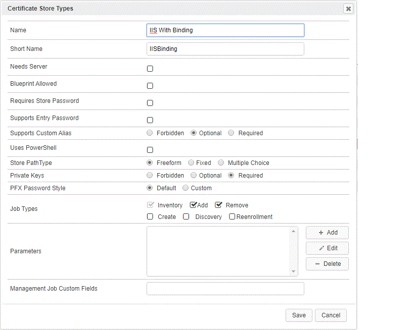
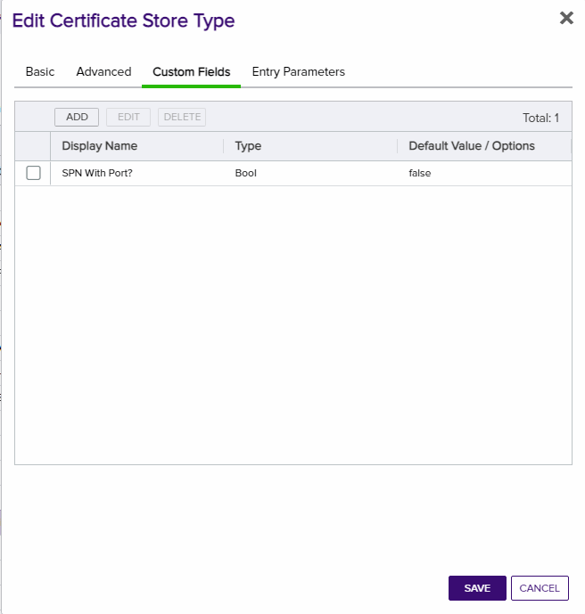
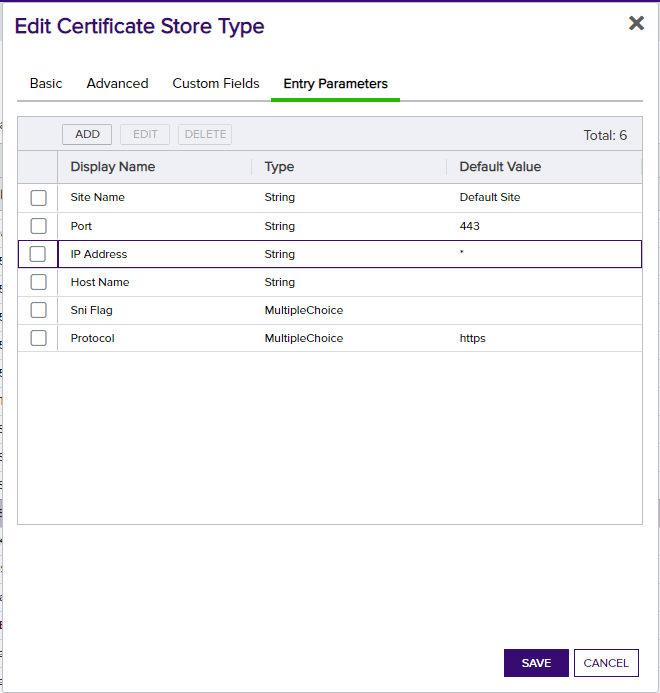

# Windows IIS Orchestrator
## Orchestrator

The IIS-With-Bindings AnyAgent allows a user to create, configure, and manage a Keyfactor certificate store defined as an Internet Information Systems (IIS) binding definition. The certificate itself will still be stored in the defined server's personal certificate store, but the management within Keyfactor will be abstracted to appear as if the binding itself houses the certificate.

<!-- add integration specific information below -->
*** 
**IIS With Binding AnyAgent Configuration**

**Overview**

The IIS-With-Bindings AnyAgent allows a user to create, configure, and manage a Keyfactor certificate store defined as an Internet Information Systems (IIS) binding definition. The certificate itself will still be stored in the defined server&#39;s personal certificate store, but the management within Keyfactor will be abstracted to appear as if the binding itself houses the certificate.

This agent implements three job types – Inventory, Management Add, and Management Remove. Below are the steps necessary to configure this AnyAgent.

**1. Create the New Certificate Store Type for the New IIS-With-Bindings AnyAgent**

In Keyfactor Command create a new Certificate Store Type similar to the one below:

#### STORE TYPE CONFIGURATION
CONFIG ELEMENT	| DESCRIPTION
---------------------|------------------
Name	|Descriptive name for the Store Type
Short Name	|The short name that identifies the registered functionality of the orchestrator. Must be IISBinding
Needs Server	|Must be checked
Blueprint Allowed	|Unchecked
Requires Store Password	|Determines if a store password is required when configuring an individual store.  This must be unchecked.
Supports Entry Password	|Determined if an individual entry within a store can have a password.  This must be unchecked.
Supports Custom Alias	|Determines if an individual entry within a store can have a custom Alias.  This must be Forbidden.
Uses PowerShell	|Unchecked
Store Path Type	|Determines what restrictions are applied to the store path field when configuring a new store.  This must be Multiple Choice
Store Path Value|A comma separated list of options to select from for the Store Path. This, combined with the hostname, will determine the location used for the certificate store management and inventory.  Must be My, WebHosting
Private Keys	|This determines if Keyfactor can send the private key associated with a certificate to the store.  This is requried since IIS will need the private key material to establish TLS connections.
PFX Password Style	|This determines how the platform generate passwords to protect a PFX enrollment job that is delivered to the store.  This can be either Default (system generated) or Custom (user determined).
Job Types	|Inventory, Add, and Remove are the supported job types. 

**Advanced Settings:**
- **Custom Alias** – Can make Required, Optional or Forbidden based on the client preference
- **Private Key Handling** – Required

**Custom Fields:**

<table>
<tr><th>Parameter Name</th><th>Parameter Type</th><th>Default Value</th><th>Required</th></tr>
<tr><td>spnwithport</td><td>Boolean</td><td>false</td><td>No</td></tr>

- **SPN With Port** – Defaults to false but some customers need for remote Powershell Access
</table>

**Entry Parameters:**
This section must be configured with binding fields. The parameters will be populated with the appropriate data when creating a new certificate store. 
<table>
<tr><th>Parameter Name</th><th>Parameter Type</th><th>Default Value</th><th>Required</th></tr>
<tr><td>Port</td><td>String</td><td>443</td><td>Yes</td></tr>
<tr><td>IP Address</td><td>String</td><td>*</td><td>Yes</td></tr>
<tr><td>Host Name</td><td>String</td><td></td><td>No</td></tr>
<tr><td>Site Name</td><td>String</td><td>Default Web Site</td><td>Yes</td></tr>
<tr><td>Sni Flag</td><td>String</td><td>0 - No SNI</td><td>No</td></tr>
<tr><td>Protocol</td><td>Multiple Choice</td><td>https</td><td>Yes</td></tr>

- **Site Name** – Required (Adding an entry, Removing an entry, Reenrolling an entry). The site name for the web site being bound to – i.e. &quot;Default Web Site&quot;
- **IP Address** – Required (Adding an entry, Removing an entry, Reenrolling an entry). The IP address for the web site being bound to. Default is &quot;\*&quot; for all IP Addresses.
- **Port** – Required (Adding an entry, Removing an entry, Reenrolling an entry). The port for the web site being bound to. Default is &quot;443&quot;.
- **Host Name** – Optional. The host name for the web site being bound to.
- *Protocol* - Required (Adding an entry, Removing an entry, Reenrolling an entry) 
   - https
   - http
- **Sni Flag** – Optional. Set the SNI flag assoicated with the binding being created.Default is &quot;0&quot;. Acceptable values are:
   - 0 - No SNI
   - 1 - SNI Enabled
   - 2 - Non SNI Binding
   - 3 - SNI Binding
</table>

**2. Register the IIS-With-Bindings AnyAgent with Keyfactor**

**3. Create an IIS With Binding Certificate Store within Keyfactor Command**

In Keyfactor Command create a new Certificate Store similar to the one below, selecting IIS With Binding as the Category and the parameters as described in &quot;Create the New Certificate Store Type for the New IIS-With-Bindings AnyAgent&quot;.

#### STORE CONFIGURATION 
CONFIG ELEMENT	|DESCRIPTION
----------------|---------------
Category	|The type of certificate store to be configured. Select category based on the display name configured above.
Container	|This is a logical grouping of like stores. This configuration is optional and does not impact the functionality of the store.
Client Machine	|The hostname of the server to be managed. The Change Credentials option must be clicked to provide a username and password. This account will be used to manage the remote server via PowerShell.
Store Path	|My or WebHosting
Orchestrator	|This is the orchestrator server registered with the appropriate capabilities to manage this certificate store type. 
Inventory Schedule	|The interval that the system will use to report on what certificates are currently in the store. 
