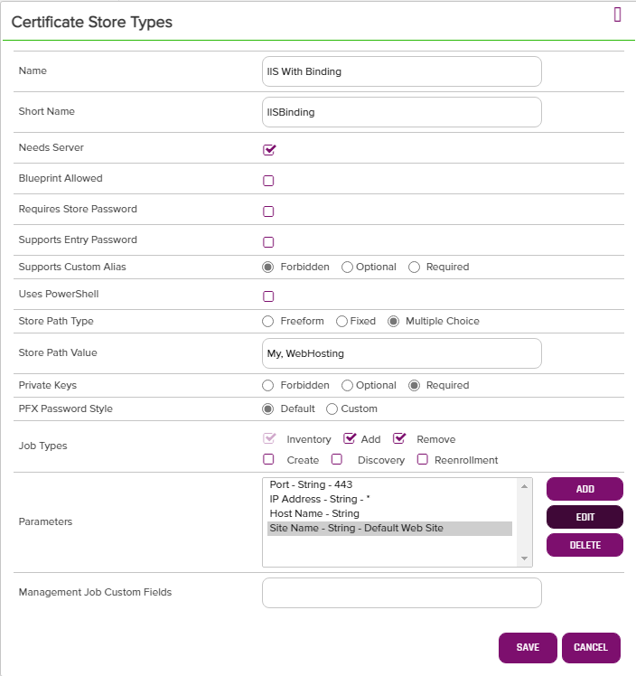
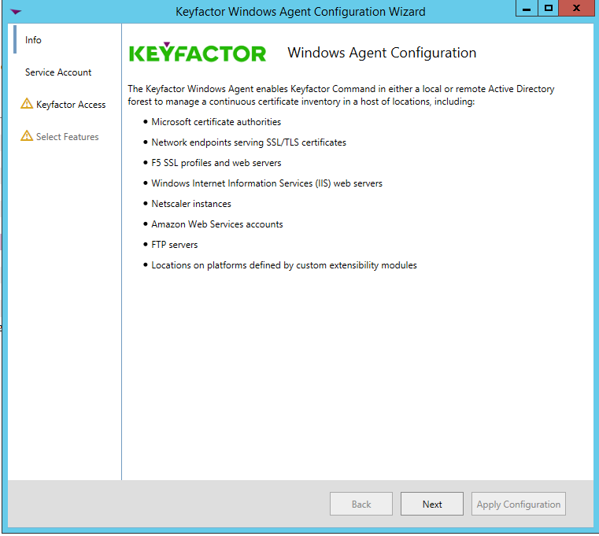
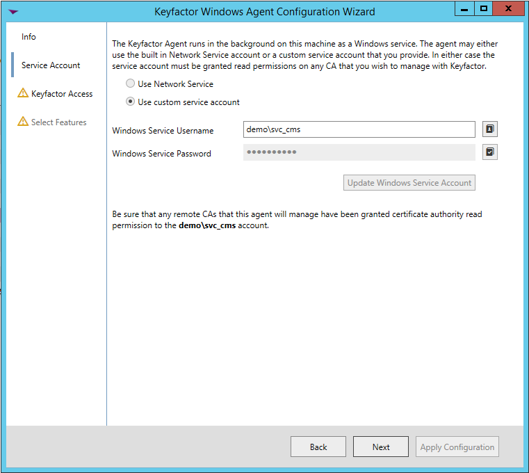
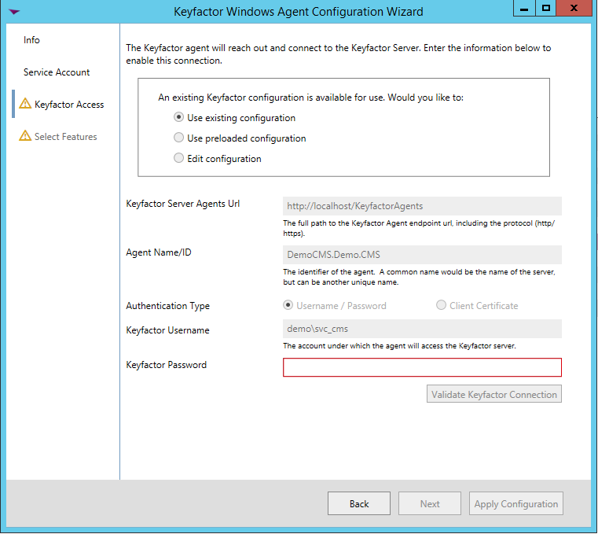
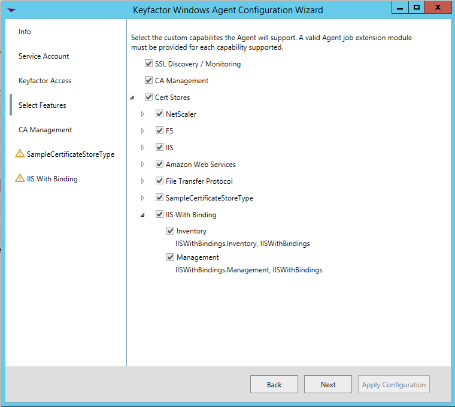
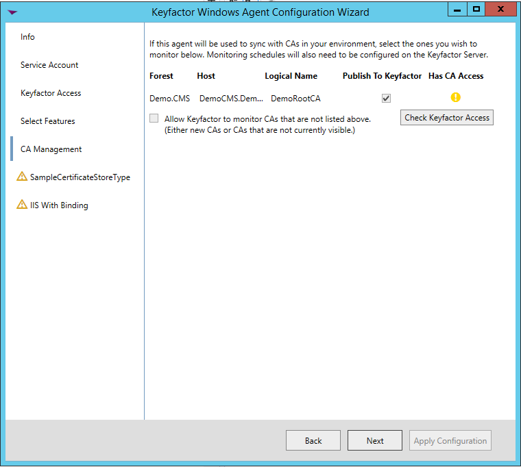
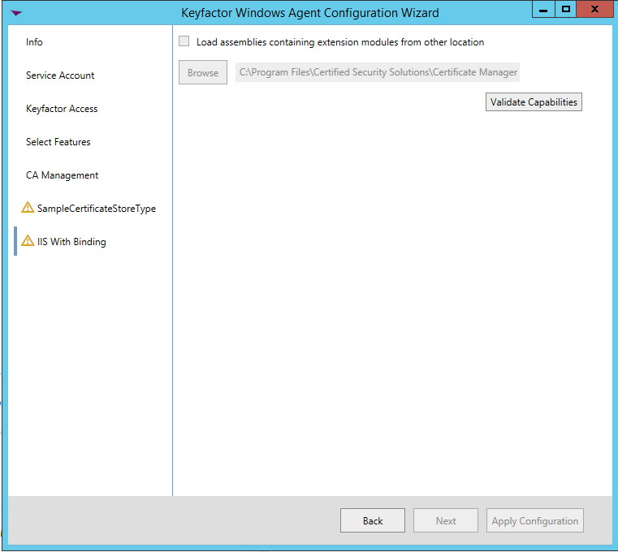
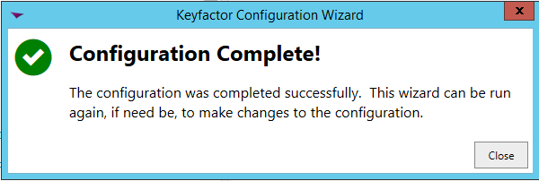
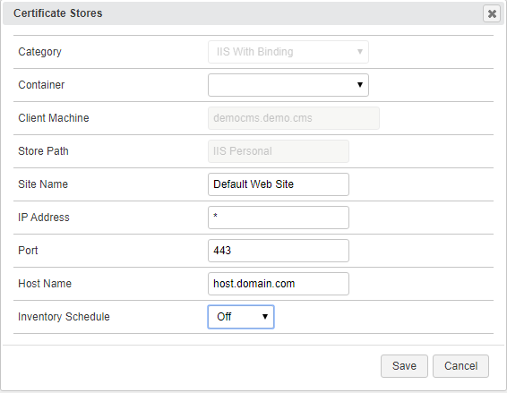

**IIS With Binding AnyAgent Configuration**

**Overview**

The IIS-With-Bindings AnyAgent allows a user to create, configure, and manage a Keyfactor certificate store defined as an Internet Information Systems (IIS) binding definition. The certificate itself will still be stored in the defined server&#39;s personal certificate store, but the management within Keyfactor will be abstracted to appear as if the binding itself houses the certificate.

This agent implements three job types – Inventory, Management Add, and Management Remove. Below are the steps necessary to configure this AnyAgent.

**1. Create the New Certificate Store Type for the New IIS-With-Bindings AnyAgent**

In Keyfactor Command create a new Certificate Store Type similar to the one below:

- **Name** – Required. The display name of the new Certificate Store Type
- **Short Name** – Required. **MUST** be &quot;IISBinding&quot;
- **Needs Server, Blueprint Allowed, Requires Store Password, Supports Entry Password** – unchecked
- **Supports Custom Alias** – Not applicable, so &quot;Optional&quot; is fine
- **Use PowerShell** – Unchecked
- **Store PathType** – Fixed
- **Store Path Value** – IIS Personal (READ ONLY – this value is display only)
- **Private Keys** – Required (the private key must be delivered to the certificate store for IIS binding)
- **PFX Password Style** – Default
- **Job Types** – Inventory, Add, and Remove are the 3 job types implemented by this AnyAgent

**Parameters:**

- **Site Name** – Required. The site name for the web site being bound to – i.e. &quot;Default Web Site&quot;
- **IP Address** – Required. The IP address for the web site being bound to. Default is &quot;\*&quot; for all IP Addresses.
- **Port** – Required. The port for the web site being bound to. Default is &quot;443&quot;.
- **Host Name** – Optional. The host name for the web site being bound to.

**2. Register the IIS-With-Bindings AnyAgent with Keyfactor**

Open the Keyfactor Windows Agent Configuration Wizard and perform the tasks as illustrated below:

- Click **\&lt;Next\&gt;**

- If you have configured the agent service previously, you should be able to skip to just click **\&lt;Next\&gt;.** Otherwise, enter the service account Username and Password you wish to run the Keyfactor Windows Agent Service under, click **\&lt;Update Windows Service Account\&gt;** and click **\&lt;Next\&gt;.**

- If you have configured the agent service previously, you should be able to skip to just re-enter the password to the service account the agent service will run under, click **\&lt;Validate Keyfactor Connection\&gt;** and then **\&lt;Next\&gt;.**

- Select the agent you are adding capabilities for (in this case, IIS With Binding, and also select the specific capabilities (Inventory and Management in this example). Click **\&lt;Next\&gt;**.

- For agent configuration purposes, this screen can be skipped by clicking **\&lt;Next\&gt;**.

- For each AnyAgent implementation, check **Load assemblies containing extension modules from other location** , browse to the location of the compiled AnyAgent dll, and click **\&lt;Validate Capabilities\&gt;**. Once all AnyAgents have been validated, click **\&lt;Apply Configuration\&gt;**.

- If the Keyfactor Agent Configuration Wizard configured everything correctly, you should see the dialog above.

**3. Create an IIS With Binding Certificate Store within Keyfactor Command**

In Keyfactor Command create a new Certificate Store similar to the one below, selecting IIS With Binding as the Category and the parameters as described in &quot;Create the New Certificate Store Type for the New IIS-With-Bindings AnyAgent&quot;.

