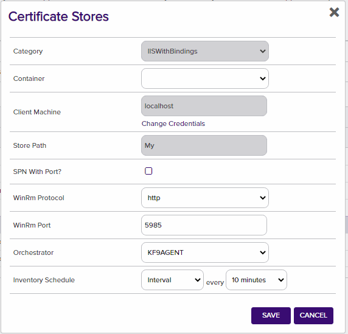
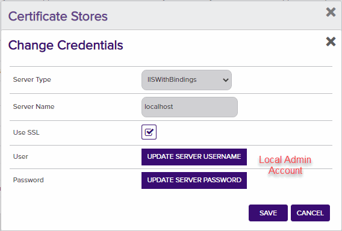

# IIS Orchestrator

The IIS Orchestrator treats the certificates bound (actively in use) on a Microsoft Internet Information Server (IIS) as a Keyfactor certificate store. Inventory and Management functions are supported. The orchestrator replaces the IIS orchestrator that ships with Keyfactor Command (which did not support binding.)

#### Integration status: Production - Ready for use in production environments.

## About the Keyfactor Universal Orchestrator Capability

This repository contains a Universal Orchestrator Capability which is a plugin to the Keyfactor Universal Orchestrator. Within the Keyfactor Platform, Orchestrators are used to manage “certificate stores” &mdash; collections of certificates and roots of trust that are found within and used by various applications.

The Universal Orchestrator is part of the Keyfactor software distribution and is available via the Keyfactor customer portal. For general instructions on installing Capabilities, see the “Keyfactor Command Orchestrator Installation and Configuration Guide” section of the Keyfactor documentation. For configuration details of this specific Capability, see below in this readme.

The Universal Orchestrator is the successor to the Windows Orchestrator. This Capability plugin only works with the Universal Orchestrator and does not work with the Windows Orchestrator.

---

**IIS Orchestrator Configuration**

**Overview**

The IIS Orchestrator remotely manages certificates in a Windows Server local machine certificate store.
The "Personal" (My) and "Web Hosting" Stores are supported.
Only certificates that are bound to an IIS web site are managed.
Unbound certificates are ignored.

This agent implements three job types – Inventory, Management Add, and Management Remove. Below are the steps necessary to configure this AnyAgent.

WinRM is used to remotely manage the certificate stores and IIS bindings. WinRM must be properly configured to allow
the server running the orchestrator to manage the server running IIS.

**Note if you are upgrading from version 1.1.2 you must run the IISWBin 1.1.3 upgrade script.sql SQL Script**

**1. Create the New Certificate Store Type for the IIS Orchestrator**

In Keyfactor Command create a new Certificate Store Type similar to the one below:

#### STORE TYPE CONFIGURATION
CONFIG ELEMENT	| DESCRIPTION
------------------|------------------
Name	|Descriptive name for the Store Type
Short Name	|The short name that identifies the registered functionality of the orchestrator. Must be IISWBin
Custom Capability|Store type name orchestrator will register with. Must be "IISBindings".
Needs Server	|Must be checked
Blueprint Allowed	|Unchecked
Requires Store Password	|Determines if a store password is required when configuring an individual store.  This must be unchecked.
Supports Entry Password	|Determined if an individual entry within a store can have a password.  This must be unchecked.
Supports Custom Alias	|Determines if an individual entry within a store can have a custom Alias.  This must be Forbidden.
Uses PowerShell	|Unchecked
Store Path Type	|Determines what restrictions are applied to the store path field when configuring a new store.  This must be Multiple Choice
Store Path Value|A comma separated list of options to select from for the Store Path. This, combined with the hostname, will determine the location used for the certificate store management and inventory.  Must be My, WebHosting
Private Keys	|This determines if Keyfactor can send the private key associated with a certificate to the store.  This is required since IIS will need the private key material to establish TLS connections.
PFX Password Style	|This determines how the platform generate passwords to protect a PFX enrollment job that is delivered to the store.  This can be either Default (system generated) or Custom (user determined).
Job Types	|Inventory, Add, and Remove are the supported job types. 

**Advanced Settings:**
- **Custom Alias** – Forbidden
- **Private Key Handling** – Required

**Custom Fields:**

- **SPN With Port** – Defaults to false but some customers need for remote PowerShell Access

Parameter Name|Display Name|Parameter Type|Default Value|Required|Description
---|---|---|---|---|---
spnwithport|SPN With Port?|Boolean|false|No|An SPN is the name by which a client uniquely identifies an instance of a service
WinRm Protocol|WinRm Protocol|Multiple Choice|http|Yes|Protocol that WinRM Runs on
WinRm Port|WinRm Port|String|5985|Yes|Port that WinRM Runs on

**Entry Parameters:**
This section must be configured with binding fields. The parameters will be populated with the appropriate data when creating a new certificate store. 

- **Site Name** – Required (Adding an entry, Removing an entry, Reenrolling an entry). The site name for the web site being bound to – i.e. &quot;Default Web Site&quot;
- **IP Address** – Required (Adding an entry, Removing an entry, Reenrolling an entry). The IP address for the web site being bound to. Default is &quot;\*&quot; for all IP Addresses.
- **Port** – Required (Adding an entry, Removing an entry, Reenrolling an entry). The port for the web site being bound to. Default is &quot;443&quot;.
- **Host Name** – Optional. The host name for the web site being bound to.
- **Protocol** - Required (Adding an entry, Removing an entry, Reenrolling an entry) 
   - https
   - http
- **Sni Flag** – Optional. Set the SNI flag associated with the binding being created. Default is "0". Acceptable values are:
   - 0 - No SNI
   - 1 - SNI Enabled
   - 2 - Non SNI Binding
   - 3 - SNI Binding

Parameter Name|Parameter Type|Default Value|Required
---|---|---|---
Port|String|443|Yes
IP Address|String|*|Yes
Host Name |String||No
Site Name |String|Default Web Site|Yes
Sni Flag  |String|0 - No SNI|No
Protocol  |Multiple Choice|https|Yes

**2. Register the IIS Binding Orchestrator with Keyfactor**
See Keyfactor InstallingKeyfactorOrchestrators.pdf Documentation.  Get from your Keyfactor contact/representative.

**3. Create an IIS Binding Certificate Store within Keyfactor Command**

In Keyfactor Command create a new Certificate Store similar to the one below, selecting IIS With Binding as the Category and the parameters as described in &quot;Create the New Certificate Store Type for the New IIS-With-Bindings AnyAgent&quot;.

#### STORE CONFIGURATION 
CONFIG ELEMENT	|DESCRIPTION
----------------|---------------
Category	|The type of certificate store to be configured. Select category based on the display name configured above.
Container	|This is a logical grouping of like stores. This configuration is optional and does not impact the functionality of the store.
Client Machine	|The hostname of the server to be managed. The Change Credentials option must be clicked to provide a username and password. This account will be used to manage the remote server via PowerShell.
Credentials |Local or domain admin account that has permissions to manage iis (Has to be admin)
Store Path	|My or WebHosting
WinRm Protocol|http or https
WinRm Port |Port to run WinRm on Default for http is 5985
Orchestrator	|This is the orchestrator server registered with the appropriate capabilities to manage this certificate store type. 
Inventory Schedule	|The interval that the system will use to report on what certificates are currently in the store. 

