<h1 align="center" style="border-bottom: none">
    Windows Certificate Universal Orchestrator Extension
</h1>

<p align="center">
  <!-- Badges -->

<a href="https://github.com/Keyfactor/Windows Certificate Orchestrator/releases"></a>


</p>

<p align="center">
  <!-- TOC -->
  <a href="#support">
    <b>Support</b>
  </a>
  ·
  <a href="#installation">
    <b>Installation</b>
  </a>
  ·
  <a href="#license">
    <b>License</b>
  </a>
  ·
  <a href="https://github.com/orgs/Keyfactor/repositories?q=orchestrator">
    <b>Related Integrations</b>
  </a>
</p>

## Overview

The Windows Certificate Orchestrator Extension is a multi-purpose integration that can remotely manage certificates on a Windows Server's Local Machine Store.  This extension currently manages certificates for the current store types:
* WinADFS - Rotates the Service-Communications certificate on the primary and secondary ADFS nodes
* WinCert - Certificates defined by path set for the Certificate Store
* WinIIS - IIS Bound certificates 
* WinSQL - Certificates that are bound to the specified SQL Instances

By default, most certificates are stored in the “Personal” (My) and “Web Hosting” (WebHosting) stores.
For a complete list of local machine cert stores you can execute the PowerShell command:

	Get-ChildItem Cert:\LocalMachine

The returned list will contain the actual certificate store name to be used when entering store location.

The ADFS extension performs both Inventory and Management Add jobs.  The other extensions implements four job types:  Inventory, Management Add/Remove, and Reenrollment.

The Keyfactor Universal Orchestrator (UO) and WinCert Extension can be installed on either Windows or Linux operating systems.  A UO service managing certificates on remote servers is considered to be acting as an Orchestrator, while a UO Service managing local certificates on the same server running the service is considered an Agent.  When acting as an Orchestrator, connectivity from the orchestrator server hosting the WinCert extension to the orchestrated server hosting the certificate stores(s) being managed is achieved via either an SSH (for Linux orchestrated servers) or WinRM (for Windows orchestrated servers) connection.  When acting as an agent (Windows only), WinRM may still be used, OR the certificate store can be configured to bypass a WinRM connection and instead directly access the orchestrator server's certificate stores.

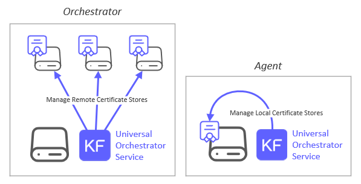

Please refer to the READMEs for each supported store type for more information on proper configuration and setup for these different stores.  The supported configurations of Universal Orchestrator hosts and managed orchestrated servers are detailed below:

| | UO Installed on Windows | UO Installed on Linux |
|-----|-----|------|
|Orchestrated Server hosting certificate store(s) on remote Windows server|WinRM connection | SSH connection |
|Certificate store(s) on same server as orchestrator service (Agent)| WinRM connection or local file system | Not Supported |  

WinRM is used to remotely manage the certificate stores and IIS bindings on Windows machines only.  WinRM must be properly configured to allow the orchestrator on the server to manage the certificates.  Setting up WinRM is not in the scope of this document.

**Note:**
In version 2.0 of the IIS Orchestrator, the certificate store type has been renamed and additional parameters have been added. Prior to 2.0 the certificate store type was called “IISBin” and as of 2.0 it is called “IISU”. If you have existing certificate stores of type “IISBin”, you have three options:
1. Leave them as is and continue to manage them with a pre 2.0 IIS Orchestrator Extension. Create the new IISU certificate store type and create any new IIS stores using the new type.
1. Delete existing IIS stores. Delete the IISBin store type. Create the new IISU store type. Recreate the IIS stores using the new IISU store type.
1. Convert existing IISBin certificate stores to IISU certificate stores. There is not currently a way to do this via the Keyfactor API, so direct updates to the underlying Keyfactor SQL database is required. A SQL script (IIS-Conversion.sql) is available in the repository to do this. Hosted customers, which do not have access to the underlying database, will need to work Keyfactor support to run the conversion. On-premises customers can run the script themselves, but are strongly encouraged to ensure that a SQL backup is taken prior running the script (and also be confident that they have a tested database restoration process.)

**Note: There is an additional (and deprecated) certificate store type of “IIS” that ships with the Keyfactor platform. Migration of certificate stores from the “IIS” type to either the “IISBin” or “IISU” types is not currently supported.**

**Note: If Looking to use GMSA Accounts to run the Service Keyfactor Command 10.2 or greater is required for No Value checkbox to work**

The Windows Certificate Universal Orchestrator extension implements 4 Certificate Store Types. Depending on your use case, you may elect to use one, or all of these Certificate Store Types. Descriptions of each are provided below.
- [Windows Certificate](#WinCert)
- [IIS Bound Certificate](#IISU)
- [WinSql](#WinSql)
- [ADFS Rotation Manager](#WinAdfs)

## Compatibility

This integration is compatible with Keyfactor Universal Orchestrator version 10.1 and later.

## Support

The Windows Certificate Universal Orchestrator extension is supported by Keyfactor. If you require support for any issues or have feature request, please open a support ticket by either contacting your Keyfactor representative or via the Keyfactor Support Portal at https://support.keyfactor.com.

> If you want to contribute bug fixes or additional enhancements, use the **[Pull requests](../../pulls)** tab.

## Requirements & Prerequisites

Before installing the Windows Certificate Universal Orchestrator extension, we recommend that you install [kfutil](https://github.com/Keyfactor/kfutil). Kfutil is a command-line tool that simplifies the process of creating store types, installing extensions, and instantiating certificate stores in Keyfactor Command.

<details>
<summary><b>Using the WinCert Extension on Linux servers and/or with Docker Containers:</b></summary>

1. General SSH Setup Information: PowerShell 6 or higher and SSH must be installed on all computers.  Install SSH, including ssh server, that's appropriate for your platform.  You also need to install PowerShell from GitHub to get the SSH remoting feature.  The SSH server must be configured to create a SSH subsysten to host a PowerShell process on the remote computer.  It is suggested to turn off password authentication as this extension uses key-based authentication.  

2. SSH Authentication: When creating a Keyfactor certificate store for the WinCert orchestrator extension, the only protocol supported to communicate with Windows servers is ssh.  When providing the user id and password, the connection is attempted by creating a temporary private key file using the contents in the Password textbox. Therefore, the password field must contain the full SSH Private key.  

3. If you choose to run this extension in a containerized environment, the container image must include PowerShell version 7.5 or later, along with either OpenSSH clients (for SSH-based connections) or OpenSSL (if SSL/TLS operations are required). Additionally, the PWSMan PowerShell module must be installed to support management tasks and remote session functionality. These dependencies are required to ensure full compatibility when connecting from the container to remote Windows servers.  Below is an example Docker file snippet:
```
dnf install https://github.com/PowerShell/PowerShell/releases/download/v7.5.2/powershell-7.5.2-1.rh.x86_64.rpm
pwsh -Command 'Install-Module -Name PSWSMan'
dnf install openssh-clients openssl
```

</details>

<details>
<summary><b>Using the WinCert Extension on Windows servers:</b></summary>

1. When orchestrating management of external (and potentially local) certificate stores, the WinCert Orchestrator Extension makes use of WinRM to connect to external certificate store servers.  The security context used is the user id entered in the Keyfactor Command certificate store.  Make sure that WinRM is set up on the orchestrated server and that the WinRM port (by convention, 5985 for HTTP and 5986 for HTTPS) is part of the certificate store path when setting up your certificate stores jobs.  If running as an agent, managing local certificate stores, local commands are run under the security context of the user account running the Keyfactor Universal Orchestrator Service.

2. **JEA (Just Enough Administration) Support** — As a more secure alternative to granting the orchestrator service account full local administrator rights, the WinCert extension supports connecting via a JEA-enabled WinRM session endpoint. When JEA is configured, the orchestrator connects to a named PowerShell session configuration on the target server. Within that session, only the specific Keyfactor certificate management functions are exposed — no general PowerShell commands, no file system access, and no administrative cmdlets are available to the connecting account. This dramatically reduces the attack surface on managed servers and allows you to follow the principle of least privilege. JEA is configured on a per-certificate-store basis by entering the JEA endpoint name in the **JEA Endpoint Name** parameter when creating or editing a certificate store in Keyfactor Command. Refer to the **Just Enough Administration (JEA) Setup and Configuration** section below for complete step-by-step setup instructions.

3. **Important:** JEA cannot be used when the certificate store is configured to access the local machine directly (i.e., when the Client Machine value contains `|LocalMachine` or is set to `localhost`/`LocalMachine`). JEA requires an actual WinRM network connection to the target server. If a JEA Endpoint Name is configured and the store is also set to LocalMachine, the job will fail immediately with an ambiguous configuration error. To manage a local machine's certificates using JEA, set the Client Machine to the server's actual hostname or IP address and configure the JEA endpoint normally.

</details>

<details>
<summary><b>Just Enough Administration (JEA) Setup and Configuration:</b></summary>

### What is JEA?

Just Enough Administration (JEA) is a PowerShell security technology built into Windows that allows administrators to create constrained, audited remote PowerShell sessions. Instead of granting a service account full administrative access to a server, JEA lets you define exactly which PowerShell functions, cmdlets, and external commands are permitted within a remote session. The connecting account runs commands in that restricted environment — it cannot browse the file system, run arbitrary scripts, or invoke any command that has not been explicitly permitted.

JEA operates through two types of configuration files:

- **Session Configuration file (`.pssc`)** — Defines the overall session: the language mode, who is allowed to connect, which role capabilities to apply, whether to use a virtual run-as account or a Group Managed Service Account, and where to write audit transcripts. This file is registered with WinRM using `Register-PSSessionConfiguration` and becomes a named WinRM endpoint on the target server.

- **Role Capability files (`.psrc`)** — Defines the functions, cmdlets, and external commands that are visible within the session to users assigned that role. Each Keyfactor module ships with its own `.psrc` file that whitelists only the functions required for certificate management.

When the Keyfactor orchestrator connects to a JEA endpoint, it runs inside a `ConstrainedLanguage` PowerShell session backed by pre-installed, fully-trusted module code. The orchestrator can invoke Keyfactor certificate management functions, but nothing else. Every command executed in the session is recorded to a transcript file for audit purposes.

---

### Why Use JEA with the WinCert Extension?

The default WinRM connection model requires the orchestrator service account to have local administrator rights on every managed server. While functional, this violates the principle of least privilege and creates a broad attack surface — if the service account credentials were ever compromised, an attacker would have administrative access to every managed server. JEA addresses this by:

- **Limiting command exposure** — The remote session only exposes the specific Keyfactor functions needed. An attacker with the service account credentials cannot run arbitrary commands or explore the target server.
- **Running as a privileged virtual or managed service account** — The connecting account itself does not need administrative rights. The JEA session can run the actual commands under a local virtual account or a Group Managed Service Account (gMSA) that has only the rights needed to manage certificates.
- **Full audit trail** — Every JEA session is automatically transcribed to a log file on the target server. You have a complete record of every function called, with what parameters, and at what time.
- **Simplified permission management** — Rather than managing complex local administrator group membership across dozens of servers, you create a single AD group of orchestrator service accounts that are permitted to connect to the JEA endpoint.

---

### How JEA Works with the WinCert Extension

When the **JEA Endpoint Name** field is populated on a certificate store, the orchestrator changes its connection behavior:

1. It connects to the target server via WinRM using the configured credentials, but specifies the named JEA session configuration (`-ConfigurationName keyfactor.wincert`) instead of opening a standard administrative session.
2. The JEA session loads the pre-installed Keyfactor PowerShell modules from the target server's system module path (`C:\Program Files\WindowsPowerShell\Modules\`). Because these modules are installed in a trusted location, they run as fully trusted code and can use .NET APIs freely.
3. The orchestrator does **not** inject script content into the session. Instead, it calls the pre-loaded module functions by name, passing parameters. This is different from the standard WinRM mode, which loads scripts at session start.
4. A pre-flight check verifies that the Keyfactor modules are installed and accessible before any job runs. If the modules are not found, the job fails immediately with an actionable error message.
5. All commands executed during the session are written to a transcript in `C:\ProgramData\Keyfactor\JEA\Transcripts\` on the target server.

---

### Prerequisites

Before configuring JEA on a target server, ensure the following:

- **Windows PowerShell 5.1** is installed on the target server (included with Windows Server 2016 and later; available via Windows Management Framework 5.1 for Windows Server 2012 R2).
- **WinRM is enabled and configured** on the target server. Verify with: `Test-WSMan -ComputerName <target>`.
- **The Keyfactor orchestrator deployment package** has been extracted. The `PowerShell` folder within the extension contains the module directories and JEA configuration files.
- **Local Administrator access** on the target server is required to perform the one-time JEA setup (registering the session configuration and installing modules). This is a setup-time requirement only — once configured, the orchestrator service account does not need administrator rights.

---

### Keyfactor PowerShell Module Overview

The WinCert extension ships three PowerShell modules. Each module contains a `RoleCapabilities` subfolder with a `.psrc` file that defines which functions are visible in a JEA session.

| Module | Store Types Supported | Purpose |
|---|---|---|
| `Keyfactor.WinCert.Common` | WinCert, WinIIS, WinSQL | Certificate inventory, add, remove, and re-enrollment (CSR generation and signed cert import). Required for all store types. |
| `Keyfactor.WinCert.IIS` | WinIIS | IIS site binding management (get, create, remove bindings). |
| `Keyfactor.WinCert.SQL` | WinSQL | SQL Server certificate binding management (get, bind, unbind). |

Install only the modules needed for the store types you manage on that server. For example, a server that only hosts IIS certificates needs `Keyfactor.WinCert.Common` and `Keyfactor.WinCert.IIS`.

---

### Step-by-Step Setup Guide

#### Step 1: Locate the JEA Configuration Files

After deploying the Keyfactor Universal Orchestrator with the WinCert extension, navigate to the extension's output directory. You will find a `PowerShell` folder containing:

```
PowerShell\
  Keyfactor.WinCert.Common\       ← Module: common certificate operations
  Keyfactor.WinCert.IIS\          ← Module: IIS binding management
  Keyfactor.WinCert.SQL\          ← Module: SQL Server binding management
  Build\
    KeyfactorWinCert.pssc          ← JEA Session Configuration file
```

Copy this entire `PowerShell` folder to the target server (or to a network share accessible from the target server) to perform the setup steps below.

---

#### Step 2: Install the Keyfactor PowerShell Modules on the Target Server

On the **target server**, open an elevated PowerShell prompt (Run as Administrator) and run the following commands. Adjust the source path (`$sourcePath`) to wherever you placed the `PowerShell` folder in Step 1.

```powershell
# Set the source path to where you copied the PowerShell folder
$sourcePath = 'C:\Temp\PowerShell'

# System module path — modules installed here are treated as fully trusted by PowerShell
$moduleBase = 'C:\Program Files\WindowsPowerShell\Modules'

# Always install the Common module — required for all store types
Copy-Item -Path "$sourcePath\Keyfactor.WinCert.Common" `
          -Destination "$moduleBase\Keyfactor.WinCert.Common" `
          -Recurse -Force

# Install the IIS module if this server hosts IIS certificate stores (WinIIS)
Copy-Item -Path "$sourcePath\Keyfactor.WinCert.IIS" `
          -Destination "$moduleBase\Keyfactor.WinCert.IIS" `
          -Recurse -Force

# Install the SQL module if this server hosts SQL Server certificate stores (WinSQL)
Copy-Item -Path "$sourcePath\Keyfactor.WinCert.SQL" `
          -Destination "$moduleBase\Keyfactor.WinCert.SQL" `
          -Recurse -Force
```

> **Important:** Modules **must** be installed under `C:\Program Files\WindowsPowerShell\Modules\` (or another path listed in the system `$env:PSModulePath`). Modules installed outside of a trusted path will not run as fully trusted code inside a `ConstrainedLanguage` JEA session, and calls to .NET APIs will fail.

Verify that the modules installed correctly by running:

```powershell
Get-Module -ListAvailable | Where-Object { $_.Name -like 'Keyfactor.*' }
```

You should see entries for each module you installed.

---

#### Step 3: (Optional) Create the Audit Transcript Directory

Transcript logging is **disabled by default** in the session configuration file. When enabled, JEA records a full transcript of every session — every function called, with its parameters and output — to a directory on the target server. This is highly recommended while you are first testing the JEA setup, and may be required by your organization's security policy in production.

To enable transcription, you must do two things: create the directory (this step), and uncomment the `TranscriptDirectory` line in the `.pssc` file (covered in Step 4).

```powershell
New-Item -ItemType Directory -Path 'C:\ProgramData\Keyfactor\JEA\Transcripts' -Force
```

Each transcript file is named with the date, time, and a unique identifier so sessions are never overwritten. To review recent transcripts:

```powershell
# List the 10 most recent transcript files
Get-ChildItem 'C:\ProgramData\Keyfactor\JEA\Transcripts\' |
    Sort-Object LastWriteTime -Descending |
    Select-Object -First 10

# View the most recent transcript
Get-ChildItem 'C:\ProgramData\Keyfactor\JEA\Transcripts\' |
    Sort-Object LastWriteTime -Descending |
    Select-Object -First 1 |
    Get-Content
```

If you choose not to enable transcript logging, skip this step entirely — no directory is needed when `TranscriptDirectory` remains commented out in the `.pssc`.

---

#### Step 4: Review and Customize the Session Configuration File

Copy the `KeyfactorWinCert.pssc` file from `PowerShell\Build\` to a working location on the target server (e.g., `C:\Temp\KeyfactorWinCert.pssc`) and open it in a text editor. The key settings to review and customize are:

**Run-As Account (choose one):**

The JEA session executes the Keyfactor functions under a run-as account that is separate from the connecting account. There are two options:

- **Virtual Account (default, recommended for testing):** A temporary local administrator account is automatically created for each JEA session and discarded when the session ends. This is the simplest option and requires no additional Active Directory configuration.

  ```powershell
  RunAsVirtualAccount = $true
  ```

- **Group Managed Service Account (recommended for production):** A gMSA runs the session under a domain account whose password is automatically managed by Active Directory. This is the preferred production option because it provides a stable, auditable identity without requiring manual password rotation. The gMSA must be created in Active Directory and granted the necessary permissions to manage certificates on the target server before use.

  ```powershell
  # Comment out RunAsVirtualAccount and uncomment this line:
  GroupManagedServiceAccount = 'DOMAIN\KeyfactorJEA$'
  ```

  To create a gMSA (run on a domain controller or with AD PowerShell module):
  ```powershell
  # Create the gMSA in Active Directory
  New-ADServiceAccount -Name 'KeyfactorJEA' `
                       -DNSHostName 'keyfactorjea.yourdomain.com' `
                       -PrincipalsAllowedToRetrieveManagedPassword 'KeyfactorServers$'

  # On the target server, install the gMSA
  Install-ADServiceAccount -Identity 'KeyfactorJEA$'

  # Verify the gMSA can log on
  Test-ADServiceAccount -Identity 'KeyfactorJEA$'
  ```

**Role Definitions (who is allowed to connect):**

The `RoleDefinitions` section maps connecting users or groups to JEA role capabilities. Replace `BUILTIN\Administrators` with the specific AD group or local group whose members should be allowed to connect via JEA. Using a dedicated AD group is strongly recommended for production environments.

```powershell
RoleDefinitions = @{
    # Replace with the AD group that contains your Keyfactor orchestrator service accounts:
    'DOMAIN\KeyfactorOrchestrators' = @{
        RoleCapabilities = 'Keyfactor.WinCert.Common', 'Keyfactor.WinCert.IIS'
    }
}
```

Only list the `RoleCapabilities` whose corresponding modules are installed on this server. The available combinations are:

| Store Types on This Server | RoleCapabilities to List |
|---|---|
| WinCert only | `'Keyfactor.WinCert.Common'` |
| WinIIS only or WinCert + WinIIS | `'Keyfactor.WinCert.Common', 'Keyfactor.WinCert.IIS'` |
| WinSQL only or WinCert + WinSQL | `'Keyfactor.WinCert.Common', 'Keyfactor.WinCert.SQL'` |
| WinCert + WinIIS + WinSQL | `'Keyfactor.WinCert.Common', 'Keyfactor.WinCert.IIS', 'Keyfactor.WinCert.SQL'` |

**Transcript Logging (Optional):**

The `TranscriptDirectory` setting in the `.pssc` file is **commented out by default**. When commented out, no transcript files are written and the directory created in Step 3 is not needed. This is a reasonable choice for production environments where the volume of orchestrator activity would generate a large number of transcript files, or where audit logging is handled by another mechanism (e.g., WinRM event logs or a SIEM).

To enable transcript logging, locate the `TranscriptDirectory` line in the `.pssc` file and remove the `#` comment character:

```powershell
# Before (transcription disabled — default):
# TranscriptDirectory = 'C:\ProgramData\Keyfactor\JEA\Transcripts'

# After (transcription enabled):
TranscriptDirectory = 'C:\ProgramData\Keyfactor\JEA\Transcripts'
```

> **Recommendation:** Enable transcript logging during initial setup and testing. It makes it easy to confirm that the orchestrator is calling the correct functions with the correct parameters, and to diagnose any unexpected failures. Once you are confident the configuration is working correctly in production, you may choose to disable it to reduce disk usage — or keep it enabled to satisfy your organization's audit requirements.

> **Important:** If you enable `TranscriptDirectory`, you must also create the directory before registering the session configuration (Step 3). If the directory does not exist at registration time, `Register-PSSessionConfiguration` will fail.

---

#### Step 5: Register the JEA Session Configuration

On the **target server**, in an elevated PowerShell prompt, register the session configuration. This creates the named WinRM endpoint that the Keyfactor orchestrator will connect to.

```powershell
Register-PSSessionConfiguration `
    -Name 'keyfactor.wincert' `
    -Path 'C:\Temp\KeyfactorWinCert.pssc' `
    -Force

# WinRM must be restarted for the new endpoint to become active
Restart-Service WinRM
```

> **Note:** `Restart-Service WinRM` will briefly interrupt all active WinRM connections on the server. Schedule this during a maintenance window if other services depend on WinRM.

The name `keyfactor.wincert` is the endpoint name you will enter into the **JEA Endpoint Name** field in Keyfactor Command. You may use a different name if desired — just ensure it matches exactly when configuring the certificate store.

---

#### Step 6: Verify the Registration

Confirm the endpoint is registered and its configuration is correct:

```powershell
# List all registered session configurations
Get-PSSessionConfiguration | Where-Object { $_.Name -eq 'keyfactor.wincert' }
```

You should see output showing the configuration name, PSVersion, and the path to the `.pssc` file.

For a more thorough validation, connect to the JEA endpoint from a remote machine and verify that the Keyfactor functions are available:

```powershell
# Connect to the JEA endpoint (run this from the Keyfactor orchestrator server or any machine with network access)
$cred = Get-Credential   # Enter the orchestrator service account credentials
$s = New-PSSession -ComputerName '<target-server>' `
                   -Port 5985 `
                   -ConfigurationName 'keyfactor.wincert' `
                   -Credential $cred

# List all commands available in the JEA session (should be limited to Keyfactor functions only)
Invoke-Command -Session $s -ScriptBlock { Get-Command }

# Test a certificate inventory call (WinCert)
Invoke-Command -Session $s -ScriptBlock { Get-KeyfactorCertificates -StoreName 'My' }

# Test IIS inventory (if Keyfactor.WinCert.IIS is installed on the target)
Invoke-Command -Session $s -ScriptBlock { Get-KeyfactorIISBoundCertificates }

# Clean up the test session
Remove-PSSession $s
```

The `Get-Command` output should show only a small set of Keyfactor functions plus the basic infrastructure cmdlets allowed by the session (e.g., `Write-Output`, `ConvertTo-Json`). If you see hundreds of commands, the session is not properly restricted and the session configuration should be reviewed.

---

#### Step 7: Configure the Certificate Store in Keyfactor Command

Once the JEA endpoint is registered and verified on the target server, configure the certificate store in Keyfactor Command:

1. Navigate to the certificate store you wish to manage via JEA (or create a new one).
2. In the store's **Custom Parameters** (also called **Store Properties**), locate the **JEA Endpoint Name** field.
3. Enter the name of the JEA session configuration you registered — for example, `keyfactor.wincert`.
4. Ensure the **Client Machine** is set to the target server's hostname or IP address. **Do not** use `localhost`, `LocalMachine`, or the `|LocalMachine` suffix — JEA requires a real WinRM network connection.
5. The **Server Username** and **Server Password** fields should contain the credentials of the account that is permitted to connect to the JEA endpoint (i.e., a member of the group specified in `RoleDefinitions` in the `.pssc` file).
6. Save the certificate store.

When a job runs against this store, the orchestrator will automatically use the JEA endpoint instead of a standard WinRM administrative session.

---

### Updating the JEA Configuration

If you need to change the session configuration — for example, to add a new module or change the run-as account — update the `.pssc` file and re-register it:

```powershell
# Re-register with the -Force flag to overwrite the existing registration
Register-PSSessionConfiguration `
    -Name 'keyfactor.wincert' `
    -Path 'C:\Temp\KeyfactorWinCert.pssc' `
    -Force

Restart-Service WinRM
```

If you update one of the Keyfactor modules (e.g., after upgrading the WinCert extension), repeat Step 2 to copy the new module files to the target server. No re-registration of the session configuration is necessary for module-only updates — the next JEA session will load the updated module automatically.

---

### Removing the JEA Configuration

To remove the JEA endpoint from a server:

```powershell
Unregister-PSSessionConfiguration -Name 'keyfactor.wincert'
Restart-Service WinRM
```

After removing the endpoint, any certificate stores in Keyfactor Command that reference the JEA endpoint name will fail. Update those stores to either clear the **JEA Endpoint Name** field (to revert to standard WinRM) or point to a different JEA endpoint.

---

### Troubleshooting

**"JEA endpoint is reachable but Keyfactor modules are not installed"**

The orchestrator connected to the JEA session but the pre-flight check for `New-KeyfactorResult` failed. This means the Keyfactor modules are not installed in a location that PowerShell recognizes as trusted. Verify that the modules are installed under `C:\Program Files\WindowsPowerShell\Modules\` (not under the user profile or any other path) and that the module folder name exactly matches the module name (e.g., `Keyfactor.WinCert.Common`).

**"The term 'Get-KeyfactorCertificates' is not recognized..."**

The function is not visible in the JEA session. Verify that:
- The module containing that function is installed on the target server (Step 2).
- The corresponding role capability is listed in `RoleDefinitions` in the `.pssc` (Step 4).
- The module name in `RoleCapabilities` matches the module folder name exactly (case-sensitive on some systems).
- The session configuration was re-registered and WinRM was restarted after any changes.

**"Connecting user is not authorized to connect to this configuration"**

The account used in the certificate store credentials is not a member of any group listed in `RoleDefinitions`. Add the account (or a group containing it) to the `RoleDefinitions` section in the `.pssc`, re-register the configuration, and restart WinRM.

**"Access is denied" or "WinRM cannot complete the operation"**

This typically indicates a WinRM connectivity issue rather than a JEA-specific problem. Verify that:
- WinRM is enabled on the target server (`Enable-PSRemoting -Force`).
- The WinRM firewall rule allows connections from the orchestrator server's IP.
- The port (5985 for HTTP, 5986 for HTTPS) specified in the certificate store matches the WinRM listener configuration.

**"Ambiguous configuration: the store target is set to the local machine but JEA endpoint is also configured"**

A **JEA Endpoint Name** was entered in the certificate store but the **Client Machine** is set to `localhost`, `LocalMachine`, or uses the `|LocalMachine` suffix. JEA is not compatible with local-machine (agent) mode. Either remove the JEA endpoint name to use direct local access, or change the Client Machine to the server's actual hostname or IP address to use JEA over WinRM.

**Reviewing JEA Transcripts (if transcript logging is enabled)**

If `TranscriptDirectory` is uncommented in the `.pssc` file, JEA writes a full transcript of every session to that directory on the target server. Each transcript file records the session start time, the connecting user, all commands executed (including parameter values), and the session end time. These files are invaluable for diagnosing job failures and for security audits. See Steps 3 and 4 for instructions on enabling this feature.

```powershell
# List recent transcript files
Get-ChildItem 'C:\ProgramData\Keyfactor\JEA\Transcripts\' | Sort-Object LastWriteTime -Descending | Select-Object -First 10

# View the most recent transcript
Get-ChildItem 'C:\ProgramData\Keyfactor\JEA\Transcripts\' |
    Sort-Object LastWriteTime -Descending |
    Select-Object -First 1 |
    Get-Content
```

---

### Important Notes and Limitations

- **JEA is not supported over SSH.** JEA requires a WinRM connection. The SSH protocol does not support named session configurations and cannot be used to target a JEA endpoint.
- **JEA is not compatible with local machine (agent) mode.** If the Client Machine is set to `localhost`, `LocalMachine`, or uses `|LocalMachine`, the JEA endpoint name must be left empty. See the troubleshooting entry above.
- **One JEA endpoint can serve multiple store types.** A single `keyfactor.wincert` endpoint can expose Common, IIS, and SQL capabilities simultaneously. You do not need separate endpoints per store type — configure the role capabilities in the `.pssc` to include all modules installed on that server.
- **Module updates require re-copying files, not re-registration.** When the WinCert extension is upgraded, copy the updated module folders to the target server's `C:\Program Files\WindowsPowerShell\Modules\` directory. WinRM does not need to be restarted for module-only updates.
- **The JEA run-as account needs certificate store permissions.** Whether using a virtual account or a gMSA, the run-as account must have permission to read and write to the Windows certificate stores, access private keys, and (for IIS) manage IIS bindings. Virtual accounts are local administrators by default, so this is typically not a concern in development. For production gMSA accounts, explicitly grant the necessary permissions.
- **ADFS stores (WinADFS) do not support JEA.** The WinADFS store type requires specific ADFS module cmdlets that cannot be constrained within a JEA session. WinADFS stores must use a standard WinRM connection.

</details>

Please consult with your company's system administrator for more information on configuring SSH or WinRM in your environment.

### PowerShell Requirements
PowerShell is extensively used to inventory and manage certificates across each Certificate Store Type.  Windows Desktop and Server includes PowerShell 5.1 that is capable of running all or most PowerShell functions.  If the Orchestrator is to run in a Linux environment using SSH as their communication protocol, PowerShell 6.1 or greater is required (7.4 or greater is recommended).  
In addition to PowerShell, IISU requires additional PowerShell modules to be installed and available.  These modules include:  WebAdministration and IISAdministration, versions 1.1.

**JEA Module Requirements:** When using JEA (Just Enough Administration) to connect to a target server, the Keyfactor PowerShell modules must be pre-installed on each target server under `C:\Program Files\WindowsPowerShell\Modules\`. These modules are included in the WinCert extension deployment package inside the `PowerShell` folder. The modules that must be installed depend on which store types are managed on that server:

| Module | Required For |
|---|---|
| `Keyfactor.WinCert.Common` | All store types — must always be installed |
| `Keyfactor.WinCert.IIS` | WinIIS stores |
| `Keyfactor.WinCert.SQL` | WinSQL stores |

In standard (non-JEA) WinRM and local-machine modes, the orchestrator automatically loads these modules from its own deployment at runtime — no pre-installation on the target server is required. JEA mode is the only mode that requires the modules to be pre-installed on the target server. See the **Just Enough Administration (JEA) Setup and Configuration** section for complete installation and setup instructions.

### Security and Permission Considerations

From an official support point of view, Local Administrator permissions are required on the target server. Some customers have been successful with using other accounts and granting rights to the underlying certificate and private key stores. Due to complexities with the interactions between Group Policy, WinRM, User Account Control, and other unpredictable customer environmental factors, Keyfactor cannot provide assistance with using accounts other than the local administrator account.
 
For customers wishing to use something other than the local administrator account, the following information may be helpful:
 
*	The WinCert extensions (WinCert, IISU, WinSQL) create a WinRM (remote PowerShell) session to the target server in order to manipulate the Windows Certificate Stores, perform binding (in the case of the IISU extension), or to access the registry (in the case of the WinSQL extension). 
 
*	When the WinRM session is created, the certificate store credentials are used if they have been specified, otherwise the WinRM session is created in the context of the Universal Orchestrator (UO) Service account (which potentially could be the network service account, a regular account, or a GMSA account)
 
*	WinRM needs to be properly set up between the server hosting the UO and the target server. This means that a WinRM client running on the UO server when running in the context of the UO service account needs to be able to create a session on the target server using the configured credentials of the target server and any PowerShell commands running on the remote session need to have appropriate permissions. 
 
*	Even though a given account may be in the administrators group or have administrative privileges on the target system and may be able to execute certificate and binding operations when running locally, the same account may not work when being used via WinRM. User Account Control (UAC) can get in the way and filter out administrative privledges. UAC / WinRM configuration has a LocalAccountTokenFilterPolicy setting that can be adjusted to not filter out administrative privledges for remote users, but enabling this may have other security ramifications. 
 
*	The following list may not be exhaustive, but in general the account (when running under a remote WinRM session) needs permissions to:
    -	Instantiate and open a .NET X509Certificates.X509Store object for the target certificate store and be able to read and write both the certificates and related private keys. Note that ACL permissions on the stores and private keys are separate.
    -	Use the Import-Certificate, Get-WebSite, Get-WebBinding, and New-WebBinding PowerShell CmdLets.
    -	Create and delete temporary files.
    -	Execute certreq commands.
    -	Access any Cryptographic Service Provider (CSP) referenced in re-enrollment jobs.
    -	Read and Write values in the registry (HKLM:\SOFTWARE\Microsoft\Microsoft SQL Server) when performing SQL Server certificate binding.

### Using Crypto Service Providers (CSP)
When adding or reenrolling certificates, you may specify an optional CSP to be used when generating and storing the private keys.  This value would typically be specified when leveraging a Hardware Security Module (HSM). The specified cryptographic provider must be available on the target server being managed. 

The list of installed cryptographic providers can be obtained by running the PowerShell command on the target server:

     certutil -csplist

When performing a ReEnrollment or On Device Key Generation (ODKG) job, if no CSP is specified, a default value of 'Microsoft Strong Cryptographic Provider' will be used.  

When performing an Add job, if no CSP is specified, the machine's default CSP will be used, in most cases this could be the 'Microsoft Enhanced Cryptographic Provider v1.0' provider.

Each CSP only supports certain key types and algorithms.

Below is a brief summary of the CSPs and their support for RSA and ECC algorithms:
|CSP Name|Supports RSA?|Supports ECC?|
|---|---|---|
|Microsoft RSA SChannel Cryptographic Provider	|✅|❌|
|Microsoft Software Key Storage Provider	    |✅|✅|
|Microsoft Enhanced Cryptographic Provider	    |✅|❌|

## Certificate Store Types

To use the Windows Certificate Universal Orchestrator extension, you **must** create the Certificate Store Types required for your use-case. This only needs to happen _once_ per Keyfactor Command instance.

The Windows Certificate Universal Orchestrator extension implements 4 Certificate Store Types. Depending on your use case, you may elect to use one, or all of these Certificate Store Types.

### WinCert

<details><summary>Click to expand details</summary>

The Windows Certificate Certificate Store Type, known by its short name 'WinCert,' enables the management of certificates within the Windows local machine certificate stores. This store type is a versatile option for general Windows certificate management and supports functionalities including inventory, add, remove, and reenrollment of certificates.

The store type represents the various certificate stores present on a Windows Server. Users can specify these stores by entering the correct store path. To get a complete list of available certificate stores, the PowerShell command `Get-ChildItem Cert:\LocalMachine` can be executed, providing the actual certificate store names needed for configuration.

#### Key Features and Considerations

- **Functionality:** The WinCert store type supports essential certificate management tasks, such as inventorying existing certificates, adding new certificates, removing old ones, and reenrolling certificates.

- **Caveats:** It's important to ensure that the Windows Remote Management (WinRM) is properly configured on the target server. The orchestrator relies on WinRM to perform its tasks, such as manipulating the Windows Certificate Stores. Misconfiguration of WinRM may lead to connection and permission issues.

- **Limitations:** Users should be aware that for this store type to function correctly, certain permissions are necessary. While some advanced users successfully use non-administrator accounts with specific permissions, it is officially supported only with Local Administrator permissions. Complexities with interactions between Group Policy, WinRM, User Account Control, and other environmental factors may impede operations if not properly configured.

#### Supported Operations

| Operation    | Is Supported |
|--------------|--------------|
| Add          | ✅ Checked |
| Remove       | ✅ Checked |
| Discovery    | 🔲 Unchecked |
| Reenrollment | ✅ Checked |
| Create       | 🔲 Unchecked |

#### Store Type Creation

##### Using kfutil:
`kfutil` is a custom CLI for the Keyfactor Command API and can be used to create certificate store types.
For more information on [kfutil](https://github.com/Keyfactor/kfutil) check out the [docs](https://github.com/Keyfactor/kfutil?tab=readme-ov-file#quickstart)

   <details><summary>Click to expand WinCert kfutil details</summary>

   ##### Using online definition from GitHub:
   This will reach out to GitHub and pull the latest store-type definition
   ```shell
   # Windows Certificate
   kfutil store-types create WinCert
   ```

   ##### Offline creation using integration-manifest file:
   If required, it is possible to create store types from the [integration-manifest.json](./integration-manifest.json) included in this repo.
   You would first download the [integration-manifest.json](./integration-manifest.json) and then run the following command
   in your offline environment.
   ```shell
   kfutil store-types create --from-file integration-manifest.json
   ```
   </details>

#### Manual Creation
Below are instructions on how to create the WinCert store type manually in
the Keyfactor Command Portal

   <details><summary>Click to expand manual WinCert details</summary>

   Create a store type called `WinCert` with the attributes in the tables below:

   ##### Basic Tab
   | Attribute | Value | Description |
   | --------- | ----- | ----- |
   | Name | Windows Certificate | Display name for the store type (may be customized) |
   | Short Name | WinCert | Short display name for the store type |
   | Capability | WinCert | Store type name orchestrator will register with. Check the box to allow entry of value |
   | Supports Add | ✅ Checked | Indicates that the Store Type supports Management Add |
   | Supports Remove | ✅ Checked | Indicates that the Store Type supports Management Remove |
   | Supports Discovery | 🔲 Unchecked | Indicates that the Store Type supports Discovery |
   | Supports Reenrollment | ✅ Checked | Indicates that the Store Type supports Reenrollment |
   | Supports Create | 🔲 Unchecked | Indicates that the Store Type supports store creation |
   | Needs Server | ✅ Checked | Determines if a target server name is required when creating store |
   | Blueprint Allowed | 🔲 Unchecked | Determines if store type may be included in an Orchestrator blueprint |
   | Uses PowerShell | 🔲 Unchecked | Determines if underlying implementation is PowerShell |
   | Requires Store Password | 🔲 Unchecked | Enables users to optionally specify a store password when defining a Certificate Store. |
   | Supports Entry Password | 🔲 Unchecked | Determines if an individual entry within a store can have a password. |

   The Basic tab should look like this:

   

   ##### Advanced Tab
   | Attribute | Value | Description |
   | --------- | ----- | ----- |
   | Supports Custom Alias | Forbidden | Determines if an individual entry within a store can have a custom Alias. |
   | Private Key Handling | Optional | This determines if Keyfactor can send the private key associated with a certificate to the store. |
   | PFX Password Style | Default | 'Default' - PFX password is randomly generated, 'Custom' - PFX password may be specified when the enrollment job is created (Requires the Allow Custom Password application setting to be enabled.) |

   The Advanced tab should look like this:

   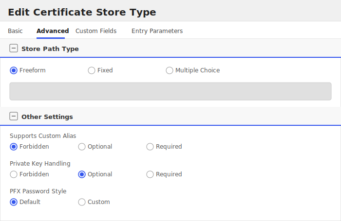

   > For Keyfactor **Command versions 24.4 and later**, a Certificate Format dropdown is available with PFX and PEM options. Ensure that **PFX** is selected, as this determines the format of new and renewed certificates sent to the Orchestrator during a Management job. Currently, all Keyfactor-supported Orchestrator extensions support only PFX.

   ##### Custom Fields Tab
   Custom fields operate at the certificate store level and are used to control how the orchestrator connects to the remote target server containing the certificate store to be managed. The following custom fields should be added to the store type:

   | Name | Display Name | Description | Type | Default Value/Options | Required |
   | ---- | ------------ | ---- | --------------------- | -------- | ----------- |
   | spnwithport | SPN With Port | Internally set the -IncludePortInSPN option when creating the remote PowerShell connection. Needed for some Kerberos configurations. | Bool | false | 🔲 Unchecked |
   | WinRM Protocol | WinRM Protocol | Multiple choice value specifying which protocol to use.  Protocols https or http use WinRM to connect from Windows to Windows Servers.  Using ssh is only supported when running the orchestrator in a Linux environment. | MultipleChoice | https,http,ssh | ✅ Checked |
   | WinRM Port | WinRM Port | String value specifying the port number that the Windows target server's WinRM listener is configured to use. Example: '5986' for HTTPS or '5985' for HTTP.  By default, when using ssh in a Linux environment, the default port number is 22. | String | 5986 | ✅ Checked |
   | ServerUsername | Server Username | Username used to log into the target server for establishing the WinRM session. Example: 'administrator' or 'domain\username'.  (This field is automatically created) | Secret |  | 🔲 Unchecked |
   | ServerPassword | Server Password | Password corresponding to the Server Username used to log into the target server.  When establishing a SSH session from a Linux environment, the password must include the full SSH Private key. (This field is automatically created) | Secret |  | 🔲 Unchecked |
   | ServerUseSsl | Use SSL | Determine whether the server uses SSL or not (This field is automatically created) | Bool | true | ✅ Checked |
   | JEAEndpointName | JEA End Point Name | Name of the JEA endpoint to use for the session (This field is automatically created) | String |  | 🔲 Unchecked |

   The Custom Fields tab should look like this:

   

   ###### SPN With Port
   Internally set the -IncludePortInSPN option when creating the remote PowerShell connection. Needed for some Kerberos configurations.

   
   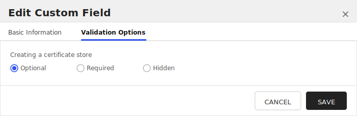


   ###### WinRM Protocol
   Multiple choice value specifying which protocol to use.  Protocols https or http use WinRM to connect from Windows to Windows Servers.  Using ssh is only supported when running the orchestrator in a Linux environment.

   
   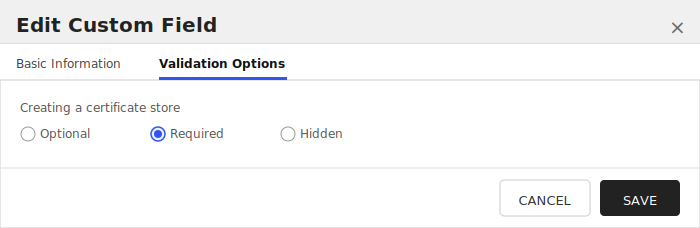


   ###### WinRM Port
   String value specifying the port number that the Windows target server's WinRM listener is configured to use. Example: '5986' for HTTPS or '5985' for HTTP.  By default, when using ssh in a Linux environment, the default port number is 22.

   
   


   ###### Server Username
   Username used to log into the target server for establishing the WinRM session. Example: 'administrator' or 'domain\username'.  (This field is automatically created)


   > [!IMPORTANT]
   > This field is created by the `Needs Server` on the Basic tab, do not create this field manually.


   ###### Server Password
   Password corresponding to the Server Username used to log into the target server.  When establishing a SSH session from a Linux environment, the password must include the full SSH Private key. (This field is automatically created)


   > [!IMPORTANT]
   > This field is created by the `Needs Server` on the Basic tab, do not create this field manually.


   ###### Use SSL
   Determine whether the server uses SSL or not (This field is automatically created)

   
   


   ###### JEA End Point Name
   Name of the JEA endpoint to use for the session (This field is automatically created)

   
   


   ##### Entry Parameters Tab

   | Name | Display Name | Description | Type | Default Value | Entry has a private key | Adding an entry | Removing an entry | Reenrolling an entry |
   | ---- | ------------ | ---- | ------------- | ----------------------- | ---------------- | ----------------- | ------------------- | ----------- |
   | ProviderName | Crypto Provider Name | Name of the Windows cryptographic service provider to use when generating and storing private keys. For more information, refer to the section 'Using Crypto Service Providers' | String |  | 🔲 Unchecked | 🔲 Unchecked | 🔲 Unchecked | 🔲 Unchecked |

   The Entry Parameters tab should look like this:

   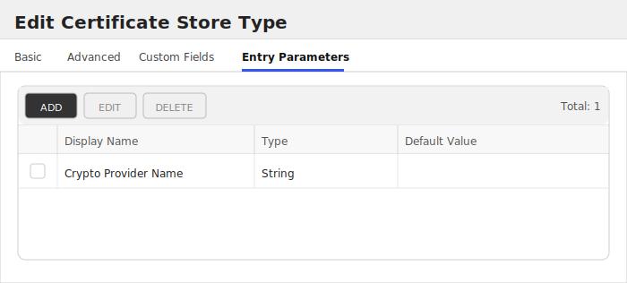
   ##### Crypto Provider Name
   Name of the Windows cryptographic service provider to use when generating and storing private keys. For more information, refer to the section 'Using Crypto Service Providers'

   
   


   </details>
</details>

### IISU

<details><summary>Click to expand details</summary>

#### Key Features and Representation

The IISU store type represents the IIS servers and their certificate bindings. It specifically caters to managing SSL/TLS certificates tied to IIS websites, allowing bind operations such as specifying site names, IP addresses, ports, and enabling Server Name Indication (SNI). By default, it supports job types like Inventory, Add, Remove, and Reenrollment, thereby offering comprehensive management capabilities for IIS certificates.

#### Understanding SSL Flags

When binding certificates to IIS sites, the `sslFlags` property can be configured to modify the behavior of HTTPS bindings.  
These flags are **bitwise values**, meaning they can be combined by adding their numeric values together.

The available SSL flags depend on the version of Windows Server and IIS.

Note that SNI/SSL Flags were introduced in IIS 8.0, so they are not available in Windows Server 2012 (IIS 8.0) and earlier versions, nor supported in this extension.

---

##### Windows Server 20162012 R2/Windows 8.1 (IIS 8.5)

| Value | Description |
|-----:|-------------|
| 0 | No SNI (traditional IP:Port binding) |
| 1 | Enable Server Name Indication (SNI) |
| 2 | Centralized Certificate Store (CCS) (Not Supported) |
| 4 | Disable HTTP/2 |

---

##### Windows Server 2016 (IIS 10.0)

| Value | Description |
|-----:|-------------|
| 0 | No SNI (traditional IP:Port binding) |
| 1 | Enable Server Name Indication (SNI) |
| 4 | Disable HTTP/2 |

---

##### Windows Server 2019 (IIS 10.0.17763)

| Value | Description |
|-----:|-------------|
| 0 | No SNI (traditional IP:Port binding) |
| 1 | Enable Server Name Indication (SNI) |
| 4 | Disable HTTP/2 |
| 8 | Disable OCSP Stapling |

---

##### Windows Server 2022 and later (IIS 10.0.20348+)

| Value | Description |
|-----:|-------------|
| 0 | No SNI (traditional IP:Port binding) |
| 1 | Enable Server Name Indication (SNI) |
| 4 | Disable HTTP/2 |
| 8 | Disable OCSP Stapling |
| 16 | Disable QUIC (HTTP/3) |
| 32 | Disable TLS 1.3 over TCP |
| 64 | Disable legacy TLS protocols |

---

##### Combining SSL Flags

Because `sslFlags` is a bitwise field, multiple options can be enabled by **adding their values together**.

**Example:**  
To enable SNI and disable HTTP/2:

The resulting SSL Flags value would be **5**.

---

##### ⚠️ Important Behavior Notes

When modifying SSL flags programmatically, **existing flag values must be preserved and combined correctly**.  
Changing SSL flags—especially SNI—without retaining the original binding configuration can lead to unintended behavior, including:

- HTTPS bindings being recreated
- Certificates appearing to be removed or reassigned
- Certificates being shared across bindings unexpectedly

This behavior occurs because SNI affects how IIS and HTTP.sys uniquely identify HTTPS bindings.  
Always update SSL flags using **bitwise operations** rather than overwriting the value.

For authoritative guidance on SSL bindings and the `sslFlags` property, refer to Microsoft documentation:

- IIS `<binding>` element (`sslFlags` attribute):  
  <https://learn.microsoft.com/iis/configuration/system.applicationhost/sites/site/bindings/binding>

- IIS SSL bindings and HTTP.sys behavior:  
  <https://learn.microsoft.com/iis/manage/configuring-security/how-to-set-up-ssl-on-iis>

---

##### Notes on Centralized Certificate Store (CCS)

**SSL Flag 2 (Centralized Certificate Store)** is currently **not supported** by this implementation.  
Using this flag will result in an error and the job will not complete successfully.

#### Limitations and Areas of Confusion

- **Caveats:** It's important to ensure that the Windows Remote Management (WinRM) is properly configured on the target server. The orchestrator relies on WinRM to perform its tasks, such as manipulating the Windows Certificate Stores. Misconfiguration of WinRM may lead to connection and permission issues.
<br><br>When performing <b>Inventory</b>, all bound certificates <i>regardless</i> to their store location will be returned.
<br><br>When executing an Add or Renew Management job, the Store Location will be considered and place the certificate in that location.

- **Limitations:** Users should be aware that for this store type to function correctly, certain permissions are necessary. While some advanced users successfully use non-administrator accounts with specific permissions, it is officially supported only with Local Administrator permissions. Complexities with interactions between Group Policy, WinRM, User Account Control, and other environmental factors may impede operations if not properly configured.

- **Custom Alias and Private Keys:** The store type does not support custom aliases for individual entries and requires private keys because IIS certificates without private keys would be invalid.

#### Supported Operations

| Operation    | Is Supported |
|--------------|--------------|
| Add          | ✅ Checked |
| Remove       | ✅ Checked |
| Discovery    | 🔲 Unchecked |
| Reenrollment | ✅ Checked |
| Create       | 🔲 Unchecked |

#### Store Type Creation

##### Using kfutil:
`kfutil` is a custom CLI for the Keyfactor Command API and can be used to create certificate store types.
For more information on [kfutil](https://github.com/Keyfactor/kfutil) check out the [docs](https://github.com/Keyfactor/kfutil?tab=readme-ov-file#quickstart)

   <details><summary>Click to expand IISU kfutil details</summary>

   ##### Using online definition from GitHub:
   This will reach out to GitHub and pull the latest store-type definition
   ```shell
   # IIS Bound Certificate
   kfutil store-types create IISU
   ```

   ##### Offline creation using integration-manifest file:
   If required, it is possible to create store types from the [integration-manifest.json](./integration-manifest.json) included in this repo.
   You would first download the [integration-manifest.json](./integration-manifest.json) and then run the following command
   in your offline environment.
   ```shell
   kfutil store-types create --from-file integration-manifest.json
   ```
   </details>

#### Manual Creation
Below are instructions on how to create the IISU store type manually in
the Keyfactor Command Portal

   <details><summary>Click to expand manual IISU details</summary>

   Create a store type called `IISU` with the attributes in the tables below:

   ##### Basic Tab
   | Attribute | Value | Description |
   | --------- | ----- | ----- |
   | Name | IIS Bound Certificate | Display name for the store type (may be customized) |
   | Short Name | IISU | Short display name for the store type |
   | Capability | IISU | Store type name orchestrator will register with. Check the box to allow entry of value |
   | Supports Add | ✅ Checked | Indicates that the Store Type supports Management Add |
   | Supports Remove | ✅ Checked | Indicates that the Store Type supports Management Remove |
   | Supports Discovery | 🔲 Unchecked | Indicates that the Store Type supports Discovery |
   | Supports Reenrollment | ✅ Checked | Indicates that the Store Type supports Reenrollment |
   | Supports Create | 🔲 Unchecked | Indicates that the Store Type supports store creation |
   | Needs Server | ✅ Checked | Determines if a target server name is required when creating store |
   | Blueprint Allowed | 🔲 Unchecked | Determines if store type may be included in an Orchestrator blueprint |
   | Uses PowerShell | 🔲 Unchecked | Determines if underlying implementation is PowerShell |
   | Requires Store Password | 🔲 Unchecked | Enables users to optionally specify a store password when defining a Certificate Store. |
   | Supports Entry Password | 🔲 Unchecked | Determines if an individual entry within a store can have a password. |

   The Basic tab should look like this:

   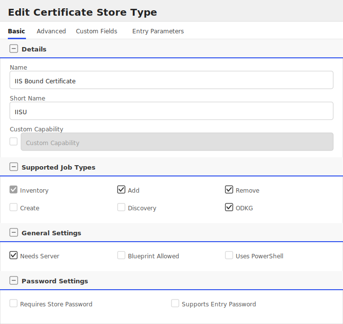

   ##### Advanced Tab
   | Attribute | Value | Description |
   | --------- | ----- | ----- |
   | Supports Custom Alias | Forbidden | Determines if an individual entry within a store can have a custom Alias. |
   | Private Key Handling | Required | This determines if Keyfactor can send the private key associated with a certificate to the store. |
   | PFX Password Style | Default | 'Default' - PFX password is randomly generated, 'Custom' - PFX password may be specified when the enrollment job is created (Requires the Allow Custom Password application setting to be enabled.) |

   The Advanced tab should look like this:

   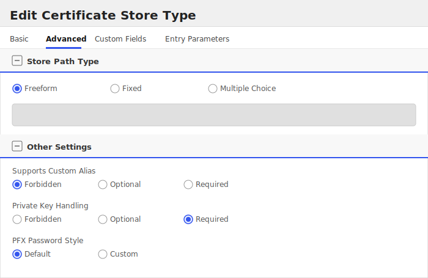

   > For Keyfactor **Command versions 24.4 and later**, a Certificate Format dropdown is available with PFX and PEM options. Ensure that **PFX** is selected, as this determines the format of new and renewed certificates sent to the Orchestrator during a Management job. Currently, all Keyfactor-supported Orchestrator extensions support only PFX.

   ##### Custom Fields Tab
   Custom fields operate at the certificate store level and are used to control how the orchestrator connects to the remote target server containing the certificate store to be managed. The following custom fields should be added to the store type:

   | Name | Display Name | Description | Type | Default Value/Options | Required |
   | ---- | ------------ | ---- | --------------------- | -------- | ----------- |
   | spnwithport | SPN With Port | Internally set the -IncludePortInSPN option when creating the remote PowerShell connection. Needed for some Kerberos configurations. | Bool | false | 🔲 Unchecked |
   | WinRM Protocol | WinRM Protocol | Multiple choice value specifying which protocol to use.  Protocols https or http use WinRM to connect from Windows to Windows Servers.  Using ssh is only supported when running the orchestrator in a Linux environment. | MultipleChoice | https,http,ssh | ✅ Checked |
   | WinRM Port | WinRM Port | String value specifying the port number that the Windows target server's WinRM listener is configured to use. Example: '5986' for HTTPS or '5985' for HTTP.  By default, when using ssh in a Linux environment, the default port number is 22. | String | 5986 | ✅ Checked |
   | ServerUsername | Server Username | Username used to log into the target server for establishing the WinRM session. Example: 'administrator' or 'domain\username'. (This field is automatically created) | Secret |  | 🔲 Unchecked |
   | ServerPassword | Server Password | Password corresponding to the Server Username used to log into the target server.  When establishing a SSH session from a Linux environment, the password must include the full SSH Private key. (This field is automatically created) | Secret |  | 🔲 Unchecked |
   | ServerUseSsl | Use SSL | Determine whether the server uses SSL or not (This field is automatically created) | Bool | true | ✅ Checked |
   | JEAEndpointName | JEA End Point Name | Name of the JEA endpoint to use for the session (This field is automatically created) | String |  | 🔲 Unchecked |

   The Custom Fields tab should look like this:

   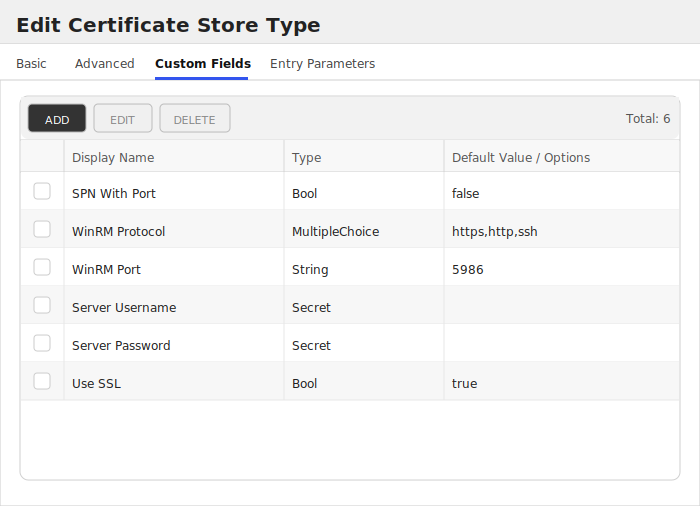

   ###### SPN With Port
   Internally set the -IncludePortInSPN option when creating the remote PowerShell connection. Needed for some Kerberos configurations.

   
   


   ###### WinRM Protocol
   Multiple choice value specifying which protocol to use.  Protocols https or http use WinRM to connect from Windows to Windows Servers.  Using ssh is only supported when running the orchestrator in a Linux environment.

   
   


   ###### WinRM Port
   String value specifying the port number that the Windows target server's WinRM listener is configured to use. Example: '5986' for HTTPS or '5985' for HTTP.  By default, when using ssh in a Linux environment, the default port number is 22.

   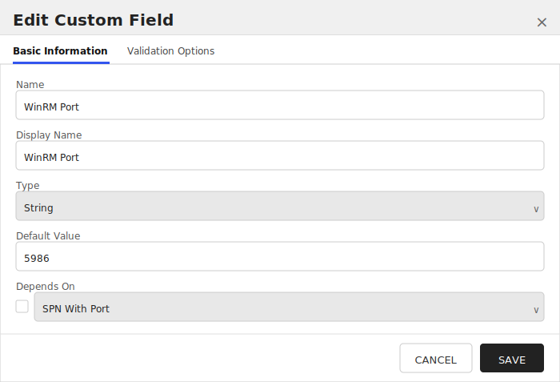
   


   ###### Server Username
   Username used to log into the target server for establishing the WinRM session. Example: 'administrator' or 'domain\username'. (This field is automatically created)


   > [!IMPORTANT]
   > This field is created by the `Needs Server` on the Basic tab, do not create this field manually.


   ###### Server Password
   Password corresponding to the Server Username used to log into the target server.  When establishing a SSH session from a Linux environment, the password must include the full SSH Private key. (This field is automatically created)


   > [!IMPORTANT]
   > This field is created by the `Needs Server` on the Basic tab, do not create this field manually.


   ###### Use SSL
   Determine whether the server uses SSL or not (This field is automatically created)

   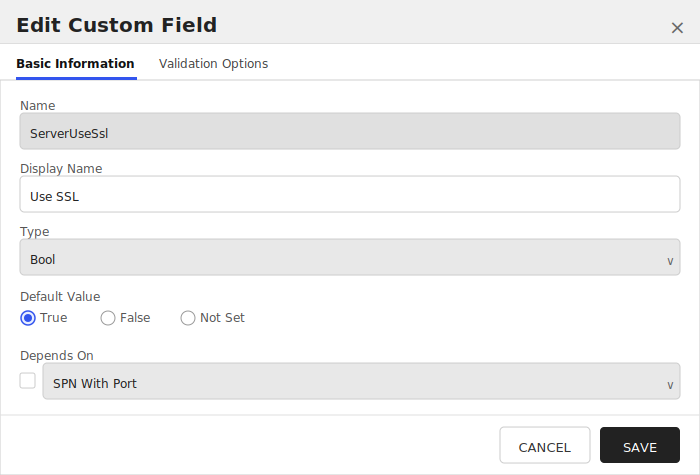
   


   ###### JEA End Point Name
   Name of the JEA endpoint to use for the session (This field is automatically created)

   
   


   ##### Entry Parameters Tab

   | Name | Display Name | Description | Type | Default Value | Entry has a private key | Adding an entry | Removing an entry | Reenrolling an entry |
   | ---- | ------------ | ---- | ------------- | ----------------------- | ---------------- | ----------------- | ------------------- | ----------- |
   | Port | Port | String value specifying the IP port to bind the certificate to for the IIS site. Example: '443' for HTTPS. | String | 443 | 🔲 Unchecked | 🔲 Unchecked | 🔲 Unchecked | 🔲 Unchecked |
   | IPAddress | IP Address | String value specifying the IP address to bind the certificate to for the IIS site. Example: '*' for all IP addresses or '192.168.1.1' for a specific IP address. | String | * | 🔲 Unchecked | ✅ Checked | ✅ Checked | ✅ Checked |
   | HostName | Host Name | String value specifying the host name (host header) to bind the certificate to for the IIS site. Leave blank for all host names or enter a specific hostname such as 'www.example.com'. | String |  | 🔲 Unchecked | 🔲 Unchecked | 🔲 Unchecked | 🔲 Unchecked |
   | SiteName | IIS Site Name | String value specifying the name of the IIS web site to bind the certificate to. Example: 'Default Web Site' or any custom site name such as 'MyWebsite'. | String | Default Web Site | 🔲 Unchecked | ✅ Checked | ✅ Checked | ✅ Checked |
   | SniFlag | SSL Flags | A 128-Bit Flag that determines what type of SSL settings you wish to use.  The default is 0, meaning No SNI.  For more information, check IIS documentation for the appropriate bit setting.) | String | 0 | 🔲 Unchecked | 🔲 Unchecked | 🔲 Unchecked | 🔲 Unchecked |
   | Protocol | Protocol | Multiple choice value specifying the protocol to bind to. Example: 'https' for secure communication. | MultipleChoice | https | 🔲 Unchecked | ✅ Checked | ✅ Checked | ✅ Checked |
   | ProviderName | Crypto Provider Name | Name of the Windows cryptographic service provider to use when generating and storing private keys. For more information, refer to the section 'Using Crypto Service Providers' | String |  | 🔲 Unchecked | 🔲 Unchecked | 🔲 Unchecked | 🔲 Unchecked |

   The Entry Parameters tab should look like this:

   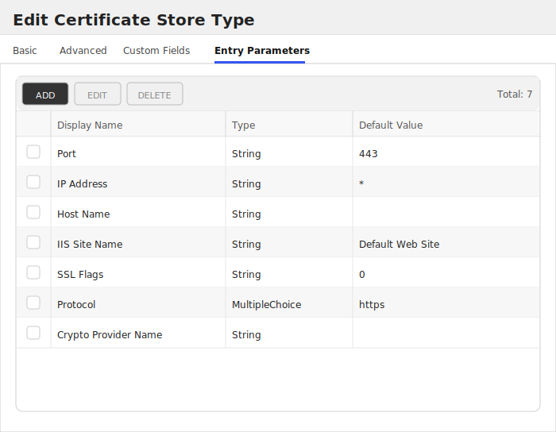
   ##### Port
   String value specifying the IP port to bind the certificate to for the IIS site. Example: '443' for HTTPS.

   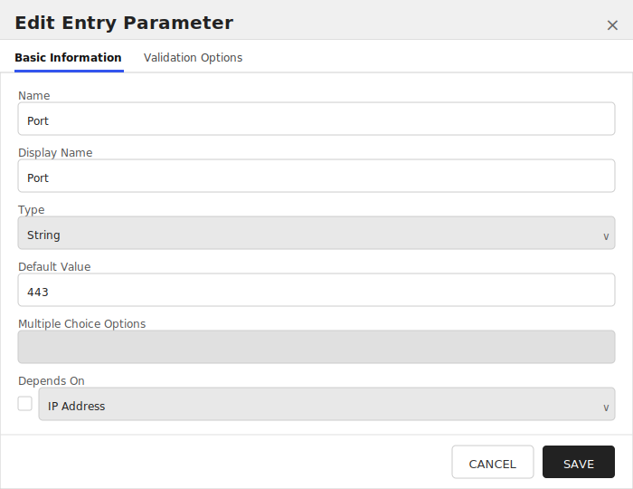
   


   ##### IP Address
   String value specifying the IP address to bind the certificate to for the IIS site. Example: '*' for all IP addresses or '192.168.1.1' for a specific IP address.

   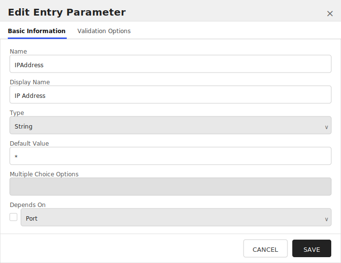
   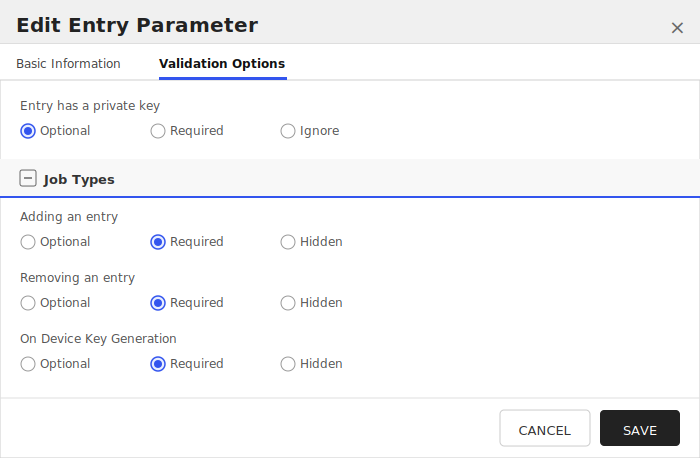


   ##### Host Name
   String value specifying the host name (host header) to bind the certificate to for the IIS site. Leave blank for all host names or enter a specific hostname such as 'www.example.com'.

   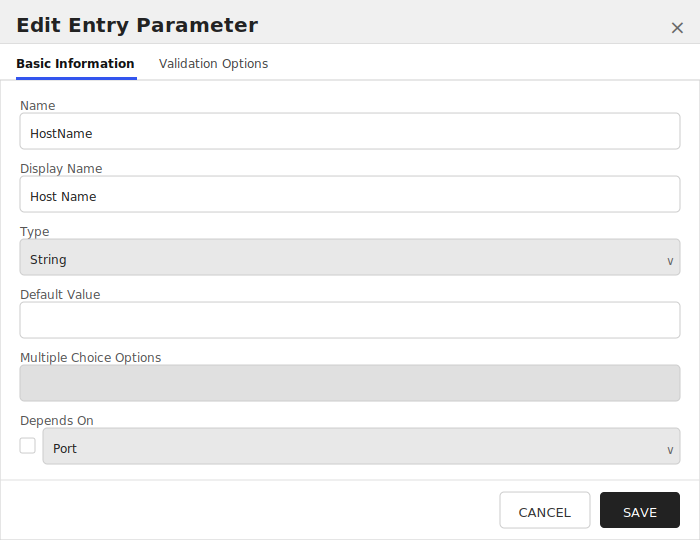
   


   ##### IIS Site Name
   String value specifying the name of the IIS web site to bind the certificate to. Example: 'Default Web Site' or any custom site name such as 'MyWebsite'.

   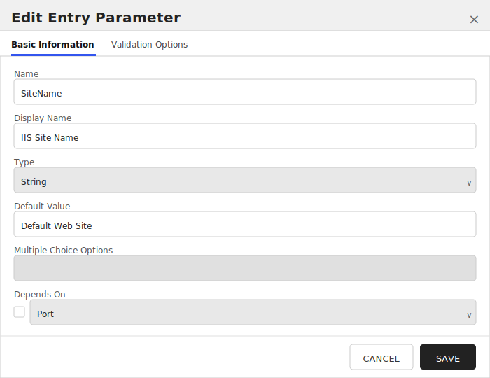
   


   ##### SSL Flags
   A 128-Bit Flag that determines what type of SSL settings you wish to use.  The default is 0, meaning No SNI.  For more information, check IIS documentation for the appropriate bit setting.)

   
   


   ##### Protocol
   Multiple choice value specifying the protocol to bind to. Example: 'https' for secure communication.

   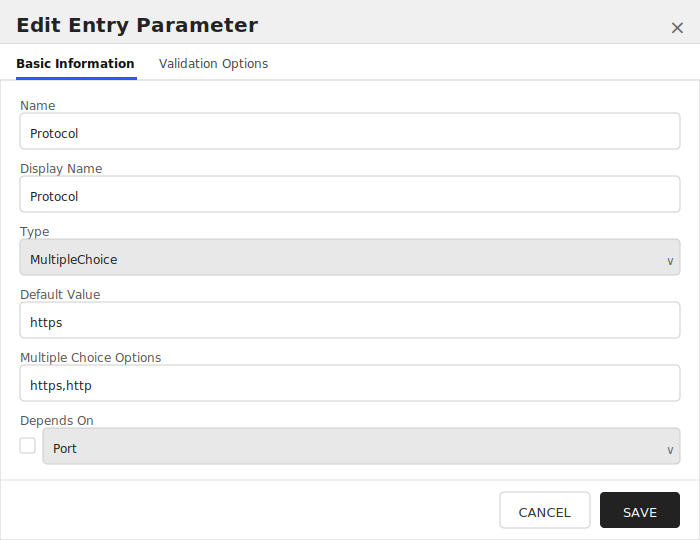
   


   ##### Crypto Provider Name
   Name of the Windows cryptographic service provider to use when generating and storing private keys. For more information, refer to the section 'Using Crypto Service Providers'

   
   


   </details>
</details>

### WinSql

<details><summary>Click to expand details</summary>

The WinSql Certificate Store Type, referred to by its short name 'WinSql,' is designed for the management of certificates used by SQL Server instances. This store type allows users to automate the process of adding, removing, reenrolling, and inventorying certificates associated with SQL Server, thereby simplifying the management of SSL/TLS certificates for database servers.

#### Caveats and Limitations

- **Caveats:** It's important to ensure that the Windows Remote Management (WinRM) is properly configured on the target server. The orchestrator relies on WinRM to perform its tasks, such as manipulating the Windows Certificate Stores. Misconfiguration of WinRM may lead to connection and permission issues.

- **Limitations:** Users should be aware that for this store type to function correctly, certain permissions are necessary. While some advanced users successfully use non-administrator accounts with specific permissions, it is officially supported only with Local Administrator permissions. Complexities with interactions between Group Policy, WinRM, User Account Control, and other environmental factors may impede operations if not properly configured.

#### Verifying a Certificate Binding

After the orchestrator binds a certificate to a SQL Server instance, **SQL Server Configuration Manager (SSCM) may show an empty value in the Certificate dropdown** under SQL Server Network Configuration → Protocols → Properties → Certificate tab. This is a known display limitation of SSCM and does not indicate a problem with the binding. SSCM applies its own certificate eligibility filter when populating the dropdown and may exclude certificates that SQL Server itself loads and uses successfully, particularly certificates bound programmatically rather than through the SSCM UI.

Use the following two-step process to confirm a binding is correct independently of SSCM.

##### Step 1 — Confirm the thumbprint is written to the registry

Run the following on the SQL Server machine, replacing `MSSQLSERVER` with your instance name if using a named instance:

```powershell
$instance = "MSSQLSERVER"
$full = Get-ItemPropertyValue "HKLM:\SOFTWARE\Microsoft\Microsoft SQL Server\Instance Names\SQL" -Name $instance
(Get-ItemPropertyValue "HKLM:\SOFTWARE\Microsoft\Microsoft SQL Server\$full\MSSQLServer\SuperSocketNetLib" -Name "Certificate").ToUpper()
```

This should return the thumbprint of the bound certificate. If the value is empty, the binding was not written to the registry.

##### Step 2 — Confirm SQL Server loaded the certificate

After the SQL Server service restarts, it writes a confirmation to the SQL Server error log. Run the following to check:

```powershell
$logPath = (Resolve-Path "C:\Program Files\Microsoft SQL Server\MSSQL*\MSSQL\Log\ERRORLOG").Path
Select-String -Path $logPath -Pattern "certificate" -CaseSensitive:$false | ForEach-Object { $_.Line }
```

A successful binding produces a line similar to the following:

```
The certificate [Cert Hash(sha1) "D54E6CFFD7DF55FF9610355025BD603D7C25A2D4"] was successfully loaded for encryption.
```

The thumbprint in this message should match the value returned in Step 1. If the log instead shows `was not found or was not loaded`, the SQL Server service account does not have read access to the certificate's private key — contact your administrator to review private key permissions.

##### Note on `encrypt_option`

Binding a certificate does not automatically encrypt all client connections. The certificate is loaded and ready for use, but SQL Server will only negotiate TLS for a given connection when either the client requests it (`Encrypt=True` in the connection string) or the server is configured to force encryption. To verify that TLS is active for a specific connection, execute the following after connecting to the instance:

```sql
SELECT session_id, encrypt_option, net_transport
FROM sys.dm_exec_connections
WHERE session_id = @@SPID
```

`encrypt_option = TRUE` confirms TLS is in use for that connection. Whether to enforce encryption server-wide (Force Encryption setting in SSCM) is a separate operational decision outside the scope of the orchestrator.

#### Supported Operations

| Operation    | Is Supported |
|--------------|--------------|
| Add          | ✅ Checked |
| Remove       | ✅ Checked |
| Discovery    | 🔲 Unchecked |
| Reenrollment | ✅ Checked |
| Create       | 🔲 Unchecked |

#### Store Type Creation

##### Using kfutil:
`kfutil` is a custom CLI for the Keyfactor Command API and can be used to create certificate store types.
For more information on [kfutil](https://github.com/Keyfactor/kfutil) check out the [docs](https://github.com/Keyfactor/kfutil?tab=readme-ov-file#quickstart)

   <details><summary>Click to expand WinSql kfutil details</summary>

   ##### Using online definition from GitHub:
   This will reach out to GitHub and pull the latest store-type definition
   ```shell
   # WinSql
   kfutil store-types create WinSql
   ```

   ##### Offline creation using integration-manifest file:
   If required, it is possible to create store types from the [integration-manifest.json](./integration-manifest.json) included in this repo.
   You would first download the [integration-manifest.json](./integration-manifest.json) and then run the following command
   in your offline environment.
   ```shell
   kfutil store-types create --from-file integration-manifest.json
   ```
   </details>

#### Manual Creation
Below are instructions on how to create the WinSql store type manually in
the Keyfactor Command Portal

   <details><summary>Click to expand manual WinSql details</summary>

   Create a store type called `WinSql` with the attributes in the tables below:

   ##### Basic Tab
   | Attribute | Value | Description |
   | --------- | ----- | ----- |
   | Name | WinSql | Display name for the store type (may be customized) |
   | Short Name | WinSql | Short display name for the store type |
   | Capability | WinSql | Store type name orchestrator will register with. Check the box to allow entry of value |
   | Supports Add | ✅ Checked | Indicates that the Store Type supports Management Add |
   | Supports Remove | ✅ Checked | Indicates that the Store Type supports Management Remove |
   | Supports Discovery | 🔲 Unchecked | Indicates that the Store Type supports Discovery |
   | Supports Reenrollment | ✅ Checked | Indicates that the Store Type supports Reenrollment |
   | Supports Create | 🔲 Unchecked | Indicates that the Store Type supports store creation |
   | Needs Server | ✅ Checked | Determines if a target server name is required when creating store |
   | Blueprint Allowed | ✅ Checked | Determines if store type may be included in an Orchestrator blueprint |
   | Uses PowerShell | 🔲 Unchecked | Determines if underlying implementation is PowerShell |
   | Requires Store Password | 🔲 Unchecked | Enables users to optionally specify a store password when defining a Certificate Store. |
   | Supports Entry Password | 🔲 Unchecked | Determines if an individual entry within a store can have a password. |

   The Basic tab should look like this:

   

   ##### Advanced Tab
   | Attribute | Value | Description |
   | --------- | ----- | ----- |
   | Supports Custom Alias | Forbidden | Determines if an individual entry within a store can have a custom Alias. |
   | Private Key Handling | Optional | This determines if Keyfactor can send the private key associated with a certificate to the store. |
   | PFX Password Style | Default | 'Default' - PFX password is randomly generated, 'Custom' - PFX password may be specified when the enrollment job is created (Requires the Allow Custom Password application setting to be enabled.) |

   The Advanced tab should look like this:

   

   > For Keyfactor **Command versions 24.4 and later**, a Certificate Format dropdown is available with PFX and PEM options. Ensure that **PFX** is selected, as this determines the format of new and renewed certificates sent to the Orchestrator during a Management job. Currently, all Keyfactor-supported Orchestrator extensions support only PFX.

   ##### Custom Fields Tab
   Custom fields operate at the certificate store level and are used to control how the orchestrator connects to the remote target server containing the certificate store to be managed. The following custom fields should be added to the store type:

   | Name | Display Name | Description | Type | Default Value/Options | Required |
   | ---- | ------------ | ---- | --------------------- | -------- | ----------- |
   | spnwithport | SPN With Port | Internally set the -IncludePortInSPN option when creating the remote PowerShell connection. Needed for some Kerberos configurations. | Bool | false | 🔲 Unchecked |
   | WinRM Protocol | WinRM Protocol | Multiple choice value specifying which protocol to use.  Protocols https or http use WinRM to connect from Windows to Windows Servers.  Using ssh is only supported when running the orchestrator in a Linux environment. | MultipleChoice | https,http,ssh | ✅ Checked |
   | WinRM Port | WinRM Port | String value specifying the port number that the Windows target server's WinRM listener is configured to use. Example: '5986' for HTTPS or '5985' for HTTP.  By default, when using ssh in a Linux environment, the default port number is 22. | String | 5986 | ✅ Checked |
   | ServerUsername | Server Username | Username used to log into the target server for establishing the WinRM session. Example: 'administrator' or 'domain\username'. (This field is automatically created) | Secret |  | 🔲 Unchecked |
   | ServerPassword | Server Password | Password corresponding to the Server Username used to log into the target server.  When establishing a SSH session from a Linux environment, the password must include the full SSH Private key. (This field is automatically created) | Secret |  | 🔲 Unchecked |
   | ServerUseSsl | Use SSL | Determine whether the server uses SSL or not (This field is automatically created) | Bool | true | ✅ Checked |
   | RestartService | Restart SQL Service After Cert Installed | Boolean value (true or false) indicating whether to restart the SQL Server service after installing the certificate. Example: 'true' to enable service restart after installation. | Bool | false | ✅ Checked |
   | JEAEndpointName | JEA End Point Name | Name of the JEA endpoint to use for the session (This field is automatically created) | String |  | 🔲 Unchecked |

   The Custom Fields tab should look like this:

   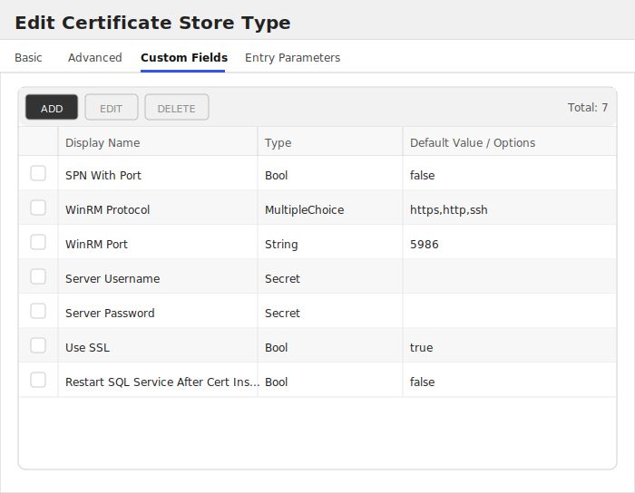

   ###### SPN With Port
   Internally set the -IncludePortInSPN option when creating the remote PowerShell connection. Needed for some Kerberos configurations.

   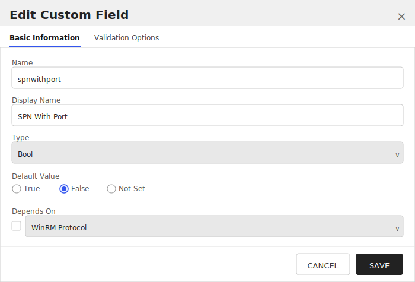
   


   ###### WinRM Protocol
   Multiple choice value specifying which protocol to use.  Protocols https or http use WinRM to connect from Windows to Windows Servers.  Using ssh is only supported when running the orchestrator in a Linux environment.

   
   


   ###### WinRM Port
   String value specifying the port number that the Windows target server's WinRM listener is configured to use. Example: '5986' for HTTPS or '5985' for HTTP.  By default, when using ssh in a Linux environment, the default port number is 22.

   
   


   ###### Server Username
   Username used to log into the target server for establishing the WinRM session. Example: 'administrator' or 'domain\username'. (This field is automatically created)


   > [!IMPORTANT]
   > This field is created by the `Needs Server` on the Basic tab, do not create this field manually.


   ###### Server Password
   Password corresponding to the Server Username used to log into the target server.  When establishing a SSH session from a Linux environment, the password must include the full SSH Private key. (This field is automatically created)


   > [!IMPORTANT]
   > This field is created by the `Needs Server` on the Basic tab, do not create this field manually.


   ###### Use SSL
   Determine whether the server uses SSL or not (This field is automatically created)

   
   


   ###### Restart SQL Service After Cert Installed
   Boolean value (true or false) indicating whether to restart the SQL Server service after installing the certificate. Example: 'true' to enable service restart after installation.

   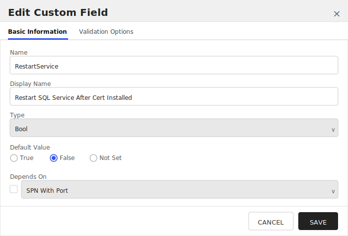
   


   ###### JEA End Point Name
   Name of the JEA endpoint to use for the session (This field is automatically created)

   
   


   ##### Entry Parameters Tab

   | Name | Display Name | Description | Type | Default Value | Entry has a private key | Adding an entry | Removing an entry | Reenrolling an entry |
   | ---- | ------------ | ---- | ------------- | ----------------------- | ---------------- | ----------------- | ------------------- | ----------- |
   | InstanceName | Instance Name | String value specifying the SQL Server instance name to bind the certificate to. Example: 'MSSQLServer' for the default instance or 'Instance1' for a named instance. | String |  | 🔲 Unchecked | 🔲 Unchecked | 🔲 Unchecked | 🔲 Unchecked |
   | ProviderName | Crypto Provider Name | Name of the Windows cryptographic service provider to use when generating and storing private keys. For more information, refer to the section 'Using Crypto Service Providers' | String |  | 🔲 Unchecked | 🔲 Unchecked | 🔲 Unchecked | 🔲 Unchecked |

   The Entry Parameters tab should look like this:

   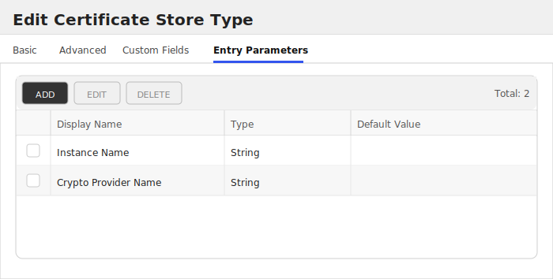
   ##### Instance Name
   String value specifying the SQL Server instance name to bind the certificate to. Example: 'MSSQLServer' for the default instance or 'Instance1' for a named instance.

   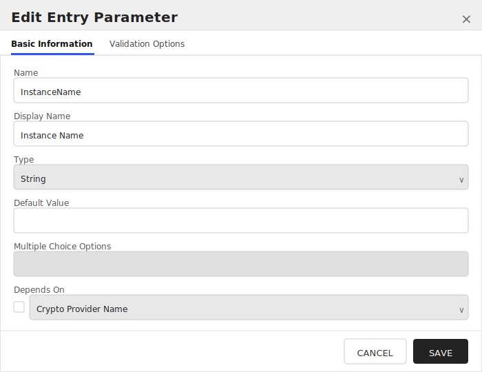
   


   ##### Crypto Provider Name
   Name of the Windows cryptographic service provider to use when generating and storing private keys. For more information, refer to the section 'Using Crypto Service Providers'

   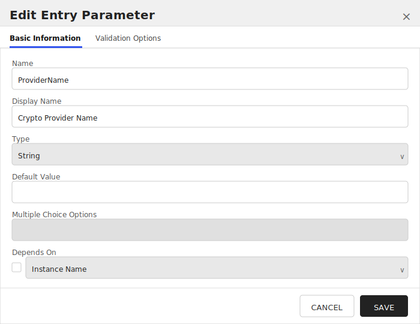
   


   </details>
</details>

### WinAdfs

<details><summary>Click to expand details</summary>

WinADFS is a store type designed for managing certificates within Microsoft Active Directory Federation Services (ADFS) environments. This store type enables users to automate the management of certificates used for securing ADFS communications, including tasks such as adding, removing, and renewing certificates associated with ADFS services.
* NOTE: Only the Service-Communications certificate is currently supported.  Follow your ADFS best practices for token encrypt and decrypt certificate management.
* NOTE: This extension also supports the auto-removal of expired certificates from the ADFS stores on the Primary and Secondary nodes during the certificate rotation process, along with restarting the ADFS service to apply changes.

#### ADFS Rotation Manager Requirements

When using WinADFS, the Universal Orchestrator must act as an agent and be installed on the Primary ADFS server within the ADFS farm. This is necessary because ADFS configurations and certificate management operations must be performed directly on the ADFS server itself to ensure proper functionality and security.

#### Supported Operations

| Operation    | Is Supported |
|--------------|--------------|
| Add          | ✅ Checked |
| Remove       | 🔲 Unchecked |
| Discovery    | 🔲 Unchecked |
| Reenrollment | 🔲 Unchecked |
| Create       | 🔲 Unchecked |

#### Store Type Creation

##### Using kfutil:
`kfutil` is a custom CLI for the Keyfactor Command API and can be used to create certificate store types.
For more information on [kfutil](https://github.com/Keyfactor/kfutil) check out the [docs](https://github.com/Keyfactor/kfutil?tab=readme-ov-file#quickstart)

   <details><summary>Click to expand WinAdfs kfutil details</summary>

   ##### Using online definition from GitHub:
   This will reach out to GitHub and pull the latest store-type definition
   ```shell
   # ADFS Rotation Manager
   kfutil store-types create WinAdfs
   ```

   ##### Offline creation using integration-manifest file:
   If required, it is possible to create store types from the [integration-manifest.json](./integration-manifest.json) included in this repo.
   You would first download the [integration-manifest.json](./integration-manifest.json) and then run the following command
   in your offline environment.
   ```shell
   kfutil store-types create --from-file integration-manifest.json
   ```
   </details>

#### Manual Creation
Below are instructions on how to create the WinAdfs store type manually in
the Keyfactor Command Portal

   <details><summary>Click to expand manual WinAdfs details</summary>

   Create a store type called `WinAdfs` with the attributes in the tables below:

   ##### Basic Tab
   | Attribute | Value | Description |
   | --------- | ----- | ----- |
   | Name | ADFS Rotation Manager | Display name for the store type (may be customized) |
   | Short Name | WinAdfs | Short display name for the store type |
   | Capability | WinAdfs | Store type name orchestrator will register with. Check the box to allow entry of value |
   | Supports Add | ✅ Checked | Indicates that the Store Type supports Management Add |
   | Supports Remove | 🔲 Unchecked | Indicates that the Store Type supports Management Remove |
   | Supports Discovery | 🔲 Unchecked | Indicates that the Store Type supports Discovery |
   | Supports Reenrollment | 🔲 Unchecked | Indicates that the Store Type supports Reenrollment |
   | Supports Create | 🔲 Unchecked | Indicates that the Store Type supports store creation |
   | Needs Server | ✅ Checked | Determines if a target server name is required when creating store |
   | Blueprint Allowed | ✅ Checked | Determines if store type may be included in an Orchestrator blueprint |
   | Uses PowerShell | 🔲 Unchecked | Determines if underlying implementation is PowerShell |
   | Requires Store Password | 🔲 Unchecked | Enables users to optionally specify a store password when defining a Certificate Store. |
   | Supports Entry Password | 🔲 Unchecked | Determines if an individual entry within a store can have a password. |

   The Basic tab should look like this:

   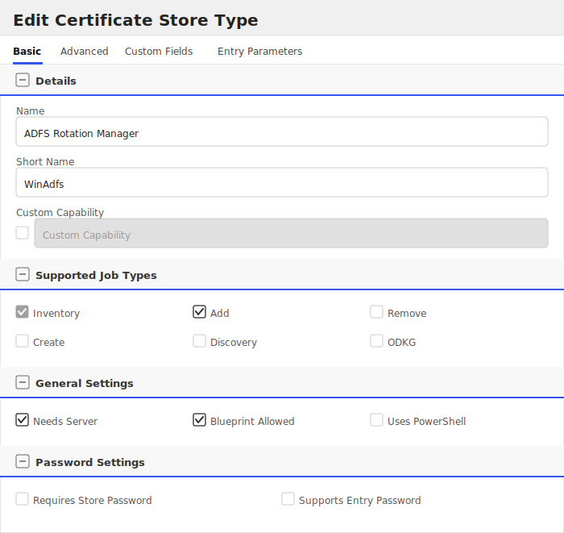

   ##### Advanced Tab
   | Attribute | Value | Description |
   | --------- | ----- | ----- |
   | Supports Custom Alias | Forbidden | Determines if an individual entry within a store can have a custom Alias. |
   | Private Key Handling | Required | This determines if Keyfactor can send the private key associated with a certificate to the store. |
   | PFX Password Style | Default | 'Default' - PFX password is randomly generated, 'Custom' - PFX password may be specified when the enrollment job is created (Requires the Allow Custom Password application setting to be enabled.) |

   The Advanced tab should look like this:

   

   > For Keyfactor **Command versions 24.4 and later**, a Certificate Format dropdown is available with PFX and PEM options. Ensure that **PFX** is selected, as this determines the format of new and renewed certificates sent to the Orchestrator during a Management job. Currently, all Keyfactor-supported Orchestrator extensions support only PFX.

   ##### Custom Fields Tab
   Custom fields operate at the certificate store level and are used to control how the orchestrator connects to the remote target server containing the certificate store to be managed. The following custom fields should be added to the store type:

   | Name | Display Name | Description | Type | Default Value/Options | Required |
   | ---- | ------------ | ---- | --------------------- | -------- | ----------- |
   | spnwithport | SPN With Port | Internally set the -IncludePortInSPN option when creating the remote PowerShell connection. Needed for some Kerberos configurations. | Bool | false | 🔲 Unchecked |
   | WinRM Protocol | WinRM Protocol | Multiple choice value specifying which protocol to use.  Protocols https or http use WinRM to connect from Windows to Windows Servers.  Using ssh is only supported when running the orchestrator in a Linux environment. | MultipleChoice | https,http,ssh | ✅ Checked |
   | WinRM Port | WinRM Port | String value specifying the port number that the Windows target server's WinRM listener is configured to use. Example: '5986' for HTTPS or '5985' for HTTP.  By default, when using ssh in a Linux environment, the default port number is 22. | String | 5986 | ✅ Checked |
   | ServerUsername | Server Username | Username used to log into the target server for establishing the WinRM session. Example: 'administrator' or 'domain\username'. (This field is automatically created) | Secret |  | 🔲 Unchecked |
   | ServerPassword | Server Password | Password corresponding to the Server Username used to log into the target server.  When establishing a SSH session from a Linux environment, the password must include the full SSH Private key. (This field is automatically created) | Secret |  | 🔲 Unchecked |
   | ServerUseSsl | Use SSL | Determine whether the server uses SSL or not (This field is automatically created) | Bool | true | ✅ Checked |

   The Custom Fields tab should look like this:

   

   ###### SPN With Port
   Internally set the -IncludePortInSPN option when creating the remote PowerShell connection. Needed for some Kerberos configurations.

   
   


   ###### WinRM Protocol
   Multiple choice value specifying which protocol to use.  Protocols https or http use WinRM to connect from Windows to Windows Servers.  Using ssh is only supported when running the orchestrator in a Linux environment.

   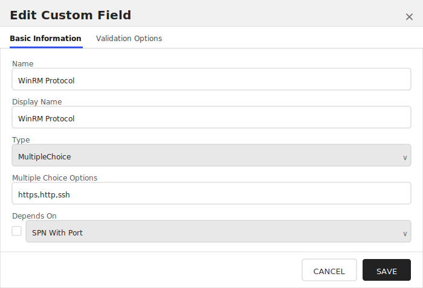
   


   ###### WinRM Port
   String value specifying the port number that the Windows target server's WinRM listener is configured to use. Example: '5986' for HTTPS or '5985' for HTTP.  By default, when using ssh in a Linux environment, the default port number is 22.

   
   


   ###### Server Username
   Username used to log into the target server for establishing the WinRM session. Example: 'administrator' or 'domain\username'. (This field is automatically created)


   > [!IMPORTANT]
   > This field is created by the `Needs Server` on the Basic tab, do not create this field manually.


   ###### Server Password
   Password corresponding to the Server Username used to log into the target server.  When establishing a SSH session from a Linux environment, the password must include the full SSH Private key. (This field is automatically created)


   > [!IMPORTANT]
   > This field is created by the `Needs Server` on the Basic tab, do not create this field manually.


   ###### Use SSL
   Determine whether the server uses SSL or not (This field is automatically created)

   
   


   ##### Entry Parameters Tab

   | Name | Display Name | Description | Type | Default Value | Entry has a private key | Adding an entry | Removing an entry | Reenrolling an entry |
   | ---- | ------------ | ---- | ------------- | ----------------------- | ---------------- | ----------------- | ------------------- | ----------- |
   | ProviderName | Crypto Provider Name | Name of the Windows cryptographic service provider to use when generating and storing private keys. For more information, refer to the section 'Using Crypto Service Providers' | String |  | 🔲 Unchecked | 🔲 Unchecked | 🔲 Unchecked | 🔲 Unchecked |

   The Entry Parameters tab should look like this:

   
   ##### Crypto Provider Name
   Name of the Windows cryptographic service provider to use when generating and storing private keys. For more information, refer to the section 'Using Crypto Service Providers'

   
   


   </details>
</details>


## Installation

1. **Download the latest Windows Certificate Universal Orchestrator extension from GitHub.**

    Navigate to the [Windows Certificate Universal Orchestrator extension GitHub version page](https://github.com/Keyfactor/Windows Certificate Orchestrator/releases/latest). Refer to the compatibility matrix below to determine which asset should be downloaded. Then, click the corresponding asset to download the zip archive.

   | Universal Orchestrator Version | Latest .NET version installed on the Universal Orchestrator server | `rollForward` condition in `Orchestrator.runtimeconfig.json` | `Windows Certificate Orchestrator` .NET version to download |
   | --------- | ----------- | ----------- | ----------- |
   | Between `11.0.0` and `11.5.1` (inclusive) | `net8.0` | `LatestMajor` | `net8.0` |
   | `11.6` _and_ newer | `net8.0` | | `net8.0` |

    Unzip the archive containing extension assemblies to a known location.

    > **Note** If you don't see an asset with a corresponding .NET version, you should always assume that it was compiled for `net8.0`.

2. **Locate the Universal Orchestrator extensions directory.**

    * **Default on Windows** - `C:\Program Files\Keyfactor\Keyfactor Orchestrator\extensions`
    * **Default on Linux** - `/opt/keyfactor/orchestrator/extensions`

3. **Create a new directory for the Windows Certificate Universal Orchestrator extension inside the extensions directory.**

    Create a new directory called `Windows Certificate Orchestrator`.
    > The directory name does not need to match any names used elsewhere; it just has to be unique within the extensions directory.

4. **Copy the contents of the downloaded and unzipped assemblies from __step 2__ to the `Windows Certificate Orchestrator` directory.**

5. **Restart the Universal Orchestrator service.**

    Refer to [Starting/Restarting the Universal Orchestrator service](https://software.keyfactor.com/Core-OnPrem/Current/Content/InstallingAgents/NetCoreOrchestrator/StarttheService.htm).

6. **(optional) PAM Integration**

    The Windows Certificate Universal Orchestrator extension is compatible with all supported Keyfactor PAM extensions to resolve PAM-eligible secrets. PAM extensions running on Universal Orchestrators enable secure retrieval of secrets from a connected PAM provider.

    To configure a PAM provider, [reference the Keyfactor Integration Catalog](https://keyfactor.github.io/integrations-catalog/content/pam) to select an extension and follow the associated instructions to install it on the Universal Orchestrator (remote).

> The above installation steps can be supplemented by the [official Command documentation](https://software.keyfactor.com/Core-OnPrem/Current/Content/InstallingAgents/NetCoreOrchestrator/CustomExtensions.htm?Highlight=extensions).

## Defining Certificate Stores

The Windows Certificate Universal Orchestrator extension implements 4 Certificate Store Types, each of which implements different functionality. Refer to the individual instructions below for each Certificate Store Type that you deemed necessary for your use case from the installation section.

<details><summary>Windows Certificate (WinCert)</summary>

### Store Creation

#### Manually with the Command UI

<details><summary>Click to expand details</summary>

1. **Navigate to the _Certificate Stores_ page in Keyfactor Command.**

    Log into Keyfactor Command, toggle the _Locations_ dropdown, and click _Certificate Stores_.

2. **Add a Certificate Store.**

    Click the Add button to add a new Certificate Store. Use the table below to populate the **Attributes** in the **Add** form.

   | Attribute | Description |
   | --------- | ----------- |
   | Category | Select "Windows Certificate" or the customized certificate store name from the previous step. |
   | Container | Optional container to associate certificate store with. |
   | Client Machine | Hostname of the Windows Server containing the certificate store to be managed. If this value is a hostname, a WinRM session will be established using the credentials specified in the Server Username and Server Password fields. For more information, see [Client Machine](#note-regarding-client-machine). |
   | Store Path | Windows certificate store path to manage. The store must exist in the Local Machine store on the target server, e.g., 'My' for the Personal Store or 'Root' for the Trusted Root Certification Authorities Store. |
   | Orchestrator | Select an approved orchestrator capable of managing `WinCert` certificates. Specifically, one with the `WinCert` capability. |
   | spnwithport | Internally set the -IncludePortInSPN option when creating the remote PowerShell connection. Needed for some Kerberos configurations. |
   | WinRM Protocol | Multiple choice value specifying which protocol to use.  Protocols https or http use WinRM to connect from Windows to Windows Servers.  Using ssh is only supported when running the orchestrator in a Linux environment. |
   | WinRM Port | String value specifying the port number that the Windows target server's WinRM listener is configured to use. Example: '5986' for HTTPS or '5985' for HTTP.  By default, when using ssh in a Linux environment, the default port number is 22. |
   | ServerUsername | Username used to log into the target server for establishing the WinRM session. Example: 'administrator' or 'domain\username'.  (This field is automatically created) |
   | ServerPassword | Password corresponding to the Server Username used to log into the target server.  When establishing a SSH session from a Linux environment, the password must include the full SSH Private key. (This field is automatically created) |
   | ServerUseSsl | Determine whether the server uses SSL or not (This field is automatically created) |
   | JEAEndpointName | Name of the JEA endpoint to use for the session (This field is automatically created) |

</details>

#### Using kfutil CLI

<details><summary>Click to expand details</summary>

1. **Generate a CSV template for the WinCert certificate store**

    ```shell
    kfutil stores import generate-template --store-type-name WinCert --outpath WinCert.csv
    ```
2. **Populate the generated CSV file**

    Open the CSV file, and reference the table below to populate parameters for each **Attribute**.

   | Attribute | Description |
   | --------- | ----------- |
   | Category | Select "Windows Certificate" or the customized certificate store name from the previous step. |
   | Container | Optional container to associate certificate store with. |
   | Client Machine | Hostname of the Windows Server containing the certificate store to be managed. If this value is a hostname, a WinRM session will be established using the credentials specified in the Server Username and Server Password fields. For more information, see [Client Machine](#note-regarding-client-machine). |
   | Store Path | Windows certificate store path to manage. The store must exist in the Local Machine store on the target server, e.g., 'My' for the Personal Store or 'Root' for the Trusted Root Certification Authorities Store. |
   | Orchestrator | Select an approved orchestrator capable of managing `WinCert` certificates. Specifically, one with the `WinCert` capability. |
   | Properties.spnwithport | Internally set the -IncludePortInSPN option when creating the remote PowerShell connection. Needed for some Kerberos configurations. |
   | Properties.WinRM Protocol | Multiple choice value specifying which protocol to use.  Protocols https or http use WinRM to connect from Windows to Windows Servers.  Using ssh is only supported when running the orchestrator in a Linux environment. |
   | Properties.WinRM Port | String value specifying the port number that the Windows target server's WinRM listener is configured to use. Example: '5986' for HTTPS or '5985' for HTTP.  By default, when using ssh in a Linux environment, the default port number is 22. |
   | Properties.ServerUsername | Username used to log into the target server for establishing the WinRM session. Example: 'administrator' or 'domain\username'.  (This field is automatically created) |
   | Properties.ServerPassword | Password corresponding to the Server Username used to log into the target server.  When establishing a SSH session from a Linux environment, the password must include the full SSH Private key. (This field is automatically created) |
   | Properties.ServerUseSsl | Determine whether the server uses SSL or not (This field is automatically created) |
   | Properties.JEAEndpointName | Name of the JEA endpoint to use for the session (This field is automatically created) |

3. **Import the CSV file to create the certificate stores**

    ```shell
    kfutil stores import csv --store-type-name WinCert --file WinCert.csv
    ```

</details>

#### PAM Provider Eligible Fields
<details><summary>Attributes eligible for retrieval by a PAM Provider on the Universal Orchestrator</summary>

If a PAM provider was installed _on the Universal Orchestrator_ in the [Installation](#Installation) section, the following parameters can be configured for retrieval _on the Universal Orchestrator_.

   | Attribute | Description |
   | --------- | ----------- |
   | ServerUsername | Username used to log into the target server for establishing the WinRM session. Example: 'administrator' or 'domain\username'.  (This field is automatically created) |
   | ServerPassword | Password corresponding to the Server Username used to log into the target server.  When establishing a SSH session from a Linux environment, the password must include the full SSH Private key. (This field is automatically created) |

Please refer to the **Universal Orchestrator (remote)** usage section ([PAM providers on the Keyfactor Integration Catalog](https://keyfactor.github.io/integrations-catalog/content/pam)) for your selected PAM provider for instructions on how to load attributes orchestrator-side.
> Any secret can be rendered by a PAM provider _installed on the Keyfactor Command server_. The above parameters are specific to attributes that can be fetched by an installed PAM provider running on the Universal Orchestrator server itself.

</details>

> The content in this section can be supplemented by the [official Command documentation](https://software.keyfactor.com/Core-OnPrem/Current/Content/ReferenceGuide/Certificate%20Stores.htm?Highlight=certificate%20store).

</details>

<details><summary>IIS Bound Certificate (IISU)</summary>

### Store Creation

#### Manually with the Command UI

<details><summary>Click to expand details</summary>

1. **Navigate to the _Certificate Stores_ page in Keyfactor Command.**

    Log into Keyfactor Command, toggle the _Locations_ dropdown, and click _Certificate Stores_.

2. **Add a Certificate Store.**

    Click the Add button to add a new Certificate Store. Use the table below to populate the **Attributes** in the **Add** form.

   | Attribute | Description |
   | --------- | ----------- |
   | Category | Select "IIS Bound Certificate" or the customized certificate store name from the previous step. |
   | Container | Optional container to associate certificate store with. |
   | Client Machine | Hostname of the Windows Server containing the IIS certificate store to be managed. If this value is a hostname, a WinRM session will be established using the credentials specified in the Server Username and Server Password fields.  For more information, see [Client Machine](#note-regarding-client-machine). |
   | Store Path | Windows certificate store path to manage. Choose 'My' for the Personal store or 'WebHosting' for the Web Hosting store. |
   | Orchestrator | Select an approved orchestrator capable of managing `IISU` certificates. Specifically, one with the `IISU` capability. |
   | spnwithport | Internally set the -IncludePortInSPN option when creating the remote PowerShell connection. Needed for some Kerberos configurations. |
   | WinRM Protocol | Multiple choice value specifying which protocol to use.  Protocols https or http use WinRM to connect from Windows to Windows Servers.  Using ssh is only supported when running the orchestrator in a Linux environment. |
   | WinRM Port | String value specifying the port number that the Windows target server's WinRM listener is configured to use. Example: '5986' for HTTPS or '5985' for HTTP.  By default, when using ssh in a Linux environment, the default port number is 22. |
   | ServerUsername | Username used to log into the target server for establishing the WinRM session. Example: 'administrator' or 'domain\username'. (This field is automatically created) |
   | ServerPassword | Password corresponding to the Server Username used to log into the target server.  When establishing a SSH session from a Linux environment, the password must include the full SSH Private key. (This field is automatically created) |
   | ServerUseSsl | Determine whether the server uses SSL or not (This field is automatically created) |
   | JEAEndpointName | Name of the JEA endpoint to use for the session (This field is automatically created) |

</details>

#### Using kfutil CLI

<details><summary>Click to expand details</summary>

1. **Generate a CSV template for the IISU certificate store**

    ```shell
    kfutil stores import generate-template --store-type-name IISU --outpath IISU.csv
    ```
2. **Populate the generated CSV file**

    Open the CSV file, and reference the table below to populate parameters for each **Attribute**.

   | Attribute | Description |
   | --------- | ----------- |
   | Category | Select "IIS Bound Certificate" or the customized certificate store name from the previous step. |
   | Container | Optional container to associate certificate store with. |
   | Client Machine | Hostname of the Windows Server containing the IIS certificate store to be managed. If this value is a hostname, a WinRM session will be established using the credentials specified in the Server Username and Server Password fields.  For more information, see [Client Machine](#note-regarding-client-machine). |
   | Store Path | Windows certificate store path to manage. Choose 'My' for the Personal store or 'WebHosting' for the Web Hosting store. |
   | Orchestrator | Select an approved orchestrator capable of managing `IISU` certificates. Specifically, one with the `IISU` capability. |
   | Properties.spnwithport | Internally set the -IncludePortInSPN option when creating the remote PowerShell connection. Needed for some Kerberos configurations. |
   | Properties.WinRM Protocol | Multiple choice value specifying which protocol to use.  Protocols https or http use WinRM to connect from Windows to Windows Servers.  Using ssh is only supported when running the orchestrator in a Linux environment. |
   | Properties.WinRM Port | String value specifying the port number that the Windows target server's WinRM listener is configured to use. Example: '5986' for HTTPS or '5985' for HTTP.  By default, when using ssh in a Linux environment, the default port number is 22. |
   | Properties.ServerUsername | Username used to log into the target server for establishing the WinRM session. Example: 'administrator' or 'domain\username'. (This field is automatically created) |
   | Properties.ServerPassword | Password corresponding to the Server Username used to log into the target server.  When establishing a SSH session from a Linux environment, the password must include the full SSH Private key. (This field is automatically created) |
   | Properties.ServerUseSsl | Determine whether the server uses SSL or not (This field is automatically created) |
   | Properties.JEAEndpointName | Name of the JEA endpoint to use for the session (This field is automatically created) |

3. **Import the CSV file to create the certificate stores**

    ```shell
    kfutil stores import csv --store-type-name IISU --file IISU.csv
    ```

</details>

#### PAM Provider Eligible Fields
<details><summary>Attributes eligible for retrieval by a PAM Provider on the Universal Orchestrator</summary>

If a PAM provider was installed _on the Universal Orchestrator_ in the [Installation](#Installation) section, the following parameters can be configured for retrieval _on the Universal Orchestrator_.

   | Attribute | Description |
   | --------- | ----------- |
   | ServerUsername | Username used to log into the target server for establishing the WinRM session. Example: 'administrator' or 'domain\username'. (This field is automatically created) |
   | ServerPassword | Password corresponding to the Server Username used to log into the target server.  When establishing a SSH session from a Linux environment, the password must include the full SSH Private key. (This field is automatically created) |

Please refer to the **Universal Orchestrator (remote)** usage section ([PAM providers on the Keyfactor Integration Catalog](https://keyfactor.github.io/integrations-catalog/content/pam)) for your selected PAM provider for instructions on how to load attributes orchestrator-side.
> Any secret can be rendered by a PAM provider _installed on the Keyfactor Command server_. The above parameters are specific to attributes that can be fetched by an installed PAM provider running on the Universal Orchestrator server itself.

</details>

> The content in this section can be supplemented by the [official Command documentation](https://software.keyfactor.com/Core-OnPrem/Current/Content/ReferenceGuide/Certificate%20Stores.htm?Highlight=certificate%20store).

</details>

<details><summary>WinSql (WinSql)</summary>

### Store Creation

#### Manually with the Command UI

<details><summary>Click to expand details</summary>

1. **Navigate to the _Certificate Stores_ page in Keyfactor Command.**

    Log into Keyfactor Command, toggle the _Locations_ dropdown, and click _Certificate Stores_.

2. **Add a Certificate Store.**

    Click the Add button to add a new Certificate Store. Use the table below to populate the **Attributes** in the **Add** form.

   | Attribute | Description |
   | --------- | ----------- |
   | Category | Select "WinSql" or the customized certificate store name from the previous step. |
   | Container | Optional container to associate certificate store with. |
   | Client Machine | Hostname of the Windows Server containing the SQL Server Certificate Store to be managed. If this value is a hostname, a WinRM session will be established using the credentials specified in the Server Username and Server Password fields. For more information, see [Client Machine](#note-regarding-client-machine). |
   | Store Path | Fixed string value 'My' indicating the Personal store on the Local Machine. This denotes the Windows certificate store to be managed for SQL Server. |
   | Orchestrator | Select an approved orchestrator capable of managing `WinSql` certificates. Specifically, one with the `WinSql` capability. |
   | spnwithport | Internally set the -IncludePortInSPN option when creating the remote PowerShell connection. Needed for some Kerberos configurations. |
   | WinRM Protocol | Multiple choice value specifying which protocol to use.  Protocols https or http use WinRM to connect from Windows to Windows Servers.  Using ssh is only supported when running the orchestrator in a Linux environment. |
   | WinRM Port | String value specifying the port number that the Windows target server's WinRM listener is configured to use. Example: '5986' for HTTPS or '5985' for HTTP.  By default, when using ssh in a Linux environment, the default port number is 22. |
   | ServerUsername | Username used to log into the target server for establishing the WinRM session. Example: 'administrator' or 'domain\username'. (This field is automatically created) |
   | ServerPassword | Password corresponding to the Server Username used to log into the target server.  When establishing a SSH session from a Linux environment, the password must include the full SSH Private key. (This field is automatically created) |
   | ServerUseSsl | Determine whether the server uses SSL or not (This field is automatically created) |
   | RestartService | Boolean value (true or false) indicating whether to restart the SQL Server service after installing the certificate. Example: 'true' to enable service restart after installation. |
   | JEAEndpointName | Name of the JEA endpoint to use for the session (This field is automatically created) |

</details>

#### Using kfutil CLI

<details><summary>Click to expand details</summary>

1. **Generate a CSV template for the WinSql certificate store**

    ```shell
    kfutil stores import generate-template --store-type-name WinSql --outpath WinSql.csv
    ```
2. **Populate the generated CSV file**

    Open the CSV file, and reference the table below to populate parameters for each **Attribute**.

   | Attribute | Description |
   | --------- | ----------- |
   | Category | Select "WinSql" or the customized certificate store name from the previous step. |
   | Container | Optional container to associate certificate store with. |
   | Client Machine | Hostname of the Windows Server containing the SQL Server Certificate Store to be managed. If this value is a hostname, a WinRM session will be established using the credentials specified in the Server Username and Server Password fields. For more information, see [Client Machine](#note-regarding-client-machine). |
   | Store Path | Fixed string value 'My' indicating the Personal store on the Local Machine. This denotes the Windows certificate store to be managed for SQL Server. |
   | Orchestrator | Select an approved orchestrator capable of managing `WinSql` certificates. Specifically, one with the `WinSql` capability. |
   | Properties.spnwithport | Internally set the -IncludePortInSPN option when creating the remote PowerShell connection. Needed for some Kerberos configurations. |
   | Properties.WinRM Protocol | Multiple choice value specifying which protocol to use.  Protocols https or http use WinRM to connect from Windows to Windows Servers.  Using ssh is only supported when running the orchestrator in a Linux environment. |
   | Properties.WinRM Port | String value specifying the port number that the Windows target server's WinRM listener is configured to use. Example: '5986' for HTTPS or '5985' for HTTP.  By default, when using ssh in a Linux environment, the default port number is 22. |
   | Properties.ServerUsername | Username used to log into the target server for establishing the WinRM session. Example: 'administrator' or 'domain\username'. (This field is automatically created) |
   | Properties.ServerPassword | Password corresponding to the Server Username used to log into the target server.  When establishing a SSH session from a Linux environment, the password must include the full SSH Private key. (This field is automatically created) |
   | Properties.ServerUseSsl | Determine whether the server uses SSL or not (This field is automatically created) |
   | Properties.RestartService | Boolean value (true or false) indicating whether to restart the SQL Server service after installing the certificate. Example: 'true' to enable service restart after installation. |
   | Properties.JEAEndpointName | Name of the JEA endpoint to use for the session (This field is automatically created) |

3. **Import the CSV file to create the certificate stores**

    ```shell
    kfutil stores import csv --store-type-name WinSql --file WinSql.csv
    ```

</details>

#### PAM Provider Eligible Fields
<details><summary>Attributes eligible for retrieval by a PAM Provider on the Universal Orchestrator</summary>

If a PAM provider was installed _on the Universal Orchestrator_ in the [Installation](#Installation) section, the following parameters can be configured for retrieval _on the Universal Orchestrator_.

   | Attribute | Description |
   | --------- | ----------- |
   | ServerUsername | Username used to log into the target server for establishing the WinRM session. Example: 'administrator' or 'domain\username'. (This field is automatically created) |
   | ServerPassword | Password corresponding to the Server Username used to log into the target server.  When establishing a SSH session from a Linux environment, the password must include the full SSH Private key. (This field is automatically created) |

Please refer to the **Universal Orchestrator (remote)** usage section ([PAM providers on the Keyfactor Integration Catalog](https://keyfactor.github.io/integrations-catalog/content/pam)) for your selected PAM provider for instructions on how to load attributes orchestrator-side.
> Any secret can be rendered by a PAM provider _installed on the Keyfactor Command server_. The above parameters are specific to attributes that can be fetched by an installed PAM provider running on the Universal Orchestrator server itself.

</details>

> The content in this section can be supplemented by the [official Command documentation](https://software.keyfactor.com/Core-OnPrem/Current/Content/ReferenceGuide/Certificate%20Stores.htm?Highlight=certificate%20store).

</details>

<details><summary>ADFS Rotation Manager (WinAdfs)</summary>

When creating a Certificate Store for WinADFS, the Client Machine name must be set as an agent and use the LocalMachine moniker, for example: myADFSPrimary|LocalMachine.

### Store Creation

#### Manually with the Command UI

<details><summary>Click to expand details</summary>

1. **Navigate to the _Certificate Stores_ page in Keyfactor Command.**

    Log into Keyfactor Command, toggle the _Locations_ dropdown, and click _Certificate Stores_.

2. **Add a Certificate Store.**

    Click the Add button to add a new Certificate Store. Use the table below to populate the **Attributes** in the **Add** form.

   | Attribute | Description |
   | --------- | ----------- |
   | Category | Select "ADFS Rotation Manager" or the customized certificate store name from the previous step. |
   | Container | Optional container to associate certificate store with. |
   | Client Machine | Since this extension type must run as an agent (The UO Must be installed on the PRIMARY ADFS Server), the ClientMachine must follow the naming convention as outlined in the Client Machine Instructions. Secondary ADFS Nodes will be automatically be updated with the same certificate added on the PRIMARY ADFS server. |
   | Store Path | Fixed string value of 'My' indicating the Personal store on the Local Machine. All ADFS Service-Communications certificates are located in the 'My' personal store by default. |
   | Orchestrator | Select an approved orchestrator capable of managing `WinAdfs` certificates. Specifically, one with the `WinAdfs` capability. |
   | spnwithport | Internally set the -IncludePortInSPN option when creating the remote PowerShell connection. Needed for some Kerberos configurations. |
   | WinRM Protocol | Multiple choice value specifying which protocol to use.  Protocols https or http use WinRM to connect from Windows to Windows Servers.  Using ssh is only supported when running the orchestrator in a Linux environment. |
   | WinRM Port | String value specifying the port number that the Windows target server's WinRM listener is configured to use. Example: '5986' for HTTPS or '5985' for HTTP.  By default, when using ssh in a Linux environment, the default port number is 22. |
   | ServerUsername | Username used to log into the target server for establishing the WinRM session. Example: 'administrator' or 'domain\username'. (This field is automatically created) |
   | ServerPassword | Password corresponding to the Server Username used to log into the target server.  When establishing a SSH session from a Linux environment, the password must include the full SSH Private key. (This field is automatically created) |
   | ServerUseSsl | Determine whether the server uses SSL or not (This field is automatically created) |

</details>

#### Using kfutil CLI

<details><summary>Click to expand details</summary>

1. **Generate a CSV template for the WinAdfs certificate store**

    ```shell
    kfutil stores import generate-template --store-type-name WinAdfs --outpath WinAdfs.csv
    ```
2. **Populate the generated CSV file**

    Open the CSV file, and reference the table below to populate parameters for each **Attribute**.

   | Attribute | Description |
   | --------- | ----------- |
   | Category | Select "ADFS Rotation Manager" or the customized certificate store name from the previous step. |
   | Container | Optional container to associate certificate store with. |
   | Client Machine | Since this extension type must run as an agent (The UO Must be installed on the PRIMARY ADFS Server), the ClientMachine must follow the naming convention as outlined in the Client Machine Instructions. Secondary ADFS Nodes will be automatically be updated with the same certificate added on the PRIMARY ADFS server. |
   | Store Path | Fixed string value of 'My' indicating the Personal store on the Local Machine. All ADFS Service-Communications certificates are located in the 'My' personal store by default. |
   | Orchestrator | Select an approved orchestrator capable of managing `WinAdfs` certificates. Specifically, one with the `WinAdfs` capability. |
   | Properties.spnwithport | Internally set the -IncludePortInSPN option when creating the remote PowerShell connection. Needed for some Kerberos configurations. |
   | Properties.WinRM Protocol | Multiple choice value specifying which protocol to use.  Protocols https or http use WinRM to connect from Windows to Windows Servers.  Using ssh is only supported when running the orchestrator in a Linux environment. |
   | Properties.WinRM Port | String value specifying the port number that the Windows target server's WinRM listener is configured to use. Example: '5986' for HTTPS or '5985' for HTTP.  By default, when using ssh in a Linux environment, the default port number is 22. |
   | Properties.ServerUsername | Username used to log into the target server for establishing the WinRM session. Example: 'administrator' or 'domain\username'. (This field is automatically created) |
   | Properties.ServerPassword | Password corresponding to the Server Username used to log into the target server.  When establishing a SSH session from a Linux environment, the password must include the full SSH Private key. (This field is automatically created) |
   | Properties.ServerUseSsl | Determine whether the server uses SSL or not (This field is automatically created) |

3. **Import the CSV file to create the certificate stores**

    ```shell
    kfutil stores import csv --store-type-name WinAdfs --file WinAdfs.csv
    ```

</details>

#### PAM Provider Eligible Fields
<details><summary>Attributes eligible for retrieval by a PAM Provider on the Universal Orchestrator</summary>

If a PAM provider was installed _on the Universal Orchestrator_ in the [Installation](#Installation) section, the following parameters can be configured for retrieval _on the Universal Orchestrator_.

   | Attribute | Description |
   | --------- | ----------- |
   | ServerUsername | Username used to log into the target server for establishing the WinRM session. Example: 'administrator' or 'domain\username'. (This field is automatically created) |
   | ServerPassword | Password corresponding to the Server Username used to log into the target server.  When establishing a SSH session from a Linux environment, the password must include the full SSH Private key. (This field is automatically created) |

Please refer to the **Universal Orchestrator (remote)** usage section ([PAM providers on the Keyfactor Integration Catalog](https://keyfactor.github.io/integrations-catalog/content/pam)) for your selected PAM provider for instructions on how to load attributes orchestrator-side.
> Any secret can be rendered by a PAM provider _installed on the Keyfactor Command server_. The above parameters are specific to attributes that can be fetched by an installed PAM provider running on the Universal Orchestrator server itself.

</details>

> The content in this section can be supplemented by the [official Command documentation](https://software.keyfactor.com/Core-OnPrem/Current/Content/ReferenceGuide/Certificate%20Stores.htm?Highlight=certificate%20store).

</details>


## Client Machine Instructions
Prior to version 2.6, this extension would only run in the Windows environment.  Version 2.6 and greater is capable of running on Linux, however, only the SSH protocol is supported.

If running as an agent (accessing stores on the server where the Universal Orchestrator Services is installed ONLY), the Client Machine can be entered, OR you can bypass a WinRM connection and access the local file system directly by adding "|LocalMachine" to the end of your value for Client Machine, for example "1.1.1.1|LocalMachine".  In this instance the value to the left of the pipe (|) is ignored.  It is important to make sure the values for Client Machine and Store Path together are unique for each certificate store created, as Keyfactor Command requires the Store Type you select, along with Client Machine, and Store Path together must be unique.  To ensure this, it is good practice to put the full DNS or IP Address to the left of the | character when setting up a certificate store that will be accessed without a WinRM connection.

## License

Apache License 2.0, see [LICENSE](LICENSE).

## Related Integrations

See all [Keyfactor Universal Orchestrator extensions](https://github.com/orgs/Keyfactor/repositories?q=orchestrator).
