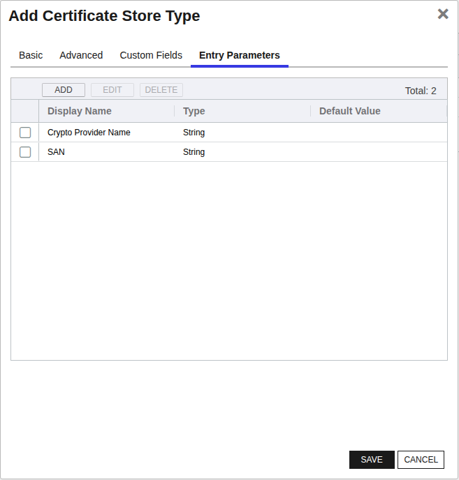
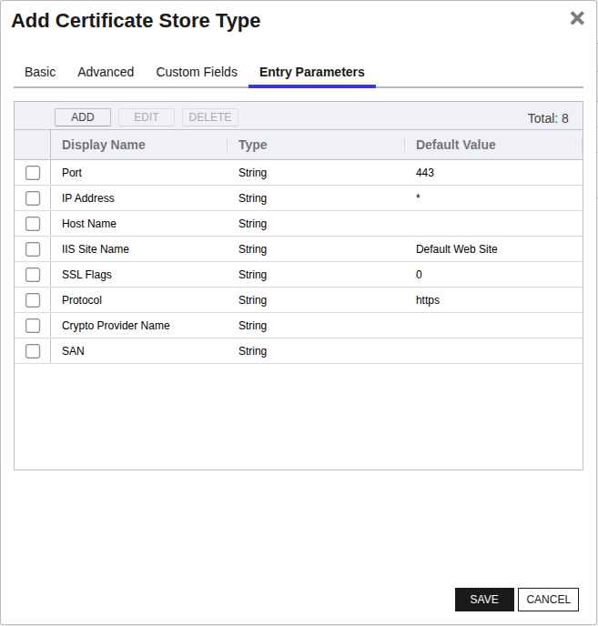

<h1 align="center" style="border-bottom: none">
    Windows Certificate Universal Orchestrator Extension
</h1>

<p align="center">
  <!-- Badges -->

<a href="https://github.com/Keyfactor/iis-orchestrator/releases"></a>


</p>

<p align="center">
  <!-- TOC -->
  <a href="#support">
    <b>Support</b>
  </a>
  ·
  <a href="#installation">
    <b>Installation</b>
  </a>
  ·
  <a href="#license">
    <b>License</b>
  </a>
  ·
  <a href="https://github.com/orgs/Keyfactor/repositories?q=orchestrator">
    <b>Related Integrations</b>
  </a>
</p>

## Overview

The Windows Certificate Orchestrator Extension is a multi-purpose integration that can remotely manage certificates on a Windows Server's Local Machine Store.  This extension currently manages certificates for the current store types:
* WinCert - Certificates defined by path set for the Certificate Store
* WinIIS - IIS Bound certificates 
* WinSQL - Certificates that are bound to the specified SQL Instances

By default, most certificates are stored in the “Personal” (My) and “Web Hosting” (WebHosting) stores.
For a complete list of local machine cert stores you can execute the PowerShell command:

	Get-ChildItem Cert:\LocalMachine

The returned list will contain the actual certificate store name to be used when entering store location.

This extension implements four job types:  Inventory, Management Add/Remove, and Reenrollment.

The Keyfactor Universal Orchestrator (UO) and WinCert Extension can be installed on either Windows or Linux operating systems.  A UO service managing certificates on remote servers is considered to be acting as an Orchestrator, while a UO Service managing local certificates on the same server running the service is considered an Agent.  When acting as an Orchestrator, connectivity from the orchestrator server hosting the WinCert extension to the orchestrated server hosting the certificate stores(s) being managed is achieved via either an SSH (for Linux orchestrated servers) or WinRM (for Windows orchestrated servers) connection.  When acting as an agent (Windows only), WinRM may still be used, OR the certificate store can be configured to bypass a WinRM connection and instead directly access the orchestrator server's certificate stores.


Please refer to the READMEs for each supported store type for more information on proper configuration and setup for these different stores.  The supported configurations of Universal Orchestrator hosts and managed orchestrated servers are detailed below:

| | UO Installed on Windows | UO Installed on Linux |
|-----|-----|------|
|Orchestrated Server hosting certificate store(s) on remote Windows server|WinRM connection | SSH connection |
|Certificate store(s) on same server as orchestrator service (Agent)| WinRM connection or local file system | Not Supported |  

WinRM is used to remotely manage the certificate stores and IIS bindings on Windows machines only.  WinRM must be properly configured to allow the orchestrator on the server to manage the certificates.  Setting up WinRM is not in the scope of this document.

**Note:**
In version 2.0 of the IIS Orchestrator, the certificate store type has been renamed and additional parameters have been added. Prior to 2.0 the certificate store type was called “IISBin” and as of 2.0 it is called “IISU”. If you have existing certificate stores of type “IISBin”, you have three options:
1. Leave them as is and continue to manage them with a pre 2.0 IIS Orchestrator Extension. Create the new IISU certificate store type and create any new IIS stores using the new type.
1. Delete existing IIS stores. Delete the IISBin store type. Create the new IISU store type. Recreate the IIS stores using the new IISU store type.
1. Convert existing IISBin certificate stores to IISU certificate stores. There is not currently a way to do this via the Keyfactor API, so direct updates to the underlying Keyfactor SQL database is required. A SQL script (IIS-Conversion.sql) is available in the repository to do this. Hosted customers, which do not have access to the underlying database, will need to work Keyfactor support to run the conversion. On-premises customers can run the script themselves, but are strongly encouraged to ensure that a SQL backup is taken prior running the script (and also be confident that they have a tested database restoration process.)

**Note: There is an additional (and deprecated) certificate store type of “IIS” that ships with the Keyfactor platform. Migration of certificate stores from the “IIS” type to either the “IISBin” or “IISU” types is not currently supported.**

**Note: If Looking to use GMSA Accounts to run the Service Keyfactor Command 10.2 or greater is required for No Value checkbox to work**

The Windows Certificate Universal Orchestrator extension implements 3 Certificate Store Types. Depending on your use case, you may elect to use one, or all of these Certificate Store Types. Descriptions of each are provided below.

- [Windows Certificate](#WinCert)

- [IIS Bound Certificate](#IISU)

- [WinSql](#WinSql)


## Compatibility

This integration is compatible with Keyfactor Universal Orchestrator version 10.1 and later.

## Support
The Windows Certificate Universal Orchestrator extension is supported by Keyfactor. If you require support for any issues or have feature request, please open a support ticket by either contacting your Keyfactor representative or via the Keyfactor Support Portal at https://support.keyfactor.com.

> If you want to contribute bug fixes or additional enhancements, use the **[Pull requests](../../pulls)** tab.

## Requirements & Prerequisites

Before installing the Windows Certificate Universal Orchestrator extension, we recommend that you install [kfutil](https://github.com/Keyfactor/kfutil). Kfutil is a command-line tool that simplifies the process of creating store types, installing extensions, and instantiating certificate stores in Keyfactor Command.


<details>
<summary><b>Using the WinCert Extension on Linux servers:</b></summary>

1. General SSH Setup Information: PowerShell 6 or higher and SSH must be installed on all computers.  Install SSH, including ssh server, that's appropriate for your platform.  You also need to install PowerShell from GitHub to get the SSH remoting feature.  The SSH server must be configured to create a SSH subsysten to host a PowerShell process on the remote computer.  It is suggested to turn off password authentication as this extension uses key-based authentication.  

2. SSH Authentication: When creating a Keyfactor certificate store for the WinCert orchestrator extension, the only protocol supported to communicate with Windows servers is ssh.  When providing the user id and password, the connection is attempted by creating a temporary private key file using the contents in the Password textbox. Therefore, the password field must contain the full SSH Private key.  

</details>

<details>
<summary><b>Using the WinCert Extension on Windows servers:</b></summary>

1. When orchestrating management of external (and potentially local) certificate stores, the WinCert Orchestrator Extension makes use of WinRM to connect to external certificate store servers.  The security context used is the user id entered in the Keyfactor Command certificate store.  Make sure that WinRM is set up on the orchestrated server and that the WinRM port (by convention, 5585 for HTTP and 5586 for HTTPS) is part of the certificate store path when setting up your certificate stores jobs.  If running as an agent, managing local certificate stores, local commands are run under the security context of the user account running the Keyfactor Universal Orchestrator Service.

</details>

Please consult with your company's system administrator for more information on configuring SSH or WinRM in your environment.

### PowerShell Requirements
PowerShell is extensively used to inventory and manage certificates across each Certificate Store Type.  Windows Desktop and Server includes PowerShell 5.1 that is capable of running all or most PowerShell functions.  If the Orchestrator is to run in a Linux environment using SSH as their communication protocol, PowerShell 6.1 or greater is required (7.4 or greater is recommended).  
In addition to PowerShell, IISU requires additional PowerShell modules to be installed and available.  These modules include:  WebAdministration and IISAdministration, versions 1.1.

### Security and Permission Considerations

From an official support point of view, Local Administrator permissions are required on the target server. Some customers have been successful with using other accounts and granting rights to the underlying certificate and private key stores. Due to complexities with the interactions between Group Policy, WinRM, User Account Control, and other unpredictable customer environmental factors, Keyfactor cannot provide assistance with using accounts other than the local administrator account.
 
For customers wishing to use something other than the local administrator account, the following information may be helpful:
 
*	The WinCert extensions (WinCert, IISU, WinSQL) create a WinRM (remote PowerShell) session to the target server in order to manipulate the Windows Certificate Stores, perform binding (in the case of the IISU extension), or to access the registry (in the case of the WinSQL extension). 
 
*	When the WinRM session is created, the certificate store credentials are used if they have been specified, otherwise the WinRM session is created in the context of the Universal Orchestrator (UO) Service account (which potentially could be the network service account, a regular account, or a GMSA account)
 
*	WinRM needs to be properly set up between the server hosting the UO and the target server. This means that a WinRM client running on the UO server when running in the context of the UO service account needs to be able to create a session on the target server using the configured credentials of the target server and any PowerShell commands running on the remote session need to have appropriate permissions. 
 
*	Even though a given account may be in the administrators group or have administrative privileges on the target system and may be able to execute certificate and binding operations when running locally, the same account may not work when being used via WinRM. User Account Control (UAC) can get in the way and filter out administrative privledges. UAC / WinRM configuration has a LocalAccountTokenFilterPolicy setting that can be adjusted to not filter out administrative privledges for remote users, but enabling this may have other security ramifications. 
 
*	The following list may not be exhaustive, but in general the account (when running under a remote WinRM session) needs permissions to:
    -	Instantiate and open a .NET X509Certificates.X509Store object for the target certificate store and be able to read and write both the certificates and related private keys. Note that ACL permissions on the stores and private keys are separate.
    -	Use the Import-Certificate, Get-WebSite, Get-WebBinding, and New-WebBinding PowerShell CmdLets.
    -	Create and delete temporary files.
    -	Execute certreq commands.
    -	Access any Cryptographic Service Provider (CSP) referenced in re-enrollment jobs.
    -	Read and Write values in the registry (HKLM:\SOFTWARE\Microsoft\Microsoft SQL Server) when performing SQL Server certificate binding.

### Using Crypto Service Providers (CSP)
When adding or reenrolling certificates, you may specify an optional CSP to be used when generating and storing the private keys.  This value would typically be specified when leveraging a Hardware Security Module (HSM). The specified cryptographic provider must be available on the target server being managed. 

The list of installed cryptographic providers can be obtained by running the PowerShell command on the target server:

     certutil -csplist

When performing a ReEnrollment or On Device Key Generation (ODKG) job, if no CSP is specified, a default value of 'Microsoft Strong Cryptographic Provider' will be used.  

When performing an Add job, if no CSP is specified, the machine's default CSP will be used, in most cases this could be the 'Microsoft Enhanced Cryptographic Provider v1.0' provider.

Each CSP only supports certain key types and algorithms.

Below is a brief summary of the CSPs and their support for RSA and ECC algorithms:
|CSP Name|Supports RSA?|Supports ECC?|
|---|---|---|
|Microsoft RSA SChannel Cryptographic Provider	|✅|❌|
|Microsoft Software Key Storage Provider	    |✅|✅|
|Microsoft Enhanced Cryptographic Provider	    |✅|❌|


## Certificate Store Types

To use the Windows Certificate Universal Orchestrator extension, you **must** create the Certificate Store Types required for your use-case. This only needs to happen _once_ per Keyfactor Command instance.

The Windows Certificate Universal Orchestrator extension implements 3 Certificate Store Types. Depending on your use case, you may elect to use one, or all of these Certificate Store Types.

### WinCert

<details><summary>Click to expand details</summary>


The Windows Certificate Certificate Store Type, known by its short name 'WinCert,' enables the management of certificates within the Windows local machine certificate stores. This store type is a versatile option for general Windows certificate management and supports functionalities including inventory, add, remove, and reenrollment of certificates.

The store type represents the various certificate stores present on a Windows Server. Users can specify these stores by entering the correct store path. To get a complete list of available certificate stores, the PowerShell command `Get-ChildItem Cert:\LocalMachine` can be executed, providing the actual certificate store names needed for configuration.

#### Key Features and Considerations

- **Functionality:** The WinCert store type supports essential certificate management tasks, such as inventorying existing certificates, adding new certificates, removing old ones, and reenrolling certificates.

- **Caveats:** It's important to ensure that the Windows Remote Management (WinRM) is properly configured on the target server. The orchestrator relies on WinRM to perform its tasks, such as manipulating the Windows Certificate Stores. Misconfiguration of WinRM may lead to connection and permission issues.

- **Limitations:** Users should be aware that for this store type to function correctly, certain permissions are necessary. While some advanced users successfully use non-administrator accounts with specific permissions, it is officially supported only with Local Administrator permissions. Complexities with interactions between Group Policy, WinRM, User Account Control, and other environmental factors may impede operations if not properly configured.


#### Supported Operations

| Operation    | Is Supported                                                                                                           |
|--------------|------------------------------------------------------------------------------------------------------------------------|
| Add          | ✅ Checked        |
| Remove       | ✅ Checked     |
| Discovery    | 🔲 Unchecked  |
| Reenrollment | ✅ Checked |
| Create       | 🔲 Unchecked     |

#### Store Type Creation

##### Using kfutil:
`kfutil` is a custom CLI for the Keyfactor Command API and can be used to create certificate store types.
For more information on [kfutil](https://github.com/Keyfactor/kfutil) check out the [docs](https://github.com/Keyfactor/kfutil?tab=readme-ov-file#quickstart)
   <details><summary>Click to expand WinCert kfutil details</summary>

   ##### Using online definition from GitHub:
   This will reach out to GitHub and pull the latest store-type definition
   ```shell
   # Windows Certificate
   kfutil store-types create WinCert
   ```

   ##### Offline creation using integration-manifest file:
   If required, it is possible to create store types from the [integration-manifest.json](./integration-manifest.json) included in this repo.
   You would first download the [integration-manifest.json](./integration-manifest.json) and then run the following command
   in your offline environment.
   ```shell
   kfutil store-types create --from-file integration-manifest.json
   ```
   </details>


#### Manual Creation
Below are instructions on how to create the WinCert store type manually in
the Keyfactor Command Portal
   <details><summary>Click to expand manual WinCert details</summary>

   Create a store type called `WinCert` with the attributes in the tables below:

   ##### Basic Tab
   | Attribute | Value | Description |
   | --------- | ----- | ----- |
   | Name | Windows Certificate | Display name for the store type (may be customized) |
   | Short Name | WinCert | Short display name for the store type |
   | Capability | WinCert | Store type name orchestrator will register with. Check the box to allow entry of value |
   | Supports Add | ✅ Checked | Check the box. Indicates that the Store Type supports Management Add |
   | Supports Remove | ✅ Checked | Check the box. Indicates that the Store Type supports Management Remove |
   | Supports Discovery | 🔲 Unchecked |  Indicates that the Store Type supports Discovery |
   | Supports Reenrollment | ✅ Checked |  Indicates that the Store Type supports Reenrollment |
   | Supports Create | 🔲 Unchecked |  Indicates that the Store Type supports store creation |
   | Needs Server | ✅ Checked | Determines if a target server name is required when creating store |
   | Blueprint Allowed | 🔲 Unchecked | Determines if store type may be included in an Orchestrator blueprint |
   | Uses PowerShell | 🔲 Unchecked | Determines if underlying implementation is PowerShell |
   | Requires Store Password | 🔲 Unchecked | Enables users to optionally specify a store password when defining a Certificate Store. |
   | Supports Entry Password | 🔲 Unchecked | Determines if an individual entry within a store can have a password. |

   The Basic tab should look like this:

   

   ##### Advanced Tab
   | Attribute | Value | Description |
   | --------- | ----- | ----- |
   | Supports Custom Alias | Forbidden | Determines if an individual entry within a store can have a custom Alias. |
   | Private Key Handling | Optional | This determines if Keyfactor can send the private key associated with a certificate to the store. Required because IIS certificates without private keys would be invalid. |
   | PFX Password Style | Default | 'Default' - PFX password is randomly generated, 'Custom' - PFX password may be specified when the enrollment job is created (Requires the Allow Custom Password application setting to be enabled.) |

   The Advanced tab should look like this:

   

   > For Keyfactor **Command versions 24.4 and later**, a Certificate Format dropdown is available with PFX and PEM options. Ensure that **PFX** is selected, as this determines the format of new and renewed certificates sent to the Orchestrator during a Management job. Currently, all Keyfactor-supported Orchestrator extensions support only PFX.

   ##### Custom Fields Tab
   Custom fields operate at the certificate store level and are used to control how the orchestrator connects to the remote target server containing the certificate store to be managed. The following custom fields should be added to the store type:

   | Name | Display Name | Description | Type | Default Value/Options | Required |
   | ---- | ------------ | ---- | --------------------- | -------- | ----------- |
   | spnwithport | SPN With Port | Internally set the -IncludePortInSPN option when creating the remote PowerShell connection. Needed for some Kerberos configurations. | Bool | false | 🔲 Unchecked |
   | WinRM Protocol | WinRM Protocol | Multiple choice value specifying which protocol to use.  Protocols https or http use WinRM to connect from Windows to Windows Servers.  Using ssh is only supported when running the orchestrator in a Linux environment. | MultipleChoice | https,http,ssh | ✅ Checked |
   | WinRM Port | WinRM Port | String value specifying the port number that the Windows target server's WinRM listener is configured to use. Example: '5986' for HTTPS or '5985' for HTTP.  By default, when using ssh in a Linux environment, the default port number is 22. | String | 5986 | ✅ Checked |
   | ServerUsername | Server Username | Username used to log into the target server for establishing the WinRM session. Example: 'administrator' or 'domain\username'. | Secret |  | 🔲 Unchecked |
   | ServerPassword | Server Password | Password corresponding to the Server Username used to log into the target server.  When establishing a SSH session from a Linux environment, the password must include the full SSH Private key. | Secret |  | 🔲 Unchecked |
   | ServerUseSsl | Use SSL | Determine whether the server uses SSL or not (This field is automatically created) | Bool | true | ✅ Checked |

   The Custom Fields tab should look like this:

   

   ##### Entry Parameters Tab

   | Name | Display Name | Description | Type | Default Value | Entry has a private key | Adding an entry | Removing an entry | Reenrolling an entry |
   | ---- | ------------ | ---- | ------------- | ----------------------- | ---------------- | ----------------- | ------------------- | ----------- |
   | ProviderName | Crypto Provider Name | Name of the Windows cryptographic service provider to use when generating and storing private keys. For more information, refer to the section 'Using Crypto Service Providers' | String |  | 🔲 Unchecked | 🔲 Unchecked | 🔲 Unchecked | 🔲 Unchecked |
   | SAN | SAN | String value specifying the Subject Alternative Name (SAN) to be used when performing reenrollment jobs. Format as a list of <san_type>=<san_value> entries separated by ampersands; Example: 'dns=www.example.com&dns=www.example2.com' for multiple SANs. Can be made optional if RFC 2818 is disabled on the CA. | String |  | 🔲 Unchecked | 🔲 Unchecked | 🔲 Unchecked | ✅ Checked |

   The Entry Parameters tab should look like this:

   

   </details>
</details>

### IISU

<details><summary>Click to expand details</summary>


The IIS Bound Certificate Store Type, identified by its short name 'IISU,' is designed for the management of certificates bound to IIS (Internet Information Services) servers. This store type allows users to automate and streamline the process of adding, removing, and reenrolling certificates for IIS sites, making it significantly easier to manage web server certificates.

#### Key Features and Representation

The IISU store type represents the IIS servers and their certificate bindings. It specifically caters to managing SSL/TLS certificates tied to IIS websites, allowing bind operations such as specifying site names, IP addresses, ports, and enabling Server Name Indication (SNI). By default, it supports job types like Inventory, Add, Remove, and Reenrollment, thereby offering comprehensive management capabilities for IIS certificates.

#### Limitations and Areas of Confusion

- **Caveats:** It's important to ensure that the Windows Remote Management (WinRM) is properly configured on the target server. The orchestrator relies on WinRM to perform its tasks, such as manipulating the Windows Certificate Stores. Misconfiguration of WinRM may lead to connection and permission issues.
<br><br>When performing <b>Inventory</b>, all bound certificates <i>regardless</i> to their store location will be returned.
<br><br>When executing an Add or Renew Management job, the Store Location will be considered and place the certificate in that location.

- **Limitations:** Users should be aware that for this store type to function correctly, certain permissions are necessary. While some advanced users successfully use non-administrator accounts with specific permissions, it is officially supported only with Local Administrator permissions. Complexities with interactions between Group Policy, WinRM, User Account Control, and other environmental factors may impede operations if not properly configured.

- **Custom Alias and Private Keys:** The store type does not support custom aliases for individual entries and requires private keys because IIS certificates without private keys would be invalid.


#### Supported Operations

| Operation    | Is Supported                                                                                                           |
|--------------|------------------------------------------------------------------------------------------------------------------------|
| Add          | ✅ Checked        |
| Remove       | ✅ Checked     |
| Discovery    | 🔲 Unchecked  |
| Reenrollment | ✅ Checked |
| Create       | 🔲 Unchecked     |

#### Store Type Creation

##### Using kfutil:
`kfutil` is a custom CLI for the Keyfactor Command API and can be used to create certificate store types.
For more information on [kfutil](https://github.com/Keyfactor/kfutil) check out the [docs](https://github.com/Keyfactor/kfutil?tab=readme-ov-file#quickstart)
   <details><summary>Click to expand IISU kfutil details</summary>

   ##### Using online definition from GitHub:
   This will reach out to GitHub and pull the latest store-type definition
   ```shell
   # IIS Bound Certificate
   kfutil store-types create IISU
   ```

   ##### Offline creation using integration-manifest file:
   If required, it is possible to create store types from the [integration-manifest.json](./integration-manifest.json) included in this repo.
   You would first download the [integration-manifest.json](./integration-manifest.json) and then run the following command
   in your offline environment.
   ```shell
   kfutil store-types create --from-file integration-manifest.json
   ```
   </details>


#### Manual Creation
Below are instructions on how to create the IISU store type manually in
the Keyfactor Command Portal
   <details><summary>Click to expand manual IISU details</summary>

   Create a store type called `IISU` with the attributes in the tables below:

   ##### Basic Tab
   | Attribute | Value | Description |
   | --------- | ----- | ----- |
   | Name | IIS Bound Certificate | Display name for the store type (may be customized) |
   | Short Name | IISU | Short display name for the store type |
   | Capability | IISU | Store type name orchestrator will register with. Check the box to allow entry of value |
   | Supports Add | ✅ Checked | Check the box. Indicates that the Store Type supports Management Add |
   | Supports Remove | ✅ Checked | Check the box. Indicates that the Store Type supports Management Remove |
   | Supports Discovery | 🔲 Unchecked |  Indicates that the Store Type supports Discovery |
   | Supports Reenrollment | ✅ Checked |  Indicates that the Store Type supports Reenrollment |
   | Supports Create | 🔲 Unchecked |  Indicates that the Store Type supports store creation |
   | Needs Server | ✅ Checked | Determines if a target server name is required when creating store |
   | Blueprint Allowed | 🔲 Unchecked | Determines if store type may be included in an Orchestrator blueprint |
   | Uses PowerShell | 🔲 Unchecked | Determines if underlying implementation is PowerShell |
   | Requires Store Password | 🔲 Unchecked | Enables users to optionally specify a store password when defining a Certificate Store. |
   | Supports Entry Password | 🔲 Unchecked | Determines if an individual entry within a store can have a password. |

   The Basic tab should look like this:

   

   ##### Advanced Tab
   | Attribute | Value | Description |
   | --------- | ----- | ----- |
   | Supports Custom Alias | Forbidden | Determines if an individual entry within a store can have a custom Alias. |
   | Private Key Handling | Required | This determines if Keyfactor can send the private key associated with a certificate to the store. Required because IIS certificates without private keys would be invalid. |
   | PFX Password Style | Default | 'Default' - PFX password is randomly generated, 'Custom' - PFX password may be specified when the enrollment job is created (Requires the Allow Custom Password application setting to be enabled.) |

   The Advanced tab should look like this:

   

   > For Keyfactor **Command versions 24.4 and later**, a Certificate Format dropdown is available with PFX and PEM options. Ensure that **PFX** is selected, as this determines the format of new and renewed certificates sent to the Orchestrator during a Management job. Currently, all Keyfactor-supported Orchestrator extensions support only PFX.

   ##### Custom Fields Tab
   Custom fields operate at the certificate store level and are used to control how the orchestrator connects to the remote target server containing the certificate store to be managed. The following custom fields should be added to the store type:

   | Name | Display Name | Description | Type | Default Value/Options | Required |
   | ---- | ------------ | ---- | --------------------- | -------- | ----------- |
   | spnwithport | SPN With Port | Internally set the -IncludePortInSPN option when creating the remote PowerShell connection. Needed for some Kerberos configurations. | Bool | false | 🔲 Unchecked |
   | WinRM Protocol | WinRM Protocol | Multiple choice value specifying which protocol to use.  Protocols https or http use WinRM to connect from Windows to Windows Servers.  Using ssh is only supported when running the orchestrator in a Linux environment. | MultipleChoice | https,http,ssh | ✅ Checked |
   | WinRM Port | WinRM Port | String value specifying the port number that the Windows target server's WinRM listener is configured to use. Example: '5986' for HTTPS or '5985' for HTTP.  By default, when using ssh in a Linux environment, the default port number is 22. | String | 5986 | ✅ Checked |
   | ServerUsername | Server Username | Username used to log into the target server for establishing the WinRM session. Example: 'administrator' or 'domain\username'. | Secret |  | 🔲 Unchecked |
   | ServerPassword | Server Password | Password corresponding to the Server Username used to log into the target server.  When establishing a SSH session from a Linux environment, the password must include the full SSH Private key. | Secret |  | 🔲 Unchecked |
   | ServerUseSsl | Use SSL | Determine whether the server uses SSL or not (This field is automatically created) | Bool | true | ✅ Checked |

   The Custom Fields tab should look like this:

   

   ##### Entry Parameters Tab

   | Name | Display Name | Description | Type | Default Value | Entry has a private key | Adding an entry | Removing an entry | Reenrolling an entry |
   | ---- | ------------ | ---- | ------------- | ----------------------- | ---------------- | ----------------- | ------------------- | ----------- |
   | Port | Port | String value specifying the IP port to bind the certificate to for the IIS site. Example: '443' for HTTPS. | String | 443 | 🔲 Unchecked | 🔲 Unchecked | 🔲 Unchecked | 🔲 Unchecked |
   | IPAddress | IP Address | String value specifying the IP address to bind the certificate to for the IIS site. Example: '*' for all IP addresses or '192.168.1.1' for a specific IP address. | String | * | 🔲 Unchecked | ✅ Checked | ✅ Checked | ✅ Checked |
   | HostName | Host Name | String value specifying the host name (host header) to bind the certificate to for the IIS site. Leave blank for all host names or enter a specific hostname such as 'www.example.com'. | String |  | 🔲 Unchecked | 🔲 Unchecked | 🔲 Unchecked | 🔲 Unchecked |
   | SiteName | IIS Site Name | String value specifying the name of the IIS web site to bind the certificate to. Example: 'Default Web Site' or any custom site name such as 'MyWebsite'. | String | Default Web Site | 🔲 Unchecked | ✅ Checked | ✅ Checked | ✅ Checked |
   | SniFlag | SSL Flags | A 128-Bit Flag that determines what type of SSL settings you wish to use.  The default is 0, meaning No SNI.  For more information, check IIS documentation for the appropriate bit setting.) | String | 0 | 🔲 Unchecked | 🔲 Unchecked | 🔲 Unchecked | 🔲 Unchecked |
   | Protocol | Protocol | Multiple choice value specifying the protocol to bind to. Example: 'https' for secure communication. | MultipleChoice | https | 🔲 Unchecked | ✅ Checked | ✅ Checked | ✅ Checked |
   | ProviderName | Crypto Provider Name | Name of the Windows cryptographic service provider to use when generating and storing private keys. For more information, refer to the section 'Using Crypto Service Providers' | String |  | 🔲 Unchecked | 🔲 Unchecked | 🔲 Unchecked | 🔲 Unchecked |
   | SAN | SAN | String value specifying the Subject Alternative Name (SAN) to be used when performing reenrollment jobs. Format as a list of <san_type>=<san_value> entries separated by ampersands; Example: 'dns=www.example.com&dns=www.example2.com' for multiple SANs. Can be made optional if RFC 2818 is disabled on the CA. | String |  | 🔲 Unchecked | 🔲 Unchecked | 🔲 Unchecked | ✅ Checked |

   The Entry Parameters tab should look like this:

   

   </details>
</details>

### WinSql

<details><summary>Click to expand details</summary>


The WinSql Certificate Store Type, referred to by its short name 'WinSql,' is designed for the management of certificates used by SQL Server instances. This store type allows users to automate the process of adding, removing, reenrolling, and inventorying certificates associated with SQL Server, thereby simplifying the management of SSL/TLS certificates for database servers.

#### Caveats and Limitations

- **Caveats:** It's important to ensure that the Windows Remote Management (WinRM) is properly configured on the target server. The orchestrator relies on WinRM to perform its tasks, such as manipulating the Windows Certificate Stores. Misconfiguration of WinRM may lead to connection and permission issues.

- **Limitations:** Users should be aware that for this store type to function correctly, certain permissions are necessary. While some advanced users successfully use non-administrator accounts with specific permissions, it is officially supported only with Local Administrator permissions. Complexities with interactions between Group Policy, WinRM, User Account Control, and other environmental factors may impede operations if not properly configured.


#### Supported Operations

| Operation    | Is Supported                                                                                                           |
|--------------|------------------------------------------------------------------------------------------------------------------------|
| Add          | ✅ Checked        |
| Remove       | ✅ Checked     |
| Discovery    | 🔲 Unchecked  |
| Reenrollment | 🔲 Unchecked |
| Create       | 🔲 Unchecked     |

#### Store Type Creation

##### Using kfutil:
`kfutil` is a custom CLI for the Keyfactor Command API and can be used to create certificate store types.
For more information on [kfutil](https://github.com/Keyfactor/kfutil) check out the [docs](https://github.com/Keyfactor/kfutil?tab=readme-ov-file#quickstart)
   <details><summary>Click to expand WinSql kfutil details</summary>

   ##### Using online definition from GitHub:
   This will reach out to GitHub and pull the latest store-type definition
   ```shell
   # WinSql
   kfutil store-types create WinSql
   ```

   ##### Offline creation using integration-manifest file:
   If required, it is possible to create store types from the [integration-manifest.json](./integration-manifest.json) included in this repo.
   You would first download the [integration-manifest.json](./integration-manifest.json) and then run the following command
   in your offline environment.
   ```shell
   kfutil store-types create --from-file integration-manifest.json
   ```
   </details>


#### Manual Creation
Below are instructions on how to create the WinSql store type manually in
the Keyfactor Command Portal
   <details><summary>Click to expand manual WinSql details</summary>

   Create a store type called `WinSql` with the attributes in the tables below:

   ##### Basic Tab
   | Attribute | Value | Description |
   | --------- | ----- | ----- |
   | Name | WinSql | Display name for the store type (may be customized) |
   | Short Name | WinSql | Short display name for the store type |
   | Capability | WinSql | Store type name orchestrator will register with. Check the box to allow entry of value |
   | Supports Add | ✅ Checked | Check the box. Indicates that the Store Type supports Management Add |
   | Supports Remove | ✅ Checked | Check the box. Indicates that the Store Type supports Management Remove |
   | Supports Discovery | 🔲 Unchecked |  Indicates that the Store Type supports Discovery |
   | Supports Reenrollment | 🔲 Unchecked |  Indicates that the Store Type supports Reenrollment |
   | Supports Create | 🔲 Unchecked |  Indicates that the Store Type supports store creation |
   | Needs Server | ✅ Checked | Determines if a target server name is required when creating store |
   | Blueprint Allowed | ✅ Checked | Determines if store type may be included in an Orchestrator blueprint |
   | Uses PowerShell | 🔲 Unchecked | Determines if underlying implementation is PowerShell |
   | Requires Store Password | 🔲 Unchecked | Enables users to optionally specify a store password when defining a Certificate Store. |
   | Supports Entry Password | 🔲 Unchecked | Determines if an individual entry within a store can have a password. |

   The Basic tab should look like this:

   

   ##### Advanced Tab
   | Attribute | Value | Description |
   | --------- | ----- | ----- |
   | Supports Custom Alias | Forbidden | Determines if an individual entry within a store can have a custom Alias. |
   | Private Key Handling | Optional | This determines if Keyfactor can send the private key associated with a certificate to the store. Required because IIS certificates without private keys would be invalid. |
   | PFX Password Style | Default | 'Default' - PFX password is randomly generated, 'Custom' - PFX password may be specified when the enrollment job is created (Requires the Allow Custom Password application setting to be enabled.) |

   The Advanced tab should look like this:

   

   > For Keyfactor **Command versions 24.4 and later**, a Certificate Format dropdown is available with PFX and PEM options. Ensure that **PFX** is selected, as this determines the format of new and renewed certificates sent to the Orchestrator during a Management job. Currently, all Keyfactor-supported Orchestrator extensions support only PFX.

   ##### Custom Fields Tab
   Custom fields operate at the certificate store level and are used to control how the orchestrator connects to the remote target server containing the certificate store to be managed. The following custom fields should be added to the store type:

   | Name | Display Name | Description | Type | Default Value/Options | Required |
   | ---- | ------------ | ---- | --------------------- | -------- | ----------- |
   | spnwithport | SPN With Port | Internally set the -IncludePortInSPN option when creating the remote PowerShell connection. Needed for some Kerberos configurations. | Bool | false | 🔲 Unchecked |
   | WinRM Protocol | WinRM Protocol | Multiple choice value specifying which protocol to use.  Protocols https or http use WinRM to connect from Windows to Windows Servers.  Using ssh is only supported when running the orchestrator in a Linux environment. | MultipleChoice | https,http,ssh | ✅ Checked |
   | WinRM Port | WinRM Port | String value specifying the port number that the Windows target server's WinRM listener is configured to use. Example: '5986' for HTTPS or '5985' for HTTP.  By default, when using ssh in a Linux environment, the default port number is 22. | String | 5986 | ✅ Checked |
   | ServerUsername | Server Username | Username used to log into the target server for establishing the WinRM session. Example: 'administrator' or 'domain\username'. | Secret |  | 🔲 Unchecked |
   | ServerPassword | Server Password | Password corresponding to the Server Username used to log into the target server.  When establishing a SSH session from a Linux environment, the password must include the full SSH Private key. | Secret |  | 🔲 Unchecked |
   | ServerUseSsl | Use SSL | Determine whether the server uses SSL or not (This field is automatically created) | Bool | true | ✅ Checked |
   | RestartService | Restart SQL Service After Cert Installed | Boolean value (true or false) indicating whether to restart the SQL Server service after installing the certificate. Example: 'true' to enable service restart after installation. | Bool | false | ✅ Checked |

   The Custom Fields tab should look like this:

   

   ##### Entry Parameters Tab

   | Name | Display Name | Description | Type | Default Value | Entry has a private key | Adding an entry | Removing an entry | Reenrolling an entry |
   | ---- | ------------ | ---- | ------------- | ----------------------- | ---------------- | ----------------- | ------------------- | ----------- |
   | InstanceName | Instance Name | String value specifying the SQL Server instance name to bind the certificate to. Example: 'MSSQLServer' for the default instance or 'Instance1' for a named instance. | String |  | 🔲 Unchecked | 🔲 Unchecked | 🔲 Unchecked | 🔲 Unchecked |
   | ProviderName | Crypto Provider Name | Name of the Windows cryptographic service provider to use when generating and storing private keys. For more information, refer to the section 'Using Crypto Service Providers' | String |  | 🔲 Unchecked | 🔲 Unchecked | 🔲 Unchecked | 🔲 Unchecked |
   | SAN | SAN | String value specifying the Subject Alternative Name (SAN) to be used when performing reenrollment jobs. Format as a list of <san_type>=<san_value> entries separated by ampersands; Example: 'dns=www.example.com&dns=www.example2.com' for multiple SANs. | String |  | 🔲 Unchecked | 🔲 Unchecked | 🔲 Unchecked | ✅ Checked |

   The Entry Parameters tab should look like this:

   

   </details>
</details>


## Installation

1. **Download the latest Windows Certificate Universal Orchestrator extension from GitHub.**

    Navigate to the [Windows Certificate Universal Orchestrator extension GitHub version page](https://github.com/Keyfactor/iis-orchestrator/releases/latest). Refer to the compatibility matrix below to determine whether the `net6.0` or `net8.0` asset should be downloaded. Then, click the corresponding asset to download the zip archive.

   | Universal Orchestrator Version | Latest .NET version installed on the Universal Orchestrator server | `rollForward` condition in `Orchestrator.runtimeconfig.json` | `iis-orchestrator` .NET version to download |
   | --------- | ----------- | ----------- | ----------- |
   | Older than `11.0.0` | | | `net6.0` |
   | Between `11.0.0` and `11.5.1` (inclusive) | `net6.0` | | `net6.0` |
   | Between `11.0.0` and `11.5.1` (inclusive) | `net8.0` | `Disable` | `net6.0` |
   | Between `11.0.0` and `11.5.1` (inclusive) | `net8.0` | `LatestMajor` | `net8.0` |
   | `11.6` _and_ newer | `net8.0` | | `net8.0` |

    Unzip the archive containing extension assemblies to a known location.

    > **Note** If you don't see an asset with a corresponding .NET version, you should always assume that it was compiled for `net6.0`.

2. **Locate the Universal Orchestrator extensions directory.**

    * **Default on Windows** - `C:\Program Files\Keyfactor\Keyfactor Orchestrator\extensions`
    * **Default on Linux** - `/opt/keyfactor/orchestrator/extensions`

3. **Create a new directory for the Windows Certificate Universal Orchestrator extension inside the extensions directory.**

    Create a new directory called `iis-orchestrator`.
    > The directory name does not need to match any names used elsewhere; it just has to be unique within the extensions directory.

4. **Copy the contents of the downloaded and unzipped assemblies from __step 2__ to the `iis-orchestrator` directory.**

5. **Restart the Universal Orchestrator service.**

    Refer to [Starting/Restarting the Universal Orchestrator service](https://software.keyfactor.com/Core-OnPrem/Current/Content/InstallingAgents/NetCoreOrchestrator/StarttheService.htm).


6. **(optional) PAM Integration**

    The Windows Certificate Universal Orchestrator extension is compatible with all supported Keyfactor PAM extensions to resolve PAM-eligible secrets. PAM extensions running on Universal Orchestrators enable secure retrieval of secrets from a connected PAM provider.

    To configure a PAM provider, [reference the Keyfactor Integration Catalog](https://keyfactor.github.io/integrations-catalog/content/pam) to select an extension and follow the associated instructions to install it on the Universal Orchestrator (remote).


> The above installation steps can be supplemented by the [official Command documentation](https://software.keyfactor.com/Core-OnPrem/Current/Content/InstallingAgents/NetCoreOrchestrator/CustomExtensions.htm?Highlight=extensions).


## Defining Certificate Stores

The Windows Certificate Universal Orchestrator extension implements 3 Certificate Store Types, each of which implements different functionality. Refer to the individual instructions below for each Certificate Store Type that you deemed necessary for your use case from the installation section.

<details><summary>Windows Certificate (WinCert)</summary>


### Store Creation

#### Manually with the Command UI

<details><summary>Click to expand details</summary>

1. **Navigate to the _Certificate Stores_ page in Keyfactor Command.**

    Log into Keyfactor Command, toggle the _Locations_ dropdown, and click _Certificate Stores_.

2. **Add a Certificate Store.**

    Click the Add button to add a new Certificate Store. Use the table below to populate the **Attributes** in the **Add** form.

   | Attribute | Description                                             |
   | --------- |---------------------------------------------------------|
   | Category | Select "Windows Certificate" or the customized certificate store name from the previous step. |
   | Container | Optional container to associate certificate store with. |
   | Client Machine | Hostname of the Windows Server containing the certificate store to be managed. If this value is a hostname, a WinRM session will be established using the credentials specified in the Server Username and Server Password fields. For more information, see [Client Machine](#note-regarding-client-machine). |
   | Store Path | Windows certificate store path to manage. The store must exist in the Local Machine store on the target server, e.g., 'My' for the Personal Store or 'Root' for the Trusted Root Certification Authorities Store. |
   | Orchestrator | Select an approved orchestrator capable of managing `WinCert` certificates. Specifically, one with the `WinCert` capability. |
   | spnwithport | Internally set the -IncludePortInSPN option when creating the remote PowerShell connection. Needed for some Kerberos configurations. |
   | WinRM Protocol | Multiple choice value specifying which protocol to use.  Protocols https or http use WinRM to connect from Windows to Windows Servers.  Using ssh is only supported when running the orchestrator in a Linux environment. |
   | WinRM Port | String value specifying the port number that the Windows target server's WinRM listener is configured to use. Example: '5986' for HTTPS or '5985' for HTTP.  By default, when using ssh in a Linux environment, the default port number is 22. |
   | ServerUsername | Username used to log into the target server for establishing the WinRM session. Example: 'administrator' or 'domain\username'. |
   | ServerPassword | Password corresponding to the Server Username used to log into the target server.  When establishing a SSH session from a Linux environment, the password must include the full SSH Private key. |
   | ServerUseSsl | Determine whether the server uses SSL or not (This field is automatically created) |

</details>


#### Using kfutil CLI

<details><summary>Click to expand details</summary>

1. **Generate a CSV template for the WinCert certificate store**

    ```shell
    kfutil stores import generate-template --store-type-name WinCert --outpath WinCert.csv
    ```
2. **Populate the generated CSV file**

    Open the CSV file, and reference the table below to populate parameters for each **Attribute**.

   | Attribute | Description |
   | --------- | ----------- |
   | Category | Select "Windows Certificate" or the customized certificate store name from the previous step. |
   | Container | Optional container to associate certificate store with. |
   | Client Machine | Hostname of the Windows Server containing the certificate store to be managed. If this value is a hostname, a WinRM session will be established using the credentials specified in the Server Username and Server Password fields. For more information, see [Client Machine](#note-regarding-client-machine). |
   | Store Path | Windows certificate store path to manage. The store must exist in the Local Machine store on the target server, e.g., 'My' for the Personal Store or 'Root' for the Trusted Root Certification Authorities Store. |
   | Orchestrator | Select an approved orchestrator capable of managing `WinCert` certificates. Specifically, one with the `WinCert` capability. |
   | Properties.spnwithport | Internally set the -IncludePortInSPN option when creating the remote PowerShell connection. Needed for some Kerberos configurations. |
   | Properties.WinRM Protocol | Multiple choice value specifying which protocol to use.  Protocols https or http use WinRM to connect from Windows to Windows Servers.  Using ssh is only supported when running the orchestrator in a Linux environment. |
   | Properties.WinRM Port | String value specifying the port number that the Windows target server's WinRM listener is configured to use. Example: '5986' for HTTPS or '5985' for HTTP.  By default, when using ssh in a Linux environment, the default port number is 22. |
   | Properties.ServerUsername | Username used to log into the target server for establishing the WinRM session. Example: 'administrator' or 'domain\username'. |
   | Properties.ServerPassword | Password corresponding to the Server Username used to log into the target server.  When establishing a SSH session from a Linux environment, the password must include the full SSH Private key. |
   | Properties.ServerUseSsl | Determine whether the server uses SSL or not (This field is automatically created) |

3. **Import the CSV file to create the certificate stores**

    ```shell
    kfutil stores import csv --store-type-name WinCert --file WinCert.csv
    ```

</details>


#### PAM Provider Eligible Fields
<details><summary>Attributes eligible for retrieval by a PAM Provider on the Universal Orchestrator</summary>

If a PAM provider was installed _on the Universal Orchestrator_ in the [Installation](#Installation) section, the following parameters can be configured for retrieval _on the Universal Orchestrator_.

   | Attribute | Description |
   | --------- | ----------- |
   | ServerUsername | Username used to log into the target server for establishing the WinRM session. Example: 'administrator' or 'domain\username'. |
   | ServerPassword | Password corresponding to the Server Username used to log into the target server.  When establishing a SSH session from a Linux environment, the password must include the full SSH Private key. |

Please refer to the **Universal Orchestrator (remote)** usage section ([PAM providers on the Keyfactor Integration Catalog](https://keyfactor.github.io/integrations-catalog/content/pam)) for your selected PAM provider for instructions on how to load attributes orchestrator-side.
> Any secret can be rendered by a PAM provider _installed on the Keyfactor Command server_. The above parameters are specific to attributes that can be fetched by an installed PAM provider running on the Universal Orchestrator server itself.

</details>


> The content in this section can be supplemented by the [official Command documentation](https://software.keyfactor.com/Core-OnPrem/Current/Content/ReferenceGuide/Certificate%20Stores.htm?Highlight=certificate%20store).


</details>

<details><summary>IIS Bound Certificate (IISU)</summary>


### Store Creation

#### Manually with the Command UI

<details><summary>Click to expand details</summary>

1. **Navigate to the _Certificate Stores_ page in Keyfactor Command.**

    Log into Keyfactor Command, toggle the _Locations_ dropdown, and click _Certificate Stores_.

2. **Add a Certificate Store.**

    Click the Add button to add a new Certificate Store. Use the table below to populate the **Attributes** in the **Add** form.

   | Attribute | Description                                             |
   | --------- |---------------------------------------------------------|
   | Category | Select "IIS Bound Certificate" or the customized certificate store name from the previous step. |
   | Container | Optional container to associate certificate store with. |
   | Client Machine | Hostname of the Windows Server containing the IIS certificate store to be managed. If this value is a hostname, a WinRM session will be established using the credentials specified in the Server Username and Server Password fields.  For more information, see [Client Machine](#note-regarding-client-machine). |
   | Store Path | Windows certificate store path to manage. Choose 'My' for the Personal store or 'WebHosting' for the Web Hosting store. |
   | Orchestrator | Select an approved orchestrator capable of managing `IISU` certificates. Specifically, one with the `IISU` capability. |
   | spnwithport | Internally set the -IncludePortInSPN option when creating the remote PowerShell connection. Needed for some Kerberos configurations. |
   | WinRM Protocol | Multiple choice value specifying which protocol to use.  Protocols https or http use WinRM to connect from Windows to Windows Servers.  Using ssh is only supported when running the orchestrator in a Linux environment. |
   | WinRM Port | String value specifying the port number that the Windows target server's WinRM listener is configured to use. Example: '5986' for HTTPS or '5985' for HTTP.  By default, when using ssh in a Linux environment, the default port number is 22. |
   | ServerUsername | Username used to log into the target server for establishing the WinRM session. Example: 'administrator' or 'domain\username'. |
   | ServerPassword | Password corresponding to the Server Username used to log into the target server.  When establishing a SSH session from a Linux environment, the password must include the full SSH Private key. |
   | ServerUseSsl | Determine whether the server uses SSL or not (This field is automatically created) |

</details>


#### Using kfutil CLI

<details><summary>Click to expand details</summary>

1. **Generate a CSV template for the IISU certificate store**

    ```shell
    kfutil stores import generate-template --store-type-name IISU --outpath IISU.csv
    ```
2. **Populate the generated CSV file**

    Open the CSV file, and reference the table below to populate parameters for each **Attribute**.

   | Attribute | Description |
   | --------- | ----------- |
   | Category | Select "IIS Bound Certificate" or the customized certificate store name from the previous step. |
   | Container | Optional container to associate certificate store with. |
   | Client Machine | Hostname of the Windows Server containing the IIS certificate store to be managed. If this value is a hostname, a WinRM session will be established using the credentials specified in the Server Username and Server Password fields.  For more information, see [Client Machine](#note-regarding-client-machine). |
   | Store Path | Windows certificate store path to manage. Choose 'My' for the Personal store or 'WebHosting' for the Web Hosting store. |
   | Orchestrator | Select an approved orchestrator capable of managing `IISU` certificates. Specifically, one with the `IISU` capability. |
   | Properties.spnwithport | Internally set the -IncludePortInSPN option when creating the remote PowerShell connection. Needed for some Kerberos configurations. |
   | Properties.WinRM Protocol | Multiple choice value specifying which protocol to use.  Protocols https or http use WinRM to connect from Windows to Windows Servers.  Using ssh is only supported when running the orchestrator in a Linux environment. |
   | Properties.WinRM Port | String value specifying the port number that the Windows target server's WinRM listener is configured to use. Example: '5986' for HTTPS or '5985' for HTTP.  By default, when using ssh in a Linux environment, the default port number is 22. |
   | Properties.ServerUsername | Username used to log into the target server for establishing the WinRM session. Example: 'administrator' or 'domain\username'. |
   | Properties.ServerPassword | Password corresponding to the Server Username used to log into the target server.  When establishing a SSH session from a Linux environment, the password must include the full SSH Private key. |
   | Properties.ServerUseSsl | Determine whether the server uses SSL or not (This field is automatically created) |

3. **Import the CSV file to create the certificate stores**

    ```shell
    kfutil stores import csv --store-type-name IISU --file IISU.csv
    ```

</details>


#### PAM Provider Eligible Fields
<details><summary>Attributes eligible for retrieval by a PAM Provider on the Universal Orchestrator</summary>

If a PAM provider was installed _on the Universal Orchestrator_ in the [Installation](#Installation) section, the following parameters can be configured for retrieval _on the Universal Orchestrator_.

   | Attribute | Description |
   | --------- | ----------- |
   | ServerUsername | Username used to log into the target server for establishing the WinRM session. Example: 'administrator' or 'domain\username'. |
   | ServerPassword | Password corresponding to the Server Username used to log into the target server.  When establishing a SSH session from a Linux environment, the password must include the full SSH Private key. |

Please refer to the **Universal Orchestrator (remote)** usage section ([PAM providers on the Keyfactor Integration Catalog](https://keyfactor.github.io/integrations-catalog/content/pam)) for your selected PAM provider for instructions on how to load attributes orchestrator-side.
> Any secret can be rendered by a PAM provider _installed on the Keyfactor Command server_. The above parameters are specific to attributes that can be fetched by an installed PAM provider running on the Universal Orchestrator server itself.

</details>


> The content in this section can be supplemented by the [official Command documentation](https://software.keyfactor.com/Core-OnPrem/Current/Content/ReferenceGuide/Certificate%20Stores.htm?Highlight=certificate%20store).


</details>

<details><summary>WinSql (WinSql)</summary>


### Store Creation

#### Manually with the Command UI

<details><summary>Click to expand details</summary>

1. **Navigate to the _Certificate Stores_ page in Keyfactor Command.**

    Log into Keyfactor Command, toggle the _Locations_ dropdown, and click _Certificate Stores_.

2. **Add a Certificate Store.**

    Click the Add button to add a new Certificate Store. Use the table below to populate the **Attributes** in the **Add** form.

   | Attribute | Description                                             |
   | --------- |---------------------------------------------------------|
   | Category | Select "WinSql" or the customized certificate store name from the previous step. |
   | Container | Optional container to associate certificate store with. |
   | Client Machine | Hostname of the Windows Server containing the SQL Server Certificate Store to be managed. If this value is a hostname, a WinRM session will be established using the credentials specified in the Server Username and Server Password fields. For more information, see [Client Machine](#note-regarding-client-machine). |
   | Store Path | Fixed string value 'My' indicating the Personal store on the Local Machine. This denotes the Windows certificate store to be managed for SQL Server. |
   | Orchestrator | Select an approved orchestrator capable of managing `WinSql` certificates. Specifically, one with the `WinSql` capability. |
   | spnwithport | Internally set the -IncludePortInSPN option when creating the remote PowerShell connection. Needed for some Kerberos configurations. |
   | WinRM Protocol | Multiple choice value specifying which protocol to use.  Protocols https or http use WinRM to connect from Windows to Windows Servers.  Using ssh is only supported when running the orchestrator in a Linux environment. |
   | WinRM Port | String value specifying the port number that the Windows target server's WinRM listener is configured to use. Example: '5986' for HTTPS or '5985' for HTTP.  By default, when using ssh in a Linux environment, the default port number is 22. |
   | ServerUsername | Username used to log into the target server for establishing the WinRM session. Example: 'administrator' or 'domain\username'. |
   | ServerPassword | Password corresponding to the Server Username used to log into the target server.  When establishing a SSH session from a Linux environment, the password must include the full SSH Private key. |
   | ServerUseSsl | Determine whether the server uses SSL or not (This field is automatically created) |
   | RestartService | Boolean value (true or false) indicating whether to restart the SQL Server service after installing the certificate. Example: 'true' to enable service restart after installation. |

</details>


#### Using kfutil CLI

<details><summary>Click to expand details</summary>

1. **Generate a CSV template for the WinSql certificate store**

    ```shell
    kfutil stores import generate-template --store-type-name WinSql --outpath WinSql.csv
    ```
2. **Populate the generated CSV file**

    Open the CSV file, and reference the table below to populate parameters for each **Attribute**.

   | Attribute | Description |
   | --------- | ----------- |
   | Category | Select "WinSql" or the customized certificate store name from the previous step. |
   | Container | Optional container to associate certificate store with. |
   | Client Machine | Hostname of the Windows Server containing the SQL Server Certificate Store to be managed. If this value is a hostname, a WinRM session will be established using the credentials specified in the Server Username and Server Password fields. For more information, see [Client Machine](#note-regarding-client-machine). |
   | Store Path | Fixed string value 'My' indicating the Personal store on the Local Machine. This denotes the Windows certificate store to be managed for SQL Server. |
   | Orchestrator | Select an approved orchestrator capable of managing `WinSql` certificates. Specifically, one with the `WinSql` capability. |
   | Properties.spnwithport | Internally set the -IncludePortInSPN option when creating the remote PowerShell connection. Needed for some Kerberos configurations. |
   | Properties.WinRM Protocol | Multiple choice value specifying which protocol to use.  Protocols https or http use WinRM to connect from Windows to Windows Servers.  Using ssh is only supported when running the orchestrator in a Linux environment. |
   | Properties.WinRM Port | String value specifying the port number that the Windows target server's WinRM listener is configured to use. Example: '5986' for HTTPS or '5985' for HTTP.  By default, when using ssh in a Linux environment, the default port number is 22. |
   | Properties.ServerUsername | Username used to log into the target server for establishing the WinRM session. Example: 'administrator' or 'domain\username'. |
   | Properties.ServerPassword | Password corresponding to the Server Username used to log into the target server.  When establishing a SSH session from a Linux environment, the password must include the full SSH Private key. |
   | Properties.ServerUseSsl | Determine whether the server uses SSL or not (This field is automatically created) |
   | Properties.RestartService | Boolean value (true or false) indicating whether to restart the SQL Server service after installing the certificate. Example: 'true' to enable service restart after installation. |

3. **Import the CSV file to create the certificate stores**

    ```shell
    kfutil stores import csv --store-type-name WinSql --file WinSql.csv
    ```

</details>


#### PAM Provider Eligible Fields
<details><summary>Attributes eligible for retrieval by a PAM Provider on the Universal Orchestrator</summary>

If a PAM provider was installed _on the Universal Orchestrator_ in the [Installation](#Installation) section, the following parameters can be configured for retrieval _on the Universal Orchestrator_.

   | Attribute | Description |
   | --------- | ----------- |
   | ServerUsername | Username used to log into the target server for establishing the WinRM session. Example: 'administrator' or 'domain\username'. |
   | ServerPassword | Password corresponding to the Server Username used to log into the target server.  When establishing a SSH session from a Linux environment, the password must include the full SSH Private key. |

Please refer to the **Universal Orchestrator (remote)** usage section ([PAM providers on the Keyfactor Integration Catalog](https://keyfactor.github.io/integrations-catalog/content/pam)) for your selected PAM provider for instructions on how to load attributes orchestrator-side.
> Any secret can be rendered by a PAM provider _installed on the Keyfactor Command server_. The above parameters are specific to attributes that can be fetched by an installed PAM provider running on the Universal Orchestrator server itself.

</details>


> The content in this section can be supplemented by the [official Command documentation](https://software.keyfactor.com/Core-OnPrem/Current/Content/ReferenceGuide/Certificate%20Stores.htm?Highlight=certificate%20store).


</details>


## Client Machine Instructions
Prior to version 2.6, this extension would only run in the Windows environment.  Version 2.6 and greater is capable of running on Linux, however, only the SSH protocol is supported.

If running as an agent (accessing stores on the server where the Universal Orchestrator Services is installed ONLY), the Client Machine can be entered, OR you can bypass a WinRM connection and access the local file system directly by adding "|LocalMachine" to the end of your value for Client Machine, for example "1.1.1.1|LocalMachine".  In this instance the value to the left of the pipe (|) is ignored.  It is important to make sure the values for Client Machine and Store Path together are unique for each certificate store created, as Keyfactor Command requires the Store Type you select, along with Client Machine, and Store Path together must be unique.  To ensure this, it is good practice to put the full DNS or IP Address to the left of the | character when setting up a certificate store that will be accessed without a WinRM connection.


## License

Apache License 2.0, see [LICENSE](LICENSE).

## Related Integrations

See all [Keyfactor Universal Orchestrator extensions](https://github.com/orgs/Keyfactor/repositories?q=orchestrator).