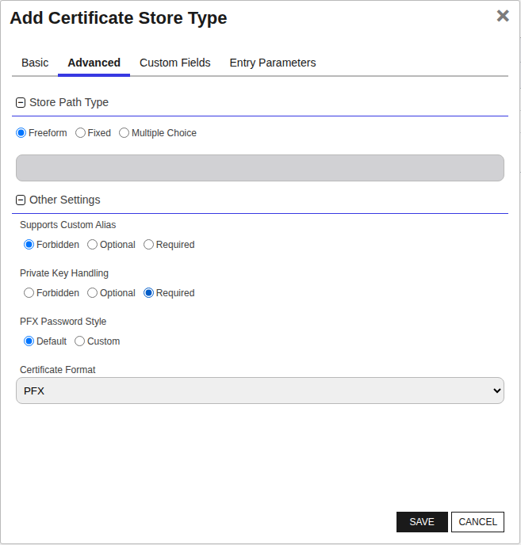
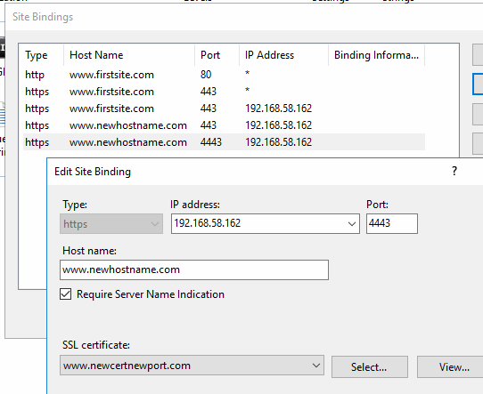
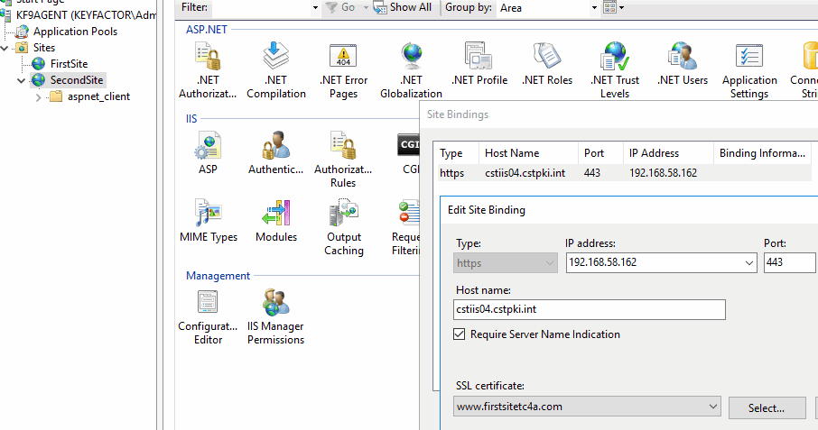
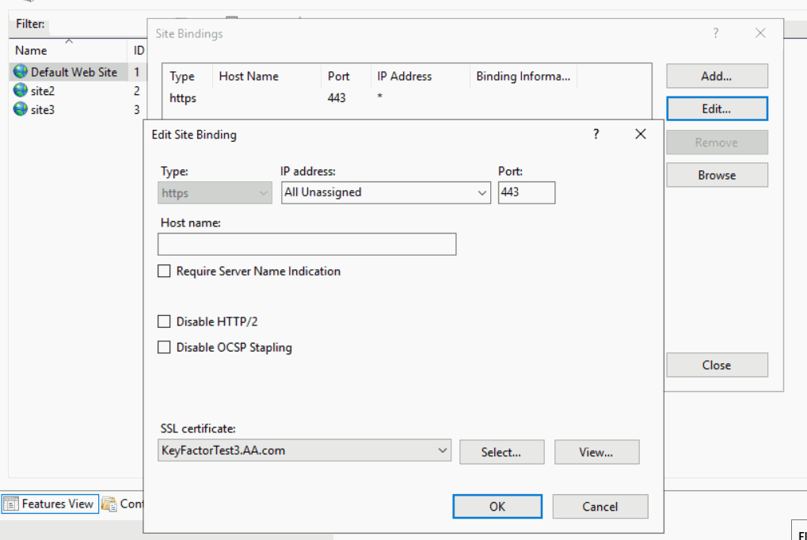

## IIS Bound Certificate

The IIS Bound Certificate Certificate Store Type, identified by its short name 'IISU,' is designed for the management of certificates bound to IIS (Internet Information Services) servers. This store type allows users to automate and streamline the process of adding, removing, and reenrolling certificates for IIS sites, making it significantly easier to manage web server certificates.

### Key Features and Representation

The IISU store type represents the IIS servers and their certificate bindings. It specifically caters to managing SSL/TLS certificates tied to IIS websites, allowing bind operations such as specifying site names, IP addresses, ports, and enabling Server Name Indication (SNI). By default, it supports job types like Inventory, Add, Remove, and Reenrollment, thereby offering comprehensive management capabilities for IIS certificates.

### Limitations and Areas of Confusion

- **Caveats:** It's important to ensure that the Windows Remote Management (WinRM) is properly configured on the target server. The orchestrator relies on WinRM to perform its tasks, such as manipulating the Windows Certificate Stores. Misconfiguration of WinRM may lead to connection and permission issues.

- **Limitations:** Users should be aware that for this store type to function correctly, certain permissions are necessary. While some advanced users successfully use non-administrator accounts with specific permissions, it is officially supported only with Local Administrator permissions. Complexities with interactions between Group Policy, WinRM, User Account Control, and other environmental factors may impede operations if not properly configured.

- **Custom Alias and Private Keys:** The store type does not support custom aliases for individual entries and requires private keys because IIS certificates without private keys would be invalid.


### Supported Job Types

| Job Name | Supported |
| -------- | --------- |
| Inventory | ✅ |
| Management Add | ✅ |
| Management Remove | ✅ |
| Discovery |  |
| Create |  |
| Reenrollment | ✅ |

## Requirements

### Security and Permission Considerations

From an official support point of view, Local Administrator permissions are required on the target server. Some customers have been successful with using other accounts and granting rights to the underlying certificate and private key stores. Due to complexities with the interactions between Group Policy, WinRM, User Account Control, and other unpredictable customer environmental factors, Keyfactor cannot provide assistance with using accounts other than the local administrator account.
 
For customers wishing to use something other than the local administrator account, the following information may be helpful:
 
*	The WinCert extensions (WinCert, IISU, WinSQL) create a WinRM (remote PowerShell) session to the target server in order to manipulate the Windows Certificate Stores, perform binding (in the case of the IISU extension), or to access the registry (in the case of the WinSQL extension). 
 
*	When the WinRM session is created, the certificate store credentials are used if they have been specified, otherwise the WinRM session is created in the context of the Universal Orchestrator (UO) Service account (which potentially could be the network service account, a regular account, or a GMSA account)
 
*	WinRM needs to be properly set up between the server hosting the UO and the target server. This means that a WinRM client running on the UO server when running in the context of the UO service account needs to be able to create a session on the target server using the configured credentials of the target server and any PowerShell commands running on the remote session need to have appropriate permissions. 
 
*	Even though a given account may be in the administrators group or have administrative privileges on the target system and may be able to execute certificate and binding operations when running locally, the same account may not work when being used via WinRM. User Account Control (UAC) can get in the way and filter out administrative privledges. UAC / WinRM configuration has a LocalAccountTokenFilterPolicy setting that can be adjusted to not filter out administrative privledges for remote users, but enabling this may have other security ramifications. 
 
*	The following list may not be exhaustive, but in general the account (when running under a remote WinRM session) needs permissions to:
    -	Instantiate and open a .NET X509Certificates.X509Store object for the target certificate store and be able to read and write both the certificates and related private keys. Note that ACL permissions on the stores and private keys are separate.
    -	Use the Import-Certificate, Get-WebSite, Get-WebBinding, and New-WebBinding PowerShell CmdLets.
    -	Create and delete temporary files.
    -	Execute certreq commands.
    -	Access any Cryptographic Service Provider (CSP) referenced in re-enrollment jobs.
    -	Read and Write values in the registry (HKLM:\SOFTWARE\Microsoft\Microsoft SQL Server) when performing SQL Server certificate binding.


## Certificate Store Type Configuration

The recommended method for creating the `IISU` Certificate Store Type is to use [kfutil](https://github.com/Keyfactor/kfutil). After installing, use the following command to create the `` Certificate Store Type:

```shell
kfutil store-types create IISU
```

<details><summary>IISU</summary>

Create a store type called `IISU` with the attributes in the tables below:

### Basic Tab
| Attribute | Value | Description |
| --------- | ----- | ----- |
| Name | IIS Bound Certificate | Display name for the store type (may be customized) |
| Short Name | IISU | Short display name for the store type |
| Capability | IISU | Store type name orchestrator will register with. Check the box to allow entry of value |
| Supported Job Types (check the box for each) | Add, Discovery, Remove | Job types the extension supports |
| Supports Add | ✅ | Check the box. Indicates that the Store Type supports Management Add |
| Supports Remove | ✅ | Check the box. Indicates that the Store Type supports Management Remove |
| Supports Discovery |  |  Indicates that the Store Type supports Discovery |
| Supports Reenrollment |  |  Indicates that the Store Type supports Reenrollment |
| Supports Create |  |  Indicates that the Store Type supports store creation |
| Needs Server | ✅ | Determines if a target server name is required when creating store |
| Blueprint Allowed |  | Determines if store type may be included in an Orchestrator blueprint |
| Uses PowerShell |  | Determines if underlying implementation is PowerShell |
| Requires Store Password |  | Determines if a store password is required when configuring an individual store. |
| Supports Entry Password |  | Determines if an individual entry within a store can have a password. |

The Basic tab should look like this:


### Advanced Tab
| Attribute | Value | Description |
| --------- | ----- | ----- |
| Supports Custom Alias | Forbidden | Determines if an individual entry within a store can have a custom Alias. |
| Private Key Handling | Required | This determines if Keyfactor can send the private key associated with a certificate to the store. Required because IIS certificates without private keys would be invalid. |
| PFX Password Style | Default | 'Default' - PFX password is randomly generated, 'Custom' - PFX password may be specified when the enrollment job is created (Requires the Allow Custom Password application setting to be enabled.) |

The Advanced tab should look like this:



### Custom Fields Tab
Custom fields operate at the certificate store level and are used to control how the orchestrator connects to the remote target server containing the certificate store to be managed. The following custom fields should be added to the store type:

| Name | Display Name | Type | Default Value/Options | Required | Description |
| ---- | ------------ | ---- | --------------------- | -------- | ----------- |
| spnwithport | SPN With Port | Bool | false |  | Boolean value (true or false) specifying whether to include the port in the Service Principal Name (SPN) during the creation of the remote PowerShell connection. Typically set to false, but may be required for certain Kerberos configurations. |
| WinRm Protocol | WinRm Protocol | MultipleChoice | https,http | ✅ | Multiple choice value specifying the protocol (https or http) that the target server's WinRM listener is using. Example: 'https' to use secure communication. |
| WinRm Port | WinRm Port | String | 5986 | ✅ | String value specifying the port number that the target server's WinRM listener is configured to use. Example: '5986' for HTTPS or '5985' for HTTP. |
| ServerUsername | Server Username | Secret | None |  | Username used to log into the target server for establishing the WinRM session. Example: 'administrator' or 'domain\username'. |
| ServerPassword | Server Password | Secret | None |  | Password corresponding to the Server Username used to log into the target server for establishing the WinRM session. Example: 'P@ssw0rd123'. |
| ServerUseSsl | Use SSL | Bool | true | ✅ | Boolean value (true or false) indicating whether the server uses SSL for the WinRM session. Example: 'true' for SSL-enabled connections. |


The Custom Fields tab should look like this:


### Entry Parameters Tab

| Name | Display Name | Type | Default Value | Entry has a private key | Adding an entry | Removing an entry | Reenrolling an entry | Description |
| ---- | ------------ | ---- | ------------- | ----------------------- | ---------------- | ----------------- | ------------------- | ----------- |
| Port | Port | String | 443 |  |  |  |  | String value specifying the IP port to bind the certificate to for the IIS site. Example: '443' for HTTPS. |
| IPAddress | IP Address | String | * |  | ✅ | ✅ | ✅ | String value specifying the IP address to bind the certificate to for the IIS site. Example: '*' for all IP addresses or '192.168.1.1' for a specific IP address. |
| HostName | Host Name | String |  |  |  |  |  | String value specifying the host name (host header) to bind the certificate to for the IIS site. Leave blank for all host names or enter a specific hostname such as 'www.example.com'. |
| SiteName | IIS Site Name | String | Default Web Site |  | ✅ | ✅ | ✅ | String value specifying the name of the IIS web site to bind the certificate to. Example: 'Default Web Site' or any custom site name such as 'MyWebsite'. |
| SniFlag | SNI Support | MultipleChoice | 0 - No SNI |  |  |  |  | Multiple choice value specifying the type of SNI (Server Name Indication) for the binding. Example: '0 - No SNI', '1 - SNI Enabled', '2 - Non SNI Binding', or '3 - SNI Binding'. |
| Protocol | Protocol | MultipleChoice | https |  | ✅ | ✅ | ✅ | Multiple choice value specifying the protocol to bind to. Example: 'https' for secure communication. |
| ProviderName | Crypto Provider Name | String |  |  |  |  |  | Name of the Windows cryptographic provider to use during reenrollment jobs when generating and storing the private keys. If not specified, defaults to 'Microsoft Strong Cryptographic Provider'. This value would typically be specified when leveraging a Hardware Security Module (HSM). The specified cryptographic provider must be available on the target server being managed. The list of installed cryptographic providers can be obtained by running 'certutil -csplist' on the target Server. |
| SAN | SAN | String |  |  |  |  | ✅ | String value specifying the Subject Alternative Name (SAN) to be used when performing reenrollment jobs. Format as a list of <san_type>=<san_value> entries separated by ampersands; Example: 'dns=www.example.com&dns=www.example2.com' for multiple SANs. Can be made optional if RFC 2818 is disabled on the CA. |

The Entry Parameters tab should look like this:


</details>


## Extension Mechanics

#### Note Regarding Client Machine

If the IIS Universal Orchestrator is deployed on the same server as the certificates it manages, the Client Machine field can be configured to bypass WinRM and manage the certificates directly. To do this, append `|LocalMachine` to the end of the Client Machine value. 

In Keyfactor Command, the Client Machine and Store Path fields together must be unique among all Certificate Stores of a given type. For example, the following scenario is not valid in Command:

```yaml
- Orchestrator: machineA
  ClientMachine: |LocalMachine
  StorePath: My
- Orchestrator: machineB
  ClientMachine: |LocalMachine
  StorePath: My
```

To accomodate this use-case, we recommend prepending the target machine's FQDN or IP address to the Client Machine field. 

```yaml
- Orchestrator: machineA
  ClientMachine: 1.1.1.1|LocalMachine
  StorePath: My
- Orchestrator: machineB
  ClientMachine: 2.2.2.2|LocalMachine
  StorePath: My
```

> All characters before the `|` are ignored by the extension.


## Certificate Store Configuration

After creating the `IISU` Certificate Store Type and installing the WinCertStore Universal Orchestrator extension, you can create new [Certificate Stores](https://software.keyfactor.com/Core-OnPrem/Current/Content/ReferenceGuide/Certificate%20Stores.htm?Highlight=certificate%20store) to manage certificates in the remote platform.

The following table describes the required and optional fields for the `IISU` certificate store type.

| Attribute | Description | Attribute is PAM Eligible |
| --------- | ----------- | ------------------------- |
| Category | Select "IIS Bound Certificate" or the customized certificate store name from the previous step. | |
| Container | Optional container to associate certificate store with. | |
| Client Machine | Hostname of the Windows Server containing the IIS certificate store to be managed. If this value is a hostname, a WinRM session will be established using the credentials specified in the Server Username and Server Password fields. | |
| Store Path | Windows certificate store path to manage. Choose 'My' for the Personal store or 'WebHosting' for the Web Hosting store. | |
| Orchestrator | Select an approved orchestrator capable of managing `IISU` certificates. Specifically, one with the `IISU` capability. | |
| spnwithport | Boolean value (true or false) specifying whether to include the port in the Service Principal Name (SPN) during the creation of the remote PowerShell connection. Typically set to false, but may be required for certain Kerberos configurations. |  |
| WinRm Protocol | Multiple choice value specifying the protocol (https or http) that the target server's WinRM listener is using. Example: 'https' to use secure communication. |  |
| WinRm Port | String value specifying the port number that the target server's WinRM listener is configured to use. Example: '5986' for HTTPS or '5985' for HTTP. |  |
| ServerUsername | Username used to log into the target server for establishing the WinRM session. Example: 'administrator' or 'domain\username'. |  ✅  |
| ServerPassword | Password corresponding to the Server Username used to log into the target server for establishing the WinRM session. Example: 'P@ssw0rd123'. |  ✅  |
| ServerUseSsl | Boolean value (true or false) indicating whether the server uses SSL for the WinRM session. Example: 'true' for SSL-enabled connections. |  |

* **Using kfutil**

    ```shell
    # Generate a CSV template for the AzureApp certificate store
    kfutil stores import generate-template --store-type-name IISU --outpath IISU.csv

    # Open the CSV file and fill in the required fields for each certificate store.

    # Import the CSV file to create the certificate stores
    kfutil stores import csv --store-type-name IISU --file IISU.csv
    ```

* **Manually with the Command UI**: In Keyfactor Command, navigate to Certificate Stores from the Locations Menu. Click the Add button to create a new Certificate Store using the attributes in the table above.
## Test Cases

| Case Number | Case Name                                                                               | Enrollment Params                                                                                                                                                                                                                                                                                                                                                                                               | Expected Results                                                                                         | Passed | Screenshot                                                           |
|-------------|-----------------------------------------------------------------------------------------|-----------------------------------------------------------------------------------------------------------------------------------------------------------------------------------------------------------------------------------------------------------------------------------------------------------------------------------------------------------------------------------------------------------------|----------------------------------------------------------------------------------------------------------|--------|----------------------------------------------------------------------|
| 1	          | New Cert Enrollment To New Binding With KFSecret Creds                                  | **Site Name:** FirstSite<br/>**Port:** 443<br/>**IP Address:**`*`<br/>**Host Name:** www.firstsite.com<br/>**Sni Flag:** 0 - No SNI<br/>**Protocol:** https                                                                                                                                                                                                                                                     | New Binding Created with Enrollment Params specified creds pulled from KFSecret                          | True   |                                      |
| 2           | New Cert Enrollment To Existing Binding                                                 | **Site Name:** FirstSite<br/>**Port:** 443<br/>**IP Address:**`*`<br/>**Host Name:** www.firstsite.com<br/>**Sni Flag:** 0 - No SNI<br/>**Protocol:** https                                                                                                                                                                                                                                                     | Existing Binding From Case 1 Updated with New Cert                                                       | True   |                                      |
| 3           | New Cert Enrollment To Existing Binding Enable SNI                                      | **Site Name:** FirstSite<br/>**Port:** 443<br/>**IP Address:**`*`<br/>**Host Name:** www.firstsite.com<br/>**Sni Flag:** 1 - SNI Enabled<br/>**Protocol:** https                                                                                                                                                                                                                                                | Will Update Site In Case 2 to Have Sni Enabled                                                           | True   |                                      |
| 4           | New Cert Enrollment New IP Address                                                      | **Site Name:** FirstSite<br/>**Port:** 443<br/>**IP Address:**`192.168.58.162`<br/>**Host Name:** www.firstsite.com<br/>**Sni Flag:** 1 - SNI Enabled<br/>**Protocol:** https                                                                                                                                                                                                                                   | New Binding Created With New IP and New SNI on Same Port                                                 | True   |                                      |
| 5           | New Cert Enrollment New Host Name                                                       | **Site Name:** FirstSite<br/>**Port:** 443<br/>**IP Address:**`192.168.58.162`<br/>**Host Name:** www.newhostname.com<br/>**Sni Flag:** 1 - SNI Enabled<br/>**Protocol:** https                                                                                                                                                                                                                                 | New Binding Created With different host on Same Port and IP Address                                      | True   |                                      |
| 6           | New Cert Enrollment Same Site New Port                                                  | **Site Name:** FirstSite<br/>**Port:** 4443<br/>**IP Address:**`192.168.58.162`<br/>**Host Name:** www.newhostname.com<br/>**Sni Flag:** 1 - SNI Enabled<br/>**Protocol:** https                                                                                                                                                                                                                                | New Binding on different port will be created with new cert enrolled                                     | True   |                                      |
| 7           | Remove Cert and Binding From Test Case 6                                                | **Site Name:** FirstSite<br/>**Port:** 4443<br/>**IP Address:**`192.168.58.162`<br/>**Host Name:** www.newhostname.com<br/>**Sni Flag:** 1 - SNI Enabled<br/>**Protocol:** https                                                                                                                                                                                                                                | Cert and Binding From Test Case 6 Removed                                                                | True   |                                      |
| 8           | Renew Same Cert on 2 Different Sites                                                    | `SITE 1`<br/>**Site Name:** FirstSite<br/>**Port:** 443<br/>**IP Address:**`*`<br/>**Host Name:** www.firstsite.com<br/>**Sni Flag:** 1 - SNI Enabled<br/>**Protocol:** https<br/>`SITE 2`<br/>**First Site**<br/>**Site Name:** SecondSite<br/>**Port:** 443<br/>**IP Address:**`*`<br/>**Host Name:** cstiis04.cstpki.int<br/>**Sni Flag:** 1 - SNI Enabled<br/>**Protocol:** https                           | Cert will be renewed on both sites because it has the same thumbprint                                    | True   |          |
| 9           | Renew Same Cert on Same Site Same Binding Settings Different Hostname                   | `BINDING 1`<br/>**Site Name:** FirstSite<br/>**Port:** 443<br/>**IP Address:**`*`<br/>**Host Name:** www.firstsitebinding1.com<br/>**Sni Flag:** 1 - SNI Enabled<br/>**Protocol:** https<br/>`BINDING 2`<br/>**Site Name:** FirstSite<br/>**Port:** 443<br/>**IP Address:**`*`<br/>**Host Name:** www.firstsitebinding2.com<br/>**Sni Flag:** 1 - SNI Enabled<br/>**Protocol:** https                           | Cert will be renewed on both bindings because it has the same thumbprint                                 | True   |    |
| 10          | Renew Single Cert on Same Site Same Binding Settings Different Hostname Different Certs | `BINDING 1`<br/>**Site Name:** FirstSite<br/>**Port:** 443<br/>**IP Address:**`*`<br/>**Host Name:** www.firstsitebinding1.com<br/>**Sni Flag:** 1 - SNI Enabled<br/>**Protocol:** https<br/>`BINDING 2`<br/>**Site Name:** FirstSite<br/>**Port:** 443<br/>**IP Address:**`*`<br/>**Host Name:** www.firstsitebinding2.com<br/>**Sni Flag:** 1 - SNI Enabled<br/>**Protocol:** https                           | Cert will be renewed on only one binding because the other binding does not match thumbprint             | True   |  |
| 11          | Renew Same Cert on Same Site Same Binding Settings Different IPs                        | `BINDING 1`<br/>**Site Name:** FirstSite<br/>**Port:** 443<br/>**IP Address:**`192.168.58.162`<br/>**Host Name:** www.firstsitebinding1.com<br/>**Sni Flag:** 1 - SNI Enabled<br/>**Protocol:** https<br/>`BINDING 2`<br/>**Site Name:** FirstSite<br/>**Port:** 443<br/>**IP Address:**`192.168.58.160`<br/>**Host Name:** www.firstsitebinding1.com<br/>**Sni Flag:** 1 - SNI Enabled<br/>**Protocol:** https | Cert will be renewed on both bindings because it has the same thumbprint                                 | True   |  |
| 12          | Renew Same Cert on Same Site Same Binding Settings Different Ports                      | `BINDING 1`<br/>**Site Name:** FirstSite<br/>**Port:** 443<br/>**IP Address:**`192.168.58.162`<br/>**Host Name:** www.firstsitebinding1.com<br/>**Sni Flag:** 1 - SNI Enabled<br/>**Protocol:** https<br/>`BINDING 2`<br/>**Site Name:** FirstSite<br/>**Port:** 543<br/>**IP Address:**`192.168.58.162`<br/>**Host Name:** www.firstsitebinding1.com<br/>**Sni Flag:** 1 - SNI Enabled<br/>**Protocol:** https | Cert will be renewed on both bindings because it has the same thumbprint                                 | True   |  |
| 13	         | ReEnrollment to Fortanix HSM                                                            | **Subject Name:** cn=www.mysite.com<br/>**Port:** 433<br/>**IP Address:**`*`<br/>**Host Name:** mysite.command.local<br/>**Site Name:**Default Web Site<br/>**Sni Flag:** 0 - No SNI<br/>**Protocol:** https<br/>**Provider Name:** Fortanix KMS CNG Provider<br/>**SAN:** dns=www.mysite.com&dns=mynewsite.com                                                                                                 | Cert will be generated with keys stored in Fortanix HSM and the cert will be bound to the supplied site. | true   |          |
| 14	         | New Cert Enrollment To New Binding With Pam Creds                                       | **Site Name:** FirstSite<br/>**Port:** 443<br/>**IP Address:**`*`<br/>**Host Name:** www.firstsite.com<br/>**Sni Flag:** 0 - No SNI<br/>**Protocol:** https                                                                                                                                                                                                                                                     | New Binding Created with Enrollment Params specified creds pulled from Pam Provider                      | True   |                                      |
| 15	         | New Cert Enrollment Default Site No HostName                                            | **Site Name:** Default Web Site<br/>**Port:** 443<br/>**IP Address:**`*`<br/>**Host Name:**<br/>**Sni Flag:** 0 - No SNI<br/>**Protocol:** https                                                                                                                                                                                                                                                                | New Binding Installed with no HostName                                                                   | True   |                                     |


