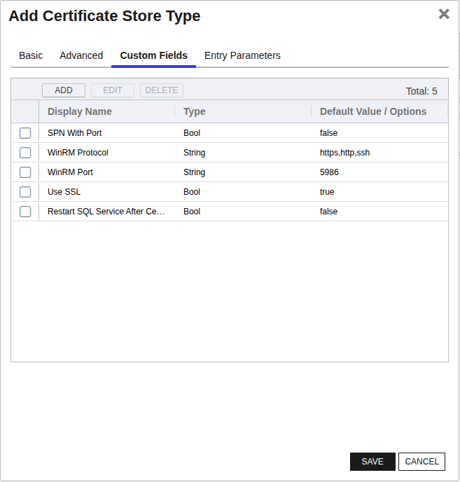
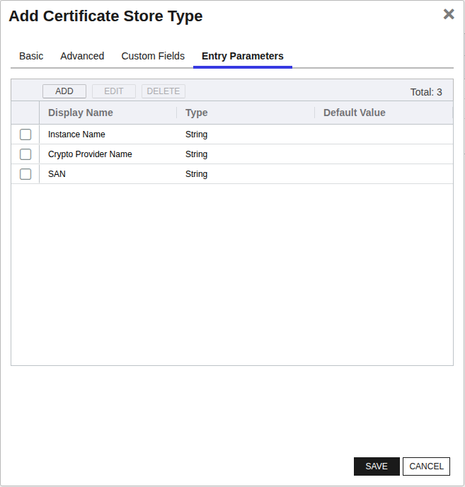
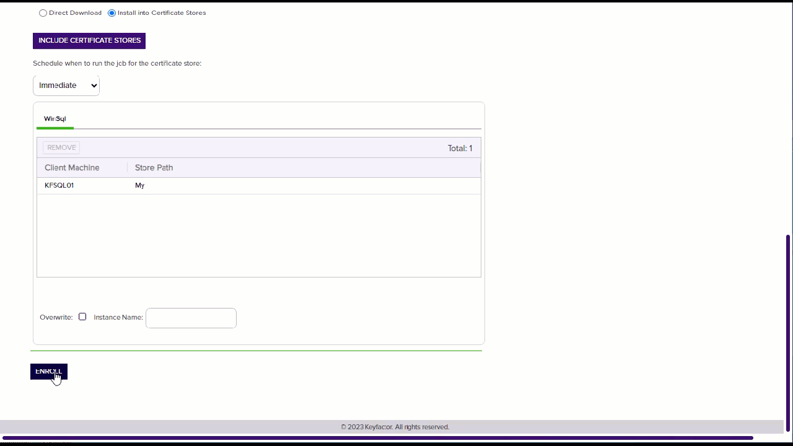
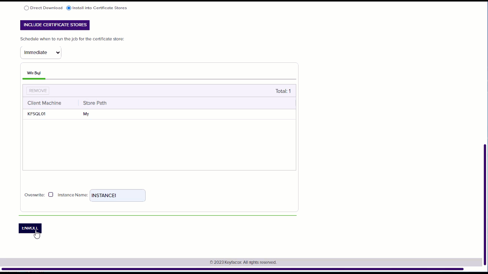
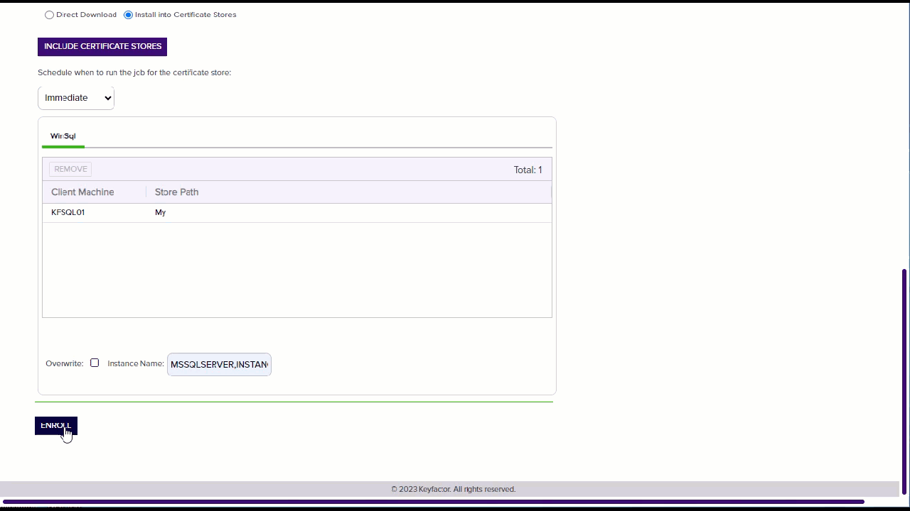
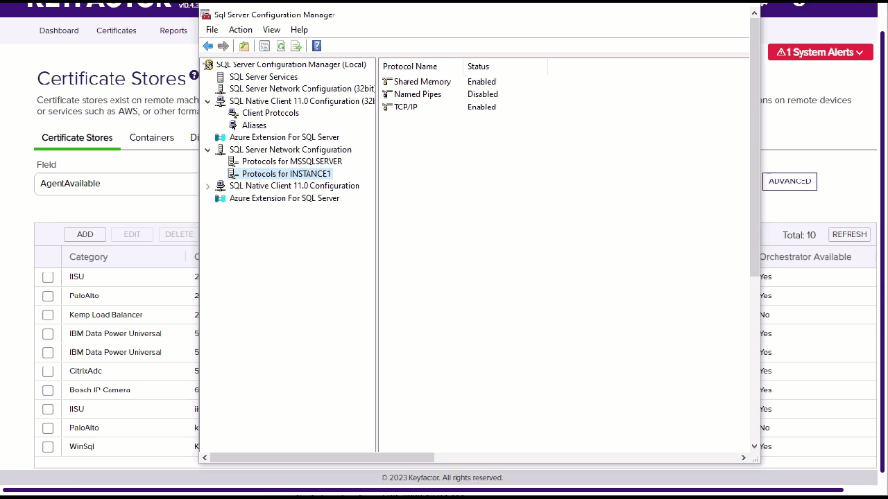

## WinSql

The WinSql Certificate Store Type, referred to by its short name 'WinSql,' is designed for the management of certificates used by SQL Server instances. This store type allows users to automate the process of adding, removing, reenrolling, and inventorying certificates associated with SQL Server, thereby simplifying the management of SSL/TLS certificates for database servers.

### Caveats and Limitations

- **Caveats:** It's important to ensure that the Windows Remote Management (WinRM) is properly configured on the target server. The orchestrator relies on WinRM to perform its tasks, such as manipulating the Windows Certificate Stores. Misconfiguration of WinRM may lead to connection and permission issues.

- **Limitations:** Users should be aware that for this store type to function correctly, certain permissions are necessary. While some advanced users successfully use non-administrator accounts with specific permissions, it is officially supported only with Local Administrator permissions. Complexities with interactions between Group Policy, WinRM, User Account Control, and other environmental factors may impede operations if not properly configured.


### Supported Job Types

| Job Name | Supported |
| -------- | --------- |
| Inventory | ✅ |
| Management Add | ✅ |
| Management Remove | ✅ |
| Discovery |  |
| Create |  |
| Reenrollment |  |

## Requirements

### Security and Permission Considerations

From an official support point of view, Local Administrator permissions are required on the target server. Some customers have been successful with using other accounts and granting rights to the underlying certificate and private key stores. Due to complexities with the interactions between Group Policy, WinRM, User Account Control, and other unpredictable customer environmental factors, Keyfactor cannot provide assistance with using accounts other than the local administrator account.
 
For customers wishing to use something other than the local administrator account, the following information may be helpful:
 
*	The WinCert extensions (WinCert, IISU, WinSQL) create a WinRM (remote PowerShell) session to the target server in order to manipulate the Windows Certificate Stores, perform binding (in the case of the IISU extension), or to access the registry (in the case of the WinSQL extension). 
 
*	When the WinRM session is created, the certificate store credentials are used if they have been specified, otherwise the WinRM session is created in the context of the Universal Orchestrator (UO) Service account (which potentially could be the network service account, a regular account, or a GMSA account)
 
*	WinRM needs to be properly set up between the server hosting the UO and the target server. This means that a WinRM client running on the UO server when running in the context of the UO service account needs to be able to create a session on the target server using the configured credentials of the target server and any PowerShell commands running on the remote session need to have appropriate permissions. 
 
*	Even though a given account may be in the administrators group or have administrative privileges on the target system and may be able to execute certificate and binding operations when running locally, the same account may not work when being used via WinRM. User Account Control (UAC) can get in the way and filter out administrative privledges. UAC / WinRM configuration has a LocalAccountTokenFilterPolicy setting that can be adjusted to not filter out administrative privledges for remote users, but enabling this may have other security ramifications. 
 
*	The following list may not be exhaustive, but in general the account (when running under a remote WinRM session) needs permissions to:
    -	Instantiate and open a .NET X509Certificates.X509Store object for the target certificate store and be able to read and write both the certificates and related private keys. Note that ACL permissions on the stores and private keys are separate.
    -	Use the Import-Certificate, Get-WebSite, Get-WebBinding, and New-WebBinding PowerShell CmdLets.
    -	Create and delete temporary files.
    -	Execute certreq commands.
    -	Access any Cryptographic Service Provider (CSP) referenced in re-enrollment jobs.
    -	Read and Write values in the registry (HKLM:\SOFTWARE\Microsoft\Microsoft SQL Server) when performing SQL Server certificate binding.


## Certificate Store Type Configuration

The recommended method for creating the `WinSql` Certificate Store Type is to use [kfutil](https://github.com/Keyfactor/kfutil). After installing, use the following command to create the `` Certificate Store Type:

```shell
kfutil store-types create WinSql
```

<details><summary>WinSql</summary>

Create a store type called `WinSql` with the attributes in the tables below:

### Basic Tab
| Attribute | Value | Description |
| --------- | ----- | ----- |
| Name | WinSql | Display name for the store type (may be customized) |
| Short Name | WinSql | Short display name for the store type |
| Capability | WinSql | Store type name orchestrator will register with. Check the box to allow entry of value |
| Supported Job Types (check the box for each) | Add, Discovery, Remove | Job types the extension supports |
| Supports Add | ✅ | Check the box. Indicates that the Store Type supports Management Add |
| Supports Remove | ✅ | Check the box. Indicates that the Store Type supports Management Remove |
| Supports Discovery |  |  Indicates that the Store Type supports Discovery |
| Supports Reenrollment |  |  Indicates that the Store Type supports Reenrollment |
| Supports Create |  |  Indicates that the Store Type supports store creation |
| Needs Server | ✅ | Determines if a target server name is required when creating store |
| Blueprint Allowed | ✅ | Determines if store type may be included in an Orchestrator blueprint |
| Uses PowerShell |  | Determines if underlying implementation is PowerShell |
| Requires Store Password |  | Determines if a store password is required when configuring an individual store. |
| Supports Entry Password |  | Determines if an individual entry within a store can have a password. |

The Basic tab should look like this:


### Advanced Tab
| Attribute | Value | Description |
| --------- | ----- | ----- |
| Supports Custom Alias | Forbidden | Determines if an individual entry within a store can have a custom Alias. |
| Private Key Handling | Optional | This determines if Keyfactor can send the private key associated with a certificate to the store. Required because IIS certificates without private keys would be invalid. |
| PFX Password Style | Default | 'Default' - PFX password is randomly generated, 'Custom' - PFX password may be specified when the enrollment job is created (Requires the Allow Custom Password application setting to be enabled.) |

The Advanced tab should look like this:


### Custom Fields Tab
Custom fields operate at the certificate store level and are used to control how the orchestrator connects to the remote target server containing the certificate store to be managed. The following custom fields should be added to the store type:

| Name | Display Name | Type | Default Value/Options | Required | Description |
| ---- | ------------ | ---- | --------------------- | -------- | ----------- |
| WinRm Protocol | WinRm Protocol | MultipleChoice | https,http | ✅ | Multiple choice value specifying the protocol (https or http) that the target server's WinRM listener is using. Example: 'https' to use secure communication. |
| WinRm Port | WinRm Port | String | 5986 | ✅ | String value specifying the port number that the target server's WinRM listener is configured to use. Example: '5986' for HTTPS or '5985' for HTTP. |
| ServerUsername | Server Username | Secret | None |  | Username used to log into the target server for establishing the WinRM session. Example: 'administrator' or 'domain\username'. |
| ServerPassword | Server Password | Secret | None |  | Password corresponding to the Server Username used to log into the target server for establishing the WinRM session. Example: 'P@ssw0rd123'. |
| ServerUseSsl | Use SSL | Bool | true | ✅ | Boolean value (true or false) indicating whether the server uses SSL for the WinRM session. Example: 'true' for SSL-enabled connections. |
| RestartService | Restart SQL Service After Cert Installed | Bool | false | ✅ | Boolean value (true or false) indicating whether to restart the SQL Server service after installing the certificate. Example: 'true' to enable service restart after installation. |


The Custom Fields tab should look like this:




### Entry Parameters Tab

| Name | Display Name | Type | Default Value | Entry has a private key | Adding an entry | Removing an entry | Reenrolling an entry | Description |
| ---- | ------------ | ---- | ------------- | ----------------------- | ---------------- | ----------------- | ------------------- | ----------- |
| InstanceName | Instance Name | String |  |  |  |  |  | String value specifying the SQL Server instance name to bind the certificate to. Example: 'MSSQLServer' for the default instance or 'Instance1' for a named instance. |
| ProviderName | Crypto Provider Name | String |  |  |  |  |  | Optional string value specifying the name of the Windows cryptographic provider to use during reenrollment jobs when generating and storing private keys. Example: 'Microsoft Strong Cryptographic Provider'. |
| SAN | SAN | String |  |  |  |  | ✅ | String value specifying the Subject Alternative Name (SAN) to be used when performing reenrollment jobs. Format as a list of <san_type>=<san_value> entries separated by ampersands; Example: 'dns=www.example.com&dns=www.example2.com' for multiple SANs. |

The Entry Parameters tab should look like this:




</details>


## Extension Mechanics

#### Note Regarding Client Machine

If the IIS Universal Orchestrator is deployed on the same server as the certificates it manages, the Client Machine field can be configured to bypass WinRM and manage the certificates directly. To do this, append `|LocalMachine` to the end of the Client Machine value. 

In Keyfactor Command, the Client Machine and Store Path fields together must be unique among all Certificate Stores of a given type. For example, the following scenario is not valid in Command:

```yaml
- Orchestrator: machineA
  ClientMachine: |LocalMachine
  StorePath: My
- Orchestrator: machineB
  ClientMachine: |LocalMachine
  StorePath: My
```

To accomodate this use-case, we recommend prepending the target machine's FQDN or IP address to the Client Machine field. 

```yaml
- Orchestrator: machineA
  ClientMachine: 1.1.1.1|LocalMachine
  StorePath: My
- Orchestrator: machineB
  ClientMachine: 2.2.2.2|LocalMachine
  StorePath: My
```

> All characters before the `|` are ignored by the extension.


## Certificate Store Configuration

After creating the `WinSql` Certificate Store Type and installing the WinCertStore Universal Orchestrator extension, you can create new [Certificate Stores](https://software.keyfactor.com/Core-OnPrem/Current/Content/ReferenceGuide/Certificate%20Stores.htm?Highlight=certificate%20store) to manage certificates in the remote platform.

The following table describes the required and optional fields for the `WinSql` certificate store type.

| Attribute | Description | Attribute is PAM Eligible |
| --------- | ----------- | ------------------------- |
| Category | Select "WinSql" or the customized certificate store name from the previous step. | |
| Container | Optional container to associate certificate store with. | |
| Client Machine | Hostname of the Windows Server containing the SQL Server Certificate Store to be managed. If this value is a hostname, a WinRM session will be established using the credentials specified in the Server Username and Server Password fields. | |
| Store Path | Fixed string value 'My' indicating the Personal store on the Local Machine. This denotes the Windows certificate store to be managed for SQL Server. | |
| Orchestrator | Select an approved orchestrator capable of managing `WinSql` certificates. Specifically, one with the `WinSql` capability. | |
| WinRm Protocol | Multiple choice value specifying the protocol (https or http) that the target server's WinRM listener is using. Example: 'https' to use secure communication. |  |
| WinRm Port | String value specifying the port number that the target server's WinRM listener is configured to use. Example: '5986' for HTTPS or '5985' for HTTP. |  |
| ServerUsername | Username used to log into the target server for establishing the WinRM session. Example: 'administrator' or 'domain\username'. |  ✅  |
| ServerPassword | Password corresponding to the Server Username used to log into the target server for establishing the WinRM session. Example: 'P@ssw0rd123'. |  ✅  |
| ServerUseSsl | Boolean value (true or false) indicating whether the server uses SSL for the WinRM session. Example: 'true' for SSL-enabled connections. |  |
| RestartService | Boolean value (true or false) indicating whether to restart the SQL Server service after installing the certificate. Example: 'true' to enable service restart after installation. |  |

* **Using kfutil**

    ```shell
    # Generate a CSV template for the AzureApp certificate store
    kfutil stores import generate-template --store-type-name WinSql --outpath WinSql.csv

    # Open the CSV file and fill in the required fields for each certificate store.

    # Import the CSV file to create the certificate stores
    kfutil stores import csv --store-type-name WinSql --file WinSql.csv
    ```

* **Manually with the Command UI**: In Keyfactor Command, navigate to Certificate Stores from the Locations Menu. Click the Add button to create a new Certificate Store using the attributes in the table above.
## Test Cases

| Case Number | Case Name                                                         | Enrollment Params                        | Expected Results                                                                                                               | Passed | Screenshot                   |
|-------------|-------------------------------------------------------------------|------------------------------------------|--------------------------------------------------------------------------------------------------------------------------------|--------|------------------------------|
| 1	          | New Cert Enrollment To Default Instance Leave Blank               | **Instance Name:**                       | Cert will be Installed to default Instance, Service will be restarted for default instance                                     | True   |  |
| 2	          | New Cert Enrollment To Default Instance MSSQLServer               | **Instance Name:** MSSQLServer           | Cert will be Installed to default Instance, Service will be restarted for default instance                                     | True   |  |
| 3	          | New Cert Enrollment To Instance1                                  | **Instance Name:** Instance1             | Cert will be Installed to Instance1, Service will be restarted for Instance1                                                   | True   |  |
| 4	          | New Cert Enrollment To Instance1 and Default Instance             | **Instance Name:** MSSQLServer,Instance1 | Cert will be Installed to Default Instance and Instance1, Service will be restarted for Default Instance and Instance1         | True   |  |
| 5	          | One Click Renew Cert Enrollment To Instance1 and Default Instance | N/A                                      | Cert will be Renewed/Installed to Default Instance and Instance1, Service will be restarted for Default Instance and Instance1 | True   |  |
| 6	          | Remove Cert From Instance1 and Default Instance                   | **Instance Name:**                       | Cert from TC5 will be Removed From Default Instance and Instance1                                                              | True   |  |
| 7	          | Inventory Different Certs Different Instance                      | N/A                                      | 2 Certs will be inventoried and each tied to its Instance                                                                      | True   |  |
| 8	          | Inventory Same Cert Different Instance                            | N/A                                      | 2 Certs will be inventoried the cert will have a comma separated list of Instances                                             | True   |  |
| 9	          | Inventory Against Machine Without SQL Server                      | N/A                                      | Will fail with error saying it can't find SQL Server                                                                           | True   |  |


