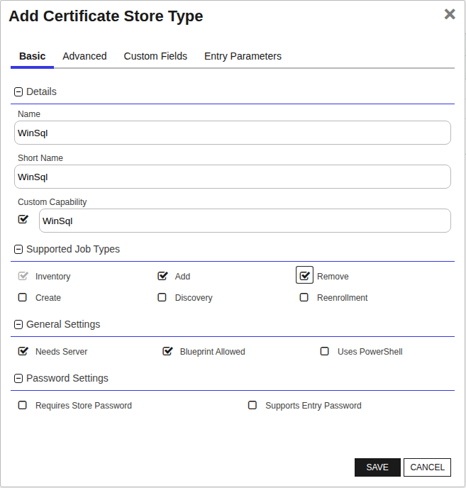

## WinSql

The WinSql Certificate Store Type, referred to by its short name 'WinSql,' is designed for the management of certificates used by SQL Server instances. This store type allows users to automate the process of adding, removing, reenrolling, and inventorying certificates associated with SQL Server, thereby simplifying the management of SSL/TLS certificates for database servers.

### Key Features and Representation

The WinSql store type represents SQL Server instances and their certificate bindings. It enables users to seamlessly manage the certificates required for securing SQL Server communications. This involves specifying SQL Server instance names for which the certificates are applicable and setting configurations unique to SQL Server environments, such as whether the SQL service should be restarted after a certificate installation.

### Caveats and Considerations

Several important caveats and considerations should be kept in mind when using the WinSql store type:

- **WinRM Configuration:** Like other store types in the WinCertStore Universal Orchestrator extension, WinSql relies on Windows Remote Management (WinRM) to perform remote management tasks. Therefore, the proper configuration of WinRM between the orchestrator server and the target SQL Server is crucial to avoid connection issues or failures during remote command execution.

- **Permissions:** Local Administrator permissions are recommended on the target SQL Server. Some users may successfully use non-administrator accounts with specific permissions; however, due to potential complexities with Group Policy, WinRM, User Account Control, and other environmental factors, using the local administrator account is advised to prevent unexpected issues.

### Limitations and Areas of Confusion

- **Fixed Store Path:** The store path for WinSql is fixed to 'My' on the local machine store. This means users do not have flexibility in choosing different certificate stores for SQL Server certificates.

- **Custom Aliases and Private Keys:** Custom aliases for individual entries are not supported, and private keys are required because SQL Server certificates without private keys would be ineffective.

- **PFX Passwords:** The PFX password can either be set to Default (randomly generated) or Custom (specified during job creation). Enabling the 'Allow Custom Password' application setting in Keyfactor Command is necessary for the Custom option.

### SDK Usage

The WinSql store type does not require a specific SDK for its operations. It leverages native Windows functionalities and PowerShell commands to manage certificates, ensuring compatibility with SQL Server environments.

Overall, the WinSql Certificate Store Type is a specialized solution for managing SQL Server certificates, offering comprehensive functionality provided the necessary configurations and permissions are in place.


### Supported Job Types

| Job Name | Supported |
| -------- | --------- |
| Inventory | ✅ |
| Management Add | ✅ |
| Management Remove | ✅ |
| Discovery |  |
| Create |  |
| Reenrollment |  |

## Requirements

### Security and Permission Considerations
From an official support point of view, Local Administrator permissions are required on the target server. Some customers have been successful with using other accounts and granting rights to the underlying certificate and private key stores. Due to complexities with the interactions between Group Policy, WinRM, User Account Control, and other unpredictable customer environmental factors, Keyfactor cannot provide assistance with using accounts other than the local administrator account.
 
For customers wishing to use something other than the local administrator account, the following information may be helpful:
 
*	The WinCert extensions (WinCert, IISU, WinSQL) create a WinRM (remote PowerShell) session to the target server in order to manipulate the Windows Certificate Stores, perform binding (in the case of the IISU extension), or to access the registry (in the case of the WinSQL extension). 
 
*	When the WinRM session is created, the certificate store credentials are used if they have been specified, otherwise the WinRM session is created in the context of the Universal Orchestrator (UO) Service account (which potentially could be the network service account, a regular account, or a GMSA account)
 
*	WinRM needs to be properly set up between the server hosting the UO and the target server. This means that a WinRM client running on the UO server when running in the context of the UO service account needs to be able to create a session on the target server using the configured credentials of the target server and any PowerShell commands running on the remote session need to have appropriate permissions. 
 
*	Even though a given account may be in the administrators group or have administrative privileges on the target system and may be able to execute certificate and binding operations when running locally, the same account may not work when being used via WinRM. User Account Control (UAC) can get in the way and filter out administrative privledges. UAC / WinRM configuration has a LocalAccountTokenFilterPolicy setting that can be adjusted to not filter out administrative privledges for remote users, but enabling this may have other security ramifications. 
 
*	The following list may not be exhaustive, but in general the account (when running under a remote WinRM session) needs permissions to:
    -	Instantiate and open a .NET X509Certificates.X509Store object for the target certificate store and be able to read and write both the certificates and related private keys. Note that ACL permissions on the stores and private keys are separate.
    -	Use the Import-Certificate, Get-WebSite, Get-WebBinding, and New-WebBinding PowerShell CmdLets.
    -	Create and delete temporary files.
    -	Execute certreq commands.
    -	Access any Cryptographic Service Provider (CSP) referenced in re-enrollment jobs.
    -	Read and Write values in the registry (HKLM:\SOFTWARE\Microsoft\Microsoft SQL Server) when performing SQL Server certificate binding.

### Creating New Certificate Store Types
Currently this orchestrator handles three types of extensions: IISU for IIS servers with bound certificates, WinCert for general Windows Certificates and WinSql for managing certificates for SQL Server.
Below describes how each of these certificate store types are created and configured.
<details>
	<summary>IISU Extension</summary>

**In Keyfactor Command create a new Certificate Store Type as specified below:**

**Basic Settings:**

CONFIG ELEMENT | VALUE | DESCRIPTION
--|--|--
Name | IIS Bound Certificate | Display name for the store type (may be customized)
Short Name| IISU | Short display name for the store type
Custom Capability | IISU | Store type name orchestrator will register with. Check the box to allow entry of value
Supported Job Types | Inventory, Add, Remove, Reenrollment | Job types the extension supports
Needs Server | Checked | Determines if a target server name is required when creating store
Blueprint Allowed | Unchecked | Determines if store type may be included in an Orchestrator blueprint
Uses PowerShell | Unchecked | Determines if underlying implementation is PowerShell
Requires Store Password	| Unchecked | Determines if a store password is required when configuring an individual store.
Supports Entry Password	| Unchecked | Determines if an individual entry within a store can have a password.


**Advanced Settings:**

CONFIG ELEMENT | VALUE | DESCRIPTION
--|--|--
Store Path Type	| Multiple Choice | Determines what restrictions are applied to the store path field when configuring a new store.
Store Path Value | My,WebHosting | Comma separated list of options configure multiple choice. This, combined with the hostname, will determine the location used for the certificate store management and inventory.
Supports Custom Alias | Forbidden | Determines if an individual entry within a store can have a custom Alias.
Private Keys | Required | This determines if Keyfactor can send the private key associated with a certificate to the store. Required because IIS certificates without private keys would be invalid.
PFX Password Style | Default or Custom | "Default" - PFX password is randomly generated, "Custom" - PFX password may be specified when the enrollment job is created (Requires the *Allow Custom Password* application setting to be enabled.)


**Custom Fields:**

Custom fields operate at the certificate store level and are used to control how the orchestrator connects to the remote
target server containing the certificate store to be managed

Name|Display Name|Type|Default Value / Options|Required|Description
---|---|---|---|---|---
WinRm Protocol|WinRm Protocol|Multiple Choice| https,http |Yes|Protocol that target server WinRM listener is using
WinRm Port|WinRm Port|String|5986|Yes| Port that target server WinRM listener is using. Typically 5985 for HTTP and 5986 for HTTPS
spnwithport|SPN With Port|Bool|false|No|Internally set the -IncludePortInSPN option when creating the remote PowerShell connection. Needed for some Kerberos configurations.
ServerUsername|Server Username|Secret||No|The username to log into the target server (This field is automatically created).   Check the No Value Checkbox when using GMSA Accounts.
ServerPassword|Server Password|Secret||No|The password that matches the username to log into the target server (This field is automatically created).  Check the No Value Checkbox when using GMSA Accounts.
ServerUseSsl|Use SSL|Bool|true|Yes|Determine whether the server uses SSL or not (This field is automatically created)

*Note that some of the Names in the first column above have spaces and some do not, it is important to configure the Name field exactly as above.*


**Entry Parameters:**

Entry parameters are inventoried and maintained for each entry within a certificate store.
They are typically used to support binding of a certificate to a resource.

Name|Display Name| Type|Default Value|Required When|Description
---|---|---|---|---|---
SiteName | IIS Site Name|String|Default Web Site|Adding, Removing, Reenrolling | IIS web site to bind certificate to
IPAddress | IP Address | String | * | Adding, Removing, Reenrolling | IP address to bind certificate to (use '*' for all IP addresses)
Port | Port | String | 443 || Adding, Removing, Reenrolling|IP port for bind certificate to
HostName | Host Name | String |||| Host name (host header) to bind certificate to, leave blank for all host names
SniFlag | SNI Support | Multiple Choice | 0 - No SNI||Type of SNI for binding<br>(Multiple choice configuration should be entered as "0 - No SNI,1 - SNI Enabled,2 - Non SNI Binding,3 - SNI Binding")
Protocol | Protocol | Multiple Choice | https| Adding, Removing, Reenrolling|Protocol to bind to (always "https").<br>(Multiple choice configuration should be "https") 
ProviderName | Crypto Provider Name | String ||| Name of the Windows cryptographic provider to use during reenrollment jobs when generating and storing the private keys. If not specified, defaults to 'Microsoft Strong Cryptographic Provider'. This value would typically be specified when leveraging a Hardware Security Module (HSM). The specified cryptographic provider must be available on the target server being managed. The list of installed cryptographic providers can be obtained by running 'certutil -csplist' on the target Server.
SAN | SAN | String || Reenrolling | Specifies Subject Alternative Name (SAN) to be used when performing reenrollment jobs. Certificate templates generally require a SAN that matches the subject of the certificate (per RFC 2818). Format is a list of <san_type>=<san_value> entries separated by ampersands. Examples: 'dns=www.mysite.com' for a single SAN or 'dns=www.mysite.com&dns=www.mysite2.com' for multiple SANs. Can be made optional if RFC 2818 is disabled on the CA.

None of the above entry parameters have the "Depends On" field set.


Click Save to save the Certificate Store Type.

</details>
<details>
	<summary>SQL Server Extension</summary>

**In Keyfactor Command create a new Certificate Store Type as specified below:**

**Basic Settings:**

CONFIG ELEMENT | VALUE | DESCRIPTION
--|--|--
Name | Windows SQL Server Certificate| Display name for the store type (may be customized)
Short Name| WinSql | Short display name for the store type
Custom Capability | Leave Unchecked | Store type name orchestrator will register with. Check the box to allow entry of value
Supported Job Types | Inventory, Add, Remove, Reenrollment | Job types the extension supports
Needs Server | Checked | Determines if a target server name is required when creating store
Blueprint Allowed | Checked | Determines if store type may be included in an Orchestrator blueprint
Uses PowerShell | Unchecked | Determines if underlying implementation is PowerShell
Requires Store Password	| Unchecked | Determines if a store password is required when configuring an individual store.
Supports Entry Password	| Unchecked | Determines if an individual entry within a store can have a password.


**Advanced Settings:**

CONFIG ELEMENT | VALUE | DESCRIPTION
--|--|--
Store Path Type	| Fixed | Fixed to a defined path.  SQL Server Supports the Personal or "My" store on the Local Machine.
Store Path Value | My | Fixed Value My on the Local Machine Store.
Supports Custom Alias | Forbidden | Determines if an individual entry within a store can have a custom Alias.
Private Keys | Required | This determines if Keyfactor can send the private key associated with a certificate to the store. Required because SQL Server certificates without private keys would be useless.
PFX Password Style | Default or Custom | "Default" - PFX password is randomly generated, "Custom" - PFX password may be specified when the enrollment job is created (Requires the *Allow Custom Password* application setting to be enabled.)


**Custom Fields:**

Custom fields operate at the certificate store level and are used to control how the orchestrator connects to the remote
target server containing the certificate store to be managed

Name|Display Name|Type|Default Value / Options|Required|Description
---|---|---|---|---|---
WinRm Protocol|WinRm Protocol|Multiple Choice| https,http |Yes|Protocol that target server WinRM listener is using
WinRm Port|WinRm Port|String|5986|Yes| Port that target server WinRM listener is using. Typically 5985 for HTTP and 5986 for HTTPS
spnwithport|SPN With Port|Bool|false|No|Internally set the -IncludePortInSPN option when creating the remote PowerShell connection. Needed for some Kerberos configurations.
ServerUsername|Server Username|Secret||No|The username to log into the target server (This field is automatically created).   Check the No Value Checkbox when using GMSA Accounts.
ServerPassword|Server Password|Secret||No|The password that matches the username to log into the target server (This field is automatically created).  Check the No Value Checkbox when using GMSA Accounts.
ServerUseSsl|Use SSL|Bool|true|Yes|Determine whether the server uses SSL or not (This field is automatically created)
RestartService|Restart SQL Service After Cert Installed|Bool|False|Yes|If true, Orchestrator will restart the SQL Server Service after installing the certificate.


*Note that some of the Names in the first column above have spaces and some do not, it is important to configure the Name field exactly as above.*


**Entry Parameters:**

Entry parameters are inventoried and maintained for each entry within a certificate store.
They are typically used to support binding of a certificate to a resource.

Name|Display Name| Type|Default Value|Required When|Description
---|---|---|---|---|---
InstanceName | Instance Name|String||Not required | When enrolling leave blank or use MSSQLServer for the Default Instance, Instance Name for an Instance or MSSQLServer,Instance Name if enrolling to multiple instances plus the default instance.
ProviderName | Crypto Provider Name | String ||| Name of the Windows cryptographic provider to use during reenrollment jobs when generating and storing the private keys. If not specified, defaults to 'Microsoft Strong Cryptographic Provider'. This value would typically be specified when leveraging a Hardware Security Module (HSM). The specified cryptographic provider must be available on the target server being managed. The list of installed cryptographic providers can be obtained by running 'certutil -csplist' on the target Server.
SAN | SAN | String || Reenrolling | Specifies Subject Alternative Name (SAN) to be used when performing reenrollment jobs. Certificate templates generally require a SAN that matches the subject of the certificate (per RFC 2818). Format is a list of <san_type>=<san_value> entries separated by ampersands. Examples: 'dns=www.mysite.com' for a single SAN or 'dns=www.mysite.com&dns=www.mysite2.com' for multiple SANs. Can be made optional if RFC 2818 is disabled on the CA.


Click Save to save the Certificate Store Type.

</details>
<details>
	<summary>WinCert Extension</summary>

**1. In Keyfactor Command create a new Certificate Store Type using the settings below**

**Basic Settings:**

CONFIG ELEMENT | VALUE | DESCRIPTION
--|--|--
Name | Windows Certificate | Display name for the store type (may be customized)
Short Name| WinCert | Short display name for the store type
Custom Capability | WinCert | Store type name orchestrator will register with. Check the box to allow entry of value
Supported Job Types | Inventory, Add, Remove, Reenrollment | Job types the extension supports
Needs Server | Checked | Determines if a target server name is required when creating store
Blueprint Allowed | Unchecked | Determines if store type may be included in an Orchestrator blueprint
Uses PowerShell | Unchecked | Determines if underlying implementation is PowerShell
Requires Store Password	| Unchecked | Determines if a store password is required when configuring an individual store.
Supports Entry Password	| Unchecked | Determines if an individual entry within a store can have a password.


**Advanced Settings:**

CONFIG ELEMENT | VALUE | DESCRIPTION
--|--|--
Store Path Type	| Freeform | Allows users to type in a valid certificate store.
Supports Custom Alias | Forbidden | Determines if an individual entry within a store can have a custom Alias.
Private Keys | Optional | This determines if Keyfactor can send the private key associated with a certificate to the store. Typically the personal store would have private keys, whereas trusted root would not.
PFX Password Style | Default or Custom | "Default" - PFX password is randomly generated, "Custom" - PFX password may be specified when the enrollment job is created (Requires the *Allow Custom Password* application setting to be enabled.)


**Custom Fields:**

Custom fields operate at the certificate store level and are used to control how the orchestrator connects to the remote target server containing the certificate store to be managed

Name|Display Name|Type|Default Value / Options|Required|Description
---|---|---|---|---|---
WinRm Protocol|WinRm Protocol|Multiple Choice| https,http |Yes|Protocol that target server WinRM listener is using
WinRm Port|WinRm Port|String|5986|Yes| Port that target server WinRM listener is using. Typically 5985 for HTTP and 5986 for HTTPS
spnwithport|SPN With Port|Bool|false|No|Internally set the -IncludePortInSPN option when creating the remote PowerShell connection. Needed for some Kerberos configurations.
ServerUsername|Server Username|Secret||No|The username to log into the target server (This field is automatically created)
ServerPassword|Server Password|Secret||No|The password that matches the username to log into the target server (This field is automatically created)
ServerUseSsl|Use SSL|Bool|True|Yes|Determine whether the server uses SSL or not (This field is automatically created)

*Note that some of the Names in the first column above have spaces and some do not, it is important to configure the Name field exactly as above.*


**Entry Parameters:**

Entry parameters are inventoried and maintained for each entry within a certificate store.
They are typically used to support binding of a certificate to a resource.
For the WinCert store type they are used to control how reenrollment jobs are performed.

Name|Display Name| Type|Default Value|Required When|Description
---|---|---|---|---|---
ProviderName | Crypto Provider Name | String ||| Name of the Windows cryptographic provider to use during reenrollment jobs when generating and storing the private keys. If not specified, defaults to 'Microsoft Strong Cryptographic Provider'. This value would typically be specified when leveraging a Hardware Security Module (HSM). The specified cryptographic provider must be available on the target server being managed. The list of installed cryptographic providers can be obtained by running 'certutil -csplist' on the target Server.
SAN | SAN | String || Reenrolling | Specifies Subject Alternative Name (SAN) to be used when performing reenrollment jobs. Certificate templates generally require a SAN that matches the subject of the certificate (per RFC 2818). Format is a list of <san_type>=<san_value> entries separated by ampersands. Examples: 'dns=www.mysite.com' for a single SAN or 'dns=www.mysite.com&dns=www.mysite2.com' for multiple SANs. Can be made optional if RFC 2818 is disabled on the CA.

None of the above entry parameters have the "Depends On" field set.


Click Save to save the Certificate Store Type.

</details>

### Creating New Certificate Stores
Once the Certificate Store Types have been created, you need to create the Certificate Stores prior to using the extension.

#### Note Regarding Client Machine
If running as an agent (accessing stores on the server where the Universal Orchestrator Services is installed ONLY), the Client Machine can be entered, OR you can bypass a WinRM connection and access the local file system directly by adding "|LocalMachine" to the end of your value for Client Machine, for example "1.1.1.1|LocalMachine".  In this instance the value to the left of the pipe (|) is ignored.  It is important to make sure the values for Client Machine and Store Path together are unique for each certificate store created, as Keyfactor Command requires the Store Type you select, along with Client Machine, and Store Path together must be unique.  To ensure this, it is good practice to put the full DNS or IP Address to the left of the | character when setting up a certificate store that will be accessed without a WinRM connection.  

Here are the settings required for each Store Type previously configured.

<details>
<summary>IISU Certificate Store</summary>

In Keyfactor Command, navigate to Certificate Stores from the Locations Menu.  Click the Add button to create a new Certificate Store using the settings defined below.

##### STORE CONFIGURATION
CONFIG ELEMENT	|DESCRIPTION
----------------|---------------
Category | Select IIS Bound Certificate or the customized certificate store display name from above.
Container | Optional container to associate certificate store with.
Client Machine | Contains the Hostname of the Windows Server containing the certificate store to be managed. If this value is a hostname, a WinRM session will be established using the credentials specified in the Server Username and Server Password fields.
Store Path | Windows certificate store to manage. Choose "My" for the Personal Store or "WebHosting" for the Web Hosting Store. 
Orchestrator | Select an approved orchestrator capable of managing IIS Bound Certificates (one that has declared the IISU capability)
WinRm Protocol | Protocol to use when establishing the WinRM session. (Listener on Client Machine must be configured for selected protocol.)
WinRm Port | Port WinRM listener is configured for (HTTPS default is 5986)
SPN with Port | Typically False. Needed in some Kerberos configurations.
Server Username | Account to use when establishing the WinRM session to the Client Machine. Account needs to be an administrator or have been granted rights to manage IIS configuration and manipulate the local machine certificate store. If no account is specified, the security context of the Orchestrator service account will be used.
Server Password | Password to use when establishing the WinRM session to the Client Machine
Use SSL | Ignored for this certificate store type. Transport encryption is determined by the WinRM Protocol Setting
Inventory Schedule | The interval that the system will use to report on what certificates are currently in the store. 


Click Save to save the settings for this Certificate Store
</details>

<details>
<summary>SQL Server Certificate Store</summary>

In Keyfactor Command, navigate to Certificate Stores from the Locations Menu.  Click the Add button to create a new Certificate Store using the settings defined below.

##### STORE CONFIGURATION
CONFIG ELEMENT	|DESCRIPTION
----------------|---------------
Category | Select SQL Server Bound Certificate or the customized certificate store display name from above.
Container | Optional container to associate certificate store with.
Client Machine | Hostname of the Windows Server containing the certificate store to be managed. If this value is a hostname, a WinRM session will be established using the credentials specified in the Server Username and Server Password fields.
Store Path | Windows certificate store to manage. Fixed to "My". 
Orchestrator | Select an approved orchestrator capable of managing SQL Server Bound Certificates.
WinRm Protocol | Protocol to use when establishing the WinRM session. (Listener on Client Machine must be configured for selected protocol.)
WinRm Port | Port WinRM listener is configured for (HTTPS default is 5986)
SPN with Port | Typically False. Needed in some Kerberos configurations.
Server Username | Account to use when establishing the WinRM session to the Client Machine. Account needs to be an administrator or have been granted rights to manage IIS configuration and manipulate the local machine certificate store. If no account is specified, the security context of the Orchestrator service account will be used.
Server Password | Password to use when establishing the WinRM session to the Client Machine
Restart SQL Service After Cert Installed | For each instance the certificate is tied to, the service for that instance will be restarted after the certificate is successfully installed.
Use SSL | Ignored for this certificate store type. Transport encryption is determined by the WinRM Protocol Setting
Inventory Schedule | The interval that the system will use to report on what certificates are currently in the store. 


Click Save to save the settings for this Certificate Store
</details>
<details>
<summary>WinCert Certificate Store</summary>
In Keyfactor Command, navigate to Certificate Stores from the Locations Menu.  Click the Add button to create a new Certificate Store using the settings defined below.

##### STORE CONFIGURATION
CONFIG ELEMENT	|DESCRIPTION
----------------|---------------
Category | Select Windows Certificate or the customized certificate store display name from above.
Container | Optional container to associate certificate store with.
Client Machine | Hostname of the Windows Server containing the certificate store to be managed.  If this value is a hostname, a WinRM session will be established using the credentials specified in the Server Username and Server Password fields.
Store Path | Windows certificate store to manage. Store must exist in the Local Machine store on the target server. 
Orchestrator | Select an approved orchestrator capable of managing Windows Certificates (one that has declared the WinCert capability)
WinRm Protocol | Protocol to use when establishing the WinRM session. (Listener on Client Machine must be configured for selected protocol.)
WinRm Port | Port WinRM listener is configured for (HTTPS default is 5986)
SPN with Port | Typically False. Needed in some Kerberos configurations.
Server Username | Account to use when establishing the WinRM session to the Client Machine. Account needs to be an admin or have been granted rights to manipulate the local machine certificate store. If no account is specified, the security context of the Orchestrator service account will be used.
Server Password | Password to use when establishing the WinRM session to the Client Machine
Use SSL | Ignored for this certificate store type. Transport encryption is determined by the WinRM Protocol Setting
Inventory Schedule | The interval that the system will use to report on what certificates are currently in the store. 


</details>


## Certificate Store Type Configuration

The recommended method for creating the `WinSql` Certificate Store Type is to use [kfutil](https://github.com/Keyfactor/kfutil). After installing, use the following command to create the `` Certificate Store Type:

```shell
kfutil store-types create WinSql
```

<details><summary>WinSql</summary>

Create a store type called `WinSql` with the attributes in the tables below:

### Basic Tab
| Attribute | Value | Description |
| --------- | ----- | ----- |
| Name | WinSql | Display name for the store type (may be customized) |
| Short Name | WinSql | Short display name for the store type |
| Capability | WinSql | Store type name orchestrator will register with. Check the box to allow entry of value |
| Supported Job Types (check the box for each) | Add, Discovery, Remove | Job types the extension supports |
| Supports Add | ✅ | Check the box. Indicates that the Store Type supports Management Add |
| Supports Remove | ✅ | Check the box. Indicates that the Store Type supports Management Remove |
| Supports Discovery |  |  Indicates that the Store Type supports Discovery |
| Supports Reenrollment |  |  Indicates that the Store Type supports Reenrollment |
| Supports Create |  |  Indicates that the Store Type supports store creation |
| Needs Server | ✅ | Determines if a target server name is required when creating store |
| Blueprint Allowed | ✅ | Determines if store type may be included in an Orchestrator blueprint |
| Uses PowerShell |  | Determines if underlying implementation is PowerShell |
| Requires Store Password |  | Determines if a store password is required when configuring an individual store. |
| Supports Entry Password |  | Determines if an individual entry within a store can have a password. |

The Basic tab should look like this:



### Advanced Tab
| Attribute | Value | Description |
| --------- | ----- | ----- |
| Supports Custom Alias | Forbidden | Determines if an individual entry within a store can have a custom Alias. |
| Private Key Handling | Optional | This determines if Keyfactor can send the private key associated with a certificate to the store. Required because IIS certificates without private keys would be invalid. |
| PFX Password Style | Default | 'Default' - PFX password is randomly generated, 'Custom' - PFX password may be specified when the enrollment job is created (Requires the Allow Custom Password application setting to be enabled.) |

The Advanced tab should look like this:


### Custom Fields Tab
Custom fields operate at the certificate store level and are used to control how the orchestrator connects to the remote target server containing the certificate store to be managed. The following custom fields should be added to the store type:

| Name | Display Name | Type | Default Value/Options | Required | Description |
| ---- | ------------ | ---- | --------------------- | -------- | ----------- |


The Custom Fields tab should look like this:


</details>

## Certificate Store Configuration

After creating the `WinSql` Certificate Store Type and installing the WinCertStore Universal Orchestrator extension, you can create new [Certificate Stores](https://software.keyfactor.com/Core-OnPrem/Current/Content/ReferenceGuide/Certificate%20Stores.htm?Highlight=certificate%20store) to manage certificates in the remote platform.

The following table describes the required and optional fields for the `WinSql` certificate store type.

| Attribute | Description | Attribute is PAM Eligible |
| --------- | ----------- | ------------------------- |
| Category | Select "WinSql" or the customized certificate store name from the previous step. | |
| Container | Optional container to associate certificate store with. | |
| Client Machine | The hostname of the Windows Server containing the SQL Server instance to be managed. Example: 'sql-server.example.com'. | |
| Store Path | The path to the Windows certificate store, fixed to 'My' for the Personal store within the Local Machine store. Example: 'My'. | |
| Orchestrator | Select an approved orchestrator capable of managing `WinSql` certificates. Specifically, one with the `WinSql` capability. | |

* **Using kfutil**

    ```shell
    # Generate a CSV template for the AzureApp certificate store
    kfutil stores import generate-template --store-type-name WinSql --outpath WinSql.csv

    # Open the CSV file and fill in the required fields for each certificate store.

    # Import the CSV file to create the certificate stores
    kfutil stores import csv --store-type-name WinSql --file WinSql.csv
    ```

* **Manually with the Command UI**: In Keyfactor Command, navigate to Certificate Stores from the Locations Menu. Click the Add button to create a new Certificate Store using the attributes in the table above.