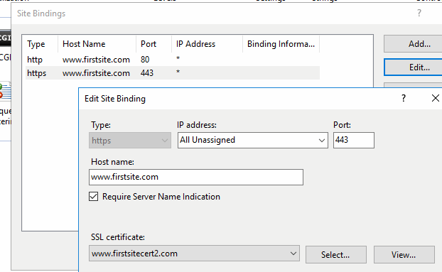

## Overview

The IIS Bound Certificate Certificate Store Type, identified by its short name 'IISU,' is designed for the management of certificates bound to IIS (Internet Information Services) servers. This store type allows users to automate and streamline the process of adding, removing, and reenrolling certificates for IIS sites, making it significantly easier to manage web server certificates.

### Key Features and Representation

The IISU store type represents the IIS servers and their certificate bindings. It specifically caters to managing SSL/TLS certificates tied to IIS websites, allowing bind operations such as specifying site names, IP addresses, ports, and enabling Server Name Indication (SNI). By default, it supports job types like Inventory, Add, Remove, and Reenrollment, thereby offering comprehensive management capabilities for IIS certificates.

### Limitations and Areas of Confusion

- **Caveats:** It's important to ensure that the Windows Remote Management (WinRM) is properly configured on the target server. The orchestrator relies on WinRM to perform its tasks, such as manipulating the Windows Certificate Stores. Misconfiguration of WinRM may lead to connection and permission issues.

- **Limitations:** Users should be aware that for this store type to function correctly, certain permissions are necessary. While some advanced users successfully use non-administrator accounts with specific permissions, it is officially supported only with Local Administrator permissions. Complexities with interactions between Group Policy, WinRM, User Account Control, and other environmental factors may impede operations if not properly configured.

- **Custom Alias and Private Keys:** The store type does not support custom aliases for individual entries and requires private keys because IIS certificates without private keys would be invalid.

## Requirements

### Security and Permission Considerations

From an official support point of view, Local Administrator permissions are required on the target server. Some customers have been successful with using other accounts and granting rights to the underlying certificate and private key stores. Due to complexities with the interactions between Group Policy, WinRM, User Account Control, and other unpredictable customer environmental factors, Keyfactor cannot provide assistance with using accounts other than the local administrator account.
 
For customers wishing to use something other than the local administrator account, the following information may be helpful:
 
*	The WinCert extensions (WinCert, IISU, WinSQL) create a WinRM (remote PowerShell) session to the target server in order to manipulate the Windows Certificate Stores, perform binding (in the case of the IISU extension), or to access the registry (in the case of the WinSQL extension). 
 
*	When the WinRM session is created, the certificate store credentials are used if they have been specified, otherwise the WinRM session is created in the context of the Universal Orchestrator (UO) Service account (which potentially could be the network service account, a regular account, or a GMSA account)
 
*	WinRM needs to be properly set up between the server hosting the UO and the target server. This means that a WinRM client running on the UO server when running in the context of the UO service account needs to be able to create a session on the target server using the configured credentials of the target server and any PowerShell commands running on the remote session need to have appropriate permissions. 
 
*	Even though a given account may be in the administrators group or have administrative privileges on the target system and may be able to execute certificate and binding operations when running locally, the same account may not work when being used via WinRM. User Account Control (UAC) can get in the way and filter out administrative privledges. UAC / WinRM configuration has a LocalAccountTokenFilterPolicy setting that can be adjusted to not filter out administrative privledges for remote users, but enabling this may have other security ramifications. 
 
*	The following list may not be exhaustive, but in general the account (when running under a remote WinRM session) needs permissions to:
    -	Instantiate and open a .NET X509Certificates.X509Store object for the target certificate store and be able to read and write both the certificates and related private keys. Note that ACL permissions on the stores and private keys are separate.
    -	Use the Import-Certificate, Get-WebSite, Get-WebBinding, and New-WebBinding PowerShell CmdLets.
    -	Create and delete temporary files.
    -	Execute certreq commands.
    -	Access any Cryptographic Service Provider (CSP) referenced in re-enrollment jobs.
    -	Read and Write values in the registry (HKLM:\SOFTWARE\Microsoft\Microsoft SQL Server) when performing SQL Server certificate binding.

## Extension Mechanics

#### Note Regarding Client Machine

If the IIS Universal Orchestrator is deployed on the same server as the certificates it manages, the Client Machine field can be configured to bypass WinRM and manage the certificates directly. To do this, append `|LocalMachine` to the end of the Client Machine value. 

In Keyfactor Command, the Client Machine and Store Path fields together must be unique among all Certificate Stores of a given type. For example, the following scenario is not valid in Command:

```yaml
- Orchestrator: machineA
  ClientMachine: |LocalMachine
  StorePath: My
- Orchestrator: machineB
  ClientMachine: |LocalMachine
  StorePath: My
```

To accomodate this use-case, we recommend prepending the target machine's FQDN or IP address to the Client Machine field. 

```yaml
- Orchestrator: machineA
  ClientMachine: 1.1.1.1|LocalMachine
  StorePath: My
- Orchestrator: machineB
  ClientMachine: 2.2.2.2|LocalMachine
  StorePath: My
```

> All characters before the `|` are ignored by the extension.

## Test Cases

| Case Number | Case Name                                                                               | Enrollment Params                                                                                                                                                                                                                                                                                                                                                                                               | Expected Results                                                                                         | Passed | Screenshot                                                           |
|-------------|-----------------------------------------------------------------------------------------|-----------------------------------------------------------------------------------------------------------------------------------------------------------------------------------------------------------------------------------------------------------------------------------------------------------------------------------------------------------------------------------------------------------------|----------------------------------------------------------------------------------------------------------|--------|----------------------------------------------------------------------|
| 1	          | New Cert Enrollment To New Binding With KFSecret Creds                                  | **Site Name:** FirstSite<br/>**Port:** 443<br/>**IP Address:**`*`<br/>**Host Name:** www.firstsite.com<br/>**Sni Flag:** 0 - No SNI<br/>**Protocol:** https                                                                                                                                                                                                                                                     | New Binding Created with Enrollment Params specified creds pulled from KFSecret                          | True   |                                      |
| 2           | New Cert Enrollment To Existing Binding                                                 | **Site Name:** FirstSite<br/>**Port:** 443<br/>**IP Address:**`*`<br/>**Host Name:** www.firstsite.com<br/>**Sni Flag:** 0 - No SNI<br/>**Protocol:** https                                                                                                                                                                                                                                                     | Existing Binding From Case 1 Updated with New Cert                                                       | True   |                                      |
| 3           | New Cert Enrollment To Existing Binding Enable SNI                                      | **Site Name:** FirstSite<br/>**Port:** 443<br/>**IP Address:**`*`<br/>**Host Name:** www.firstsite.com<br/>**Sni Flag:** 1 - SNI Enabled<br/>**Protocol:** https                                                                                                                                                                                                                                                | Will Update Site In Case 2 to Have Sni Enabled                                                           | True   |                                      |
| 4           | New Cert Enrollment New IP Address                                                      | **Site Name:** FirstSite<br/>**Port:** 443<br/>**IP Address:**`192.168.58.162`<br/>**Host Name:** www.firstsite.com<br/>**Sni Flag:** 1 - SNI Enabled<br/>**Protocol:** https                                                                                                                                                                                                                                   | New Binding Created With New IP and New SNI on Same Port                                                 | True   |                                      |
| 5           | New Cert Enrollment New Host Name                                                       | **Site Name:** FirstSite<br/>**Port:** 443<br/>**IP Address:**`192.168.58.162`<br/>**Host Name:** www.newhostname.com<br/>**Sni Flag:** 1 - SNI Enabled<br/>**Protocol:** https                                                                                                                                                                                                                                 | New Binding Created With different host on Same Port and IP Address                                      | True   |                                      |
| 6           | New Cert Enrollment Same Site New Port                                                  | **Site Name:** FirstSite<br/>**Port:** 4443<br/>**IP Address:**`192.168.58.162`<br/>**Host Name:** www.newhostname.com<br/>**Sni Flag:** 1 - SNI Enabled<br/>**Protocol:** https                                                                                                                                                                                                                                | New Binding on different port will be created with new cert enrolled                                     | True   |                                      |
| 7           | Remove Cert and Binding From Test Case 6                                                | **Site Name:** FirstSite<br/>**Port:** 4443<br/>**IP Address:**`192.168.58.162`<br/>**Host Name:** www.newhostname.com<br/>**Sni Flag:** 1 - SNI Enabled<br/>**Protocol:** https                                                                                                                                                                                                                                | Cert and Binding From Test Case 6 Removed                                                                | True   |                                      |
| 8           | Renew Same Cert on 2 Different Sites                                                    | `SITE 1`<br/>**Site Name:** FirstSite<br/>**Port:** 443<br/>**IP Address:**`*`<br/>**Host Name:** www.firstsite.com<br/>**Sni Flag:** 1 - SNI Enabled<br/>**Protocol:** https<br/>`SITE 2`<br/>**First Site**<br/>**Site Name:** SecondSite<br/>**Port:** 443<br/>**IP Address:**`*`<br/>**Host Name:** cstiis04.cstpki.int<br/>**Sni Flag:** 1 - SNI Enabled<br/>**Protocol:** https                           | Cert will be renewed on both sites because it has the same thumbprint                                    | True   |          |
| 9           | Renew Same Cert on Same Site Same Binding Settings Different Hostname                   | `BINDING 1`<br/>**Site Name:** FirstSite<br/>**Port:** 443<br/>**IP Address:**`*`<br/>**Host Name:** www.firstsitebinding1.com<br/>**Sni Flag:** 1 - SNI Enabled<br/>**Protocol:** https<br/>`BINDING 2`<br/>**Site Name:** FirstSite<br/>**Port:** 443<br/>**IP Address:**`*`<br/>**Host Name:** www.firstsitebinding2.com<br/>**Sni Flag:** 1 - SNI Enabled<br/>**Protocol:** https                           | Cert will be renewed on both bindings because it has the same thumbprint                                 | True   |    |
| 10          | Renew Single Cert on Same Site Same Binding Settings Different Hostname Different Certs | `BINDING 1`<br/>**Site Name:** FirstSite<br/>**Port:** 443<br/>**IP Address:**`*`<br/>**Host Name:** www.firstsitebinding1.com<br/>**Sni Flag:** 1 - SNI Enabled<br/>**Protocol:** https<br/>`BINDING 2`<br/>**Site Name:** FirstSite<br/>**Port:** 443<br/>**IP Address:**`*`<br/>**Host Name:** www.firstsitebinding2.com<br/>**Sni Flag:** 1 - SNI Enabled<br/>**Protocol:** https                           | Cert will be renewed on only one binding because the other binding does not match thumbprint             | True   |  |
| 11          | Renew Same Cert on Same Site Same Binding Settings Different IPs                        | `BINDING 1`<br/>**Site Name:** FirstSite<br/>**Port:** 443<br/>**IP Address:**`192.168.58.162`<br/>**Host Name:** www.firstsitebinding1.com<br/>**Sni Flag:** 1 - SNI Enabled<br/>**Protocol:** https<br/>`BINDING 2`<br/>**Site Name:** FirstSite<br/>**Port:** 443<br/>**IP Address:**`192.168.58.160`<br/>**Host Name:** www.firstsitebinding1.com<br/>**Sni Flag:** 1 - SNI Enabled<br/>**Protocol:** https | Cert will be renewed on both bindings because it has the same thumbprint                                 | True   |  |
| 12          | Renew Same Cert on Same Site Same Binding Settings Different Ports                      | `BINDING 1`<br/>**Site Name:** FirstSite<br/>**Port:** 443<br/>**IP Address:**`192.168.58.162`<br/>**Host Name:** www.firstsitebinding1.com<br/>**Sni Flag:** 1 - SNI Enabled<br/>**Protocol:** https<br/>`BINDING 2`<br/>**Site Name:** FirstSite<br/>**Port:** 543<br/>**IP Address:**`192.168.58.162`<br/>**Host Name:** www.firstsitebinding1.com<br/>**Sni Flag:** 1 - SNI Enabled<br/>**Protocol:** https | Cert will be renewed on both bindings because it has the same thumbprint                                 | True   |  |
| 13	         | ReEnrollment to Fortanix HSM                                                            | **Subject Name:** cn=www.mysite.com<br/>**Port:** 433<br/>**IP Address:**`*`<br/>**Host Name:** mysite.command.local<br/>**Site Name:**Default Web Site<br/>**Sni Flag:** 0 - No SNI<br/>**Protocol:** https<br/>**Provider Name:** Fortanix KMS CNG Provider<br/>**SAN:** dns=www.mysite.com&dns=mynewsite.com                                                                                                 | Cert will be generated with keys stored in Fortanix HSM and the cert will be bound to the supplied site. | true   |          |
| 14	         | New Cert Enrollment To New Binding With Pam Creds                                       | **Site Name:** FirstSite<br/>**Port:** 443<br/>**IP Address:**`*`<br/>**Host Name:** www.firstsite.com<br/>**Sni Flag:** 0 - No SNI<br/>**Protocol:** https                                                                                                                                                                                                                                                     | New Binding Created with Enrollment Params specified creds pulled from Pam Provider                      | True   |                                      |
| 15	         | New Cert Enrollment Default Site No HostName                                            | **Site Name:** Default Web Site<br/>**Port:** 443<br/>**IP Address:**`*`<br/>**Host Name:**<br/>**Sni Flag:** 0 - No SNI<br/>**Protocol:** https                                                                                                                                                                                                                                                                | New Binding Installed with no HostName                                                                   | True   |                                     |
