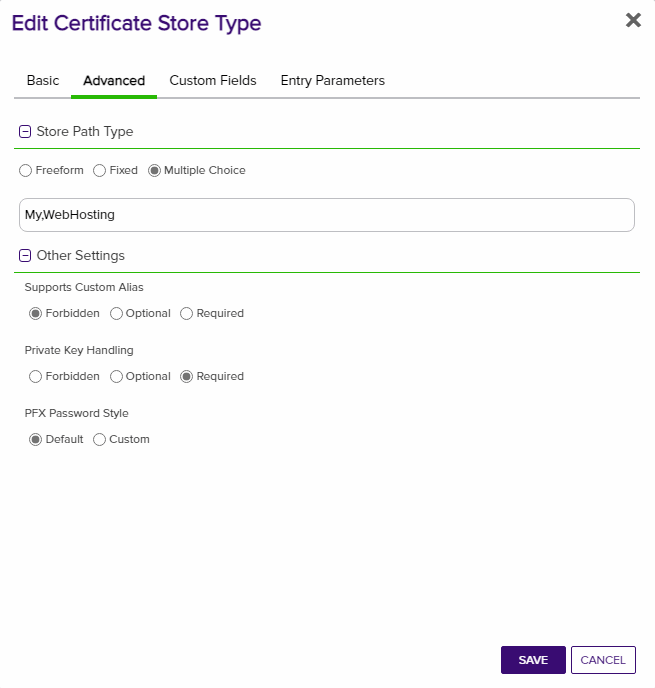
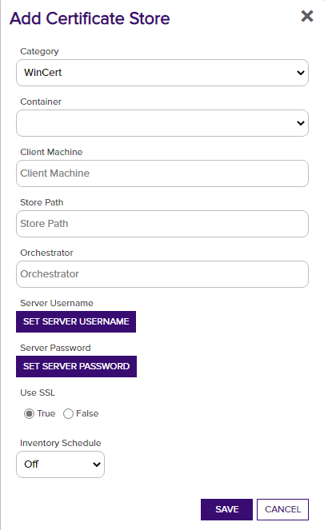

# WinCertStore Orchestrator Configuration
## Overview

The WinCertStore Orchestrator remotely manages certificates in a Windows Server local machine certificate store.  Users are able to determine which store they wish to place certificates in by entering the correct store path.  For a complete list of local machine cert stores you can execute the PowerShell command:

	Get-ChildItem Cert:\LocalMachine

The returned list will contain the actual certificate store name to be used when entering store location.

By default, most certificates are stored in the “Personal” (My) and “Web Hosting” (WebHosting) stores.

This extension implements four job types:  Inventory, Management Add/Remove, and ReEnrollment.

WinRM is used to remotely manage the certificate stores and IIS bindings.  WinRM must be properly configured to allow the orchestrator on the server to manage the certificates.  Setting up WinRM is not in the scope of this document.

**Note:**
In version 2.0 of the IIS Orchestrator, the certificate store type has been renamed and additional parameters have been added. Prior to 2.0 the certificate store type was called “IISBin” and as of 2.0 it is called “IISU”. If you have existing certificate stores of type “IISBin”, you have three options:
1. Leave them as is and continue to manage them with a pre 2.0 IIS Orchestrator Extension. Create the new IISU certificate store type and create any new IIS stores using the new type.
1. Delete existing IIS stores. Delete the IISBin store type. Create the new IISU store type. Recreate the IIS stores using the new IISU store type.
1. Convert existing IISBin certificate stores to IISU certificate stores. There is not currently a way to do this via the Keyfactor API, so direct updates to the underlying Keyfactor SQL database is required. A SQL script (IIS-Conversion.sql) is available in the repository to do this. Hosted customers, which do not have access to the underlying database, will need to work Keyfactor support to run the conversion. On-premises customers can run the script themselves, but are strongly encouraged to ensure that a SQL backup is taken prior running the script (and also be confident that they have a tested database restoration process.)

**Note: There is an additional (and deprecated) certificate store type of “IIS” that ships with the Keyfactor platform. Migration of certificate stores from the “IIS” type to either the “IISBin” or “IISU” types is not currently supported.**

## Creating New Certificate Store Types
Currently this orchestrator handles two extensions: IISU for IIS servers with bound certificates and WinCert for general Windows Certificates.
Below describes how each of these certificate store types are created and configured.

	
IISU Extension

**In Keyfactor Command create a new Certificate Store Type as specified below:**

**Basic Settings:**

CONFIG ELEMENT | VALUE | DESCRIPTION
--|--|--
Name | IISU | Display name for the store type (may be customized)
Short Name| IISU | Short display name for the store type
Custom Capability | IISU | Store type name orchestrator will register with. Check the box to allow entry of value
Supported Job Types | Inventory, Add, Remove, Reenrollment | Job types the extension supports
Needs Server | Checked | Determines if a target server name is required when creating store
Blueprint Allowed | Unchecked | Determines if store type may be included in an Orchestrator blueprint
Uses PowerShell | Unchecked | Determines if underlying implementation is PowerShell
Requires Store Password	| Unchecked | Determines if a store password is required when configuring an individual store.
Supports Entry Password	| Unchecked | Determines if an individual entry within a store can have a password.

**Advanced Settings:**

CONFIG ELEMENT | VALUE | DESCRIPTION
--|--|--
Store Path Type	| Multiple Choice | Determines what restrictions are applied to the store path field when configuring a new store.
Store Path Value | My,WebHosting | Comma separated list of options configure multiple choice. This, combined with the hostname, will determine the location used for the certificate store management and inventory.
Supports Custom Alias | Forbidden | Determines if an individual entry within a store can have a custom Alias.
Private Keys | Required | This determines if Keyfactor can send the private key associated with a certificate to the store. Required because IIS certificates without private keys would be useless.
PFX Password Style | Default or Custom | "Default" - PFX password is randomly generated, "Custom" - PFX password may be specified when the enrollment job is created (Requires the *Allow Custom Password* application setting to be enabled.)

**Custom Fields:**

Custom fields operate at the certificate store level and are used to control how the orchestrator connects to the remote
target server containing the certificate store to be managed

Parameter Name|Display Name|Parameter Type|Default Value / Options|Required|Description
---|---|---|---|---|---
ServerUsername|Server Username|Secret||No|The username to log into the target server (This field is automatically created)
ServerPassword|Server Password|Secret||No|The password that matches the username to log into the target server (This field is automatically created)
ServerUseSsl|Use SSL|Bool|True|Yes|Determine whether the server uses SSL or not (This field is automatically created)
WinRm Protocol|WinRm Protocol|Multiple Choice| https,http |Yes|Protocol that target server WinRM listener is using
WinRm Port|WinRm Port|String|5986|Yes| Port that target server WinRM listener is using. Typically 5985 for HTTP and 5986 for HTTPS
spnwithport|SPN With Port?|Boolean|false|No|Internally set the -IncludePortInSPN option when creating the remote PowerShell connection. Needed for some Kerberos configurations.

**Entry Parameters:**

Entry parameters are inventoried and maintained for each entry within a certificate store.
They are typically used to support binding of a certificate to a resource.

Parameter Name|Parameter Type|Default Value|Depends On|Required When|Description
---|---|---|---|---|---
SiteName |String|Default Web Site||Adding, Removing, Reenrolling|IIS web site to bind certificate to
IPAddress|String|*||Adding, Removing, Reenrolling|IP address to bind certificate to (use '*' for all IP addresses)
Port|String|443||Adding, Removing, Reenrolling|IP port for bind certificate to
HostName |String||||Host name (host header) to bind certificate to, leave blank for all host names
SniFlag  |Multiple Choice|0 - No SNI, 1 - SNI Enabled, 2 - Non SNI Binding, 3 - SNI Binding|||Type of SNI for binding (Mutlple choice configuration should be entered as "0 - No SNI,1 - SNI Enabled,2 - Non SNI Binding,3 - SNI Binding")
Protocol  |Multiple Choice|https||Adding, Removing, Reenrolling|Protocol to bind to (always "https"). 
ProviderName |String||||Name of the Windows cryptographic provider to use during reenrollment jobs when generating and storing the private keys. If not specified, defaults to 'Microsoft Strong Cryptographic Provider'. This value would typically be specified when leveraging a Hardware Security Module (HSM). The specified cryptographic provider must be available on the target server being managed. The list of installed cryptographic providers can be obtained by running 'certutil -csplist' on the target Server.
SAN	|String|||Reenrolling|Specifies Subject Alternative Name (SAN) to be used when performing reenrollment jobs. Certificate templates generally require a SAN that matches the subject of the certificate (per RFC 2818). Format is a list of <san_type>=<san_value> entries separated by ampersands. Examples: 'dns=www.mysite.com' for a single SAN or 'dns=www.mysite.com&dns=www.mysite2.com' for multiple SANs. Can be made optional if RFC 2818 is disabled on the CA.

Click Save to save the Certificate Store Type.

	
WinCert Extension

**1. In Keyfactor Command create a new Certificate Store Type using the settings below**

**Basic Settings:**

CONFIG ELEMENT | VALUE | DESCRIPTION
--|--|--
Name | WinCert | Display name for the store type (may be customized)
Short Name| WinCert | Short display name for the store type
Custom Capability | WinCert | Store type name orchestrator will register with. Check the box to allow entry of value
Supported Job Types | Inventory, Add, Remove, Reenrollment | Job types the extension supports
Needs Server | Checked | Determines if a target server name is required when creating store
Blueprint Allowed | Unchecked | Determines if store type may be included in an Orchestrator blueprint
Uses PowerShell | Unchecked | Determines if underlying implementation is PowerShell
Requires Store Password	| Unchecked | Determines if a store password is required when configuring an individual store.
Supports Entry Password	| Unchecked | Determines if an individual entry within a store can have a password.

**Advanced Settings:**

CONFIG ELEMENT | VALUE | DESCRIPTION
--|--|--
Store Path Type	| Freeform | Allows users to type in a valid certificate store.
Supports Custom Alias | Forbidden | Determines if an individual entry within a store can have a custom Alias.
Private Keys | Required | This determines if Keyfactor can send the private key associated with a certificate to the store. Required because IIS certificates without private keys would be useless.
PFX Password Style | Default or Custom | "Default" - PFX password is randomly generated, "Custom" - PFX password may be specified when the enrollment job is created (Requires the *Allow Custom Password* application setting to be enabled.)

**Custom Fields:**

Custom fields operate at the certificate store level and are used to control how the orchestrator connects to the remote target server containing the certificate store to be managed

Parameter Name|Display Name|Parameter Type|Default Value / Options|Required|Description
---|---|---|---|---|---
ServerUsername|Server Username|Secret||No|The username to log into the target server (This field is automatically created)
ServerPassword|Server Password|Secret||No|The password that matches the username to log into the target server (This field is automatically created)
ServerUseSsl|Use SSL|Bool|True|Yes|Determine whether the server uses SSL or not (This field is automatically created)
WinRm Protocol|WinRm Protocol|Multiple Choice| https,http |Yes|Protocol that target server WinRM listener is using
WinRm Port|WinRm Port|String|5986|Yes| Port that target server WinRM listener is using. Typically 5985 for HTTP and 5986 for HTTPS
spnwithport|SPN With Port?|Boolean|false|No|Internally set the -IncludePortInSPN option when creating the remote PowerShell connection. Needed for some Kerberos configurations.

**Entry Parameters:**

Entry parameters are inventoried and maintained for each entry within a certificate store.
They are typically used to support binding of a certificate to a resource.
For the WinCert store type they are used to control how reenrollment jobs are performed.

Parameter Name|Parameter Type|Default Value|Depends On|Required When|Description
---|---|---|---|---|---
ProviderName |String||||Name of the Windows cryptographic provider to use during reenrollment jobs when generating and storing the private keys. If not specified, defaults to 'Microsoft Strong Cryptographic Provider'. This value would typically be specified when leveraging a Hardware Security Module (HSM). The specified cryptographic provider must be available on the target server being managed. The list of installed cryptographic providers can be obtained by running 'certutil -csplist' on the target Server.
SAN	|String|||Reenrolling (if the CA follows RFC 2818 specifications)|Specifies Subject Alternative Name (SAN) to be used when performing reenrollment jobs. Certificate templates generally require a SAN that matches the subject of the certificate (per RFC 2818). Format is a list of <san_type>=<san_value> entries separated by ampersands. Examples: 'dns=www.mysite.com' for a single SAN or 'dns=www.mysite.com&dns=www.mysite2.com' for multiple SANs. Can be made optional if RFC 2818 is disabled on the CA.

Click Save to save the Certificate Store Type.

## Creating New Certificate Stores
Once the Certificate Store Types have been created, you need to create the Certificate Stores prior to using the extension.
Here are the settings required for each Store Type previously configured.

IISU Certificate Store

In Keyfactor Command, navigate to Certificate Stores from the Locations Menu.  Click the Add button to create a new Certificate Store using the settings defined below.

#### STORE CONFIGURATION 
CONFIG ELEMENT	|DESCRIPTION
----------------|---------------
Category	|Select the IISU from the dropdown.  This is the name of the Certificate Store Type you previously created.
Container	|This is a logical grouping of like stores. This configuration is optional and does not impact the functionality of the store.
Client Machine	|The hostname of the server to be managed. The Change Credentials option must be clicked to provide a username and password. This account will be used to manage the remote server via PowerShell.
Credentials |Local or domain admin account that has permissions to manage iis (Has to be admin)
Store Path	|Select My or WebHosting from the dropdown.
Orchestrator	|This is the orchestrator server registered with the appropriate capabilities to manage this certificate store type. 
SPN with Port?| Defaulted to False
WinRm Protocol|Select either http or https
WinRm Port |Port to run WinRm on Default for http is 5985
Server Username|Username to log into the IIS Server
Server Password|Password for the username required to log into the IIS Server
Use SSL|Determines whether SSL is used or not
Inventory Schedule	|The interval that the system will use to report on what certificates are currently in the store. 

Click Save to save the settings for this Certificate Store

WinCert Certificate Store

In Keyfactor Command, navigate to Certificate Stores from the Locations Menu.  Click the Add button to create a new Certificate Store using the settings defined below.

#### STORE CONFIGURATION 
CONFIG ELEMENT	|DESCRIPTION
----------------|---------------
Category	|The type of certificate store to be configured. Select category based on the display name configured above for WinCert.
Container	|This is a logical grouping of like stores. This configuration is optional and does not impact the functionality of the store.
Client Machine	|The hostname of the server to be managed. The Change Credentials option must be clicked to provide a username and password. This account will be used to manage the remote server via PowerShell.
Store Path	|Enter the specific name of the certificate store path you want to use. 
Orchestrator	|This is the orchestrator server registered with the appropriate capabilities to manage this certificate store type. 
SPN with Port?|Defaults to False
WinRm Protocol|Select http or https
WinRm Port |Port to run WinRm on Default for http is 5985
Server Username|Username to log into the IIS Server
Server Password|Password for the username required to log into the IIS Server
Use SSL|Determines whether SSL is used or not
Inventory Schedule	|The interval that the system will use to report on what certificates are currently in the store. 

## Test Cases

IISU

Case Number|Case Name|Enrollment Params|Expected Results|Passed|Screenshot
----|------------------------|------------------------------------|--------------|----------------|-------------------------
1	|New Cert Enrollment To New Binding With KFSecret Creds|**Site Name:** FirstSite **Port:** 443 **IP Address:**`*` **Host Name:** www.firstsite.com **Sni Flag:** 0 - No SNI **Protocol:** https|New Binding Created with Enrollment Params specified creds pulled from KFSecret|True|
2   |New Cert Enrollment To Existing Binding|**Site Name:** FirstSite **Port:** 443 **IP Address:**`*` **Host Name:** www.firstsite.com **Sni Flag:** 0 - No SNI **Protocol:** https|Existing Binding From Case 1 Updated with New Cert|True|
3   |New Cert Enrollment To Existing Binding Enable SNI |**Site Name:** FirstSite **Port:** 443 **IP Address:**`*` **Host Name:** www.firstsite.com **Sni Flag:** 1 - SNI Enabled **Protocol:** https|Will Update Site In Case 2 to Have Sni Enabled|True|
4   |New Cert Enrollment New IP Address|**Site Name:** FirstSite **Port:** 443 **IP Address:**`192.168.58.162` **Host Name:** www.firstsite.com **Sni Flag:** 1 - SNI Enabled **Protocol:** https|New Binding Created With New IP and New SNI on Same Port|True|
5   |New Cert Enrollment New Host Name|**Site Name:** FirstSite **Port:** 443 **IP Address:**`192.168.58.162` **Host Name:** www.newhostname.com **Sni Flag:** 1 - SNI Enabled **Protocol:** https|New Binding Created With different host on Same Port and IP Address|True|
6   |New Cert Enrollment Same Site New Port |**Site Name:** FirstSite **Port:** 4443 **IP Address:**`192.168.58.162` **Host Name:** www.newhostname.com **Sni Flag:** 1 - SNI Enabled **Protocol:** https|New Binding on different port will be created with new cert enrolled|True|
7   |Remove Cert and Binding From Test Case 6|**Site Name:** FirstSite **Port:** 4443 **IP Address:**`192.168.58.162` **Host Name:** www.newhostname.com **Sni Flag:** 1 - SNI Enabled **Protocol:** https|Cert and Binding From Test Case 6 Removed|True|
8   |Renew Same Cert on 2 Different Sites|`SITE 1` **Site Name:** FirstSite **Port:** 443 **IP Address:**`*` **Host Name:** www.firstsite.com **Sni Flag:** 1 - SNI Enabled **Protocol:** https `SITE 2` **First Site** **Site Name:** SecondSite **Port:** 443 **IP Address:**`*` **Host Name:** cstiis04.cstpki.int **Sni Flag:** 1 - SNI Enabled **Protocol:** https|Cert will be renewed on both sites because it has the same thrumbprint|True|
9   |Renew Same Cert on Same Site Same Binding Settings Different Hostname|`BINDING 1` **Site Name:** FirstSite **Port:** 443 **IP Address:**`*` **Host Name:** www.firstsitebinding1.com **Sni Flag:** 1 - SNI Enabled **Protocol:** https `BINDING 2` **Site Name:** FirstSite **Port:** 443 **IP Address:**`*` **Host Name:** www.firstsitebinding2.com **Sni Flag:** 1 - SNI Enabled **Protocol:** https|Cert will be renewed on both bindings because it has the same thrumbprint|True|
10  |Renew Single Cert on Same Site Same Binding Settings Different Hostname Different Certs|`BINDING 1` **Site Name:** FirstSite **Port:** 443 **IP Address:**`*` **Host Name:** www.firstsitebinding1.com **Sni Flag:** 1 - SNI Enabled **Protocol:** https `BINDING 2` **Site Name:** FirstSite **Port:** 443 **IP Address:**`*` **Host Name:** www.firstsitebinding2.com **Sni Flag:** 1 - SNI Enabled **Protocol:** https|Cert will be renewed on only one binding because the other binding does not match thrumbprint|True|
11  |Renew Same Cert on Same Site Same Binding Settings Different IPs|`BINDING 1` **Site Name:** FirstSite **Port:** 443 **IP Address:**`192.168.58.162` **Host Name:** www.firstsitebinding1.com **Sni Flag:** 1 - SNI Enabled **Protocol:** https `BINDING 2` **Site Name:** FirstSite **Port:** 443 **IP Address:**`192.168.58.160` **Host Name:** www.firstsitebinding1.com **Sni Flag:** 1 - SNI Enabled **Protocol:** https|Cert will be renewed on both bindings because it has the same thrumbprint|True|
12  |Renew Same Cert on Same Site Same Binding Settings Different Ports|`BINDING 1` **Site Name:** FirstSite **Port:** 443 **IP Address:**`192.168.58.162` **Host Name:** www.firstsitebinding1.com **Sni Flag:** 1 - SNI Enabled **Protocol:** https `BINDING 2` **Site Name:** FirstSite **Port:** 543 **IP Address:**`192.168.58.162` **Host Name:** www.firstsitebinding1.com **Sni Flag:** 1 - SNI Enabled **Protocol:** https|Cert will be renewed on both bindings because it has the same thrumbprint|True|
13	|ReEnrollment to Fortanix HSM|**Subject Name:** cn=www.mysite.com **Port:** 433 **IP Address:**`*` **Host Name:** mysite.command.local **Site Name:**Default Web Site **Sni Flag:** 0 - No SNI **Protocol:** https **Provider Name:** Fortanix KMS CNG Provider **SAN:** dns=www.mysite.com&dns=mynewsite.com|Cert will be generated with keys stored in Fortanix HSM and the cert will be bound to the supplied site.|true|
14	|New Cert Enrollment To New Binding With Pam Creds|**Site Name:** FirstSite **Port:** 443 **IP Address:**`*` **Host Name:** www.firstsite.com **Sni Flag:** 0 - No SNI **Protocol:** https|New Binding Created with Enrollment Params specified creds pulled from Pam Provider|True|
15	|New Cert Enrollment Default Site No HostName|**Site Name:** Default Web Site **Port:** 443 **IP Address:**`*` **Host Name:** **Sni Flag:** 0 - No SNI **Protocol:** https|New Binding Installed with no HostName|True|
	

