# WinCertStore Orchestrator Configuration
## Overview

The WinCertStore Orchestrator remotely manages certificates in a Windows Server local machine certificate store.  Users are able to determine which store they wish to place certificates in by entering the correct store path.  For a complete list of local machine cert stores you can execute the PowerShell command:

	Get-ChildItem Cert:\LocalMachine

The returned list will contain the actual certificate store name to be used when entering store location.

By default, most certificates are stored in the “Personal” (My) and “Web Hosting” (WebHosting) stores.

This extension implements four job types:  Inventory, Management Add/Remove, and Reenrollment.

WinRM is used to remotely manage the certificate stores and IIS bindings.  WinRM must be properly configured to allow the orchestrator on the server to manage the certificates.  Setting up WinRM is not in the scope of this document.

**Note:**
In version 2.0 of the IIS Orchestrator, the certificate store type has been renamed and additional parameters have been added. Prior to 2.0 the certificate store type was called “IISBin” and as of 2.0 it is called “IISU”. If you have existing certificate stores of type “IISBin”, you have three options:
1. Leave them as is and continue to manage them with a pre 2.0 IIS Orchestrator Extension. Create the new IISU certificate store type and create any new IIS stores using the new type.
1. Delete existing IIS stores. Delete the IISBin store type. Create the new IISU store type. Recreate the IIS stores using the new IISU store type.
1. Convert existing IISBin certificate stores to IISU certificate stores. There is not currently a way to do this via the Keyfactor API, so direct updates to the underlying Keyfactor SQL database is required. A SQL script (IIS-Conversion.sql) is available in the repository to do this. Hosted customers, which do not have access to the underlying database, will need to work Keyfactor support to run the conversion. On-premises customers can run the script themselves, but are strongly encouraged to ensure that a SQL backup is taken prior running the script (and also be confident that they have a tested database restoration process.)

**Note: There is an additional (and deprecated) certificate store type of “IIS” that ships with the Keyfactor platform. Migration of certificate stores from the “IIS” type to either the “IISBin” or “IISU” types is not currently supported.**

**Note: If Looking to use GMSA Accounts to run the Service Keyfactor Command 10.2 or greater is required for No Value checkbox to work**

## Security and Permission Considerations
From an official support point of view, Local Administrator permissions are required on the target server. Some customers have been successful with using other accounts and granting rights to the underlying certificate and private key stores. Due to complexities with the interactions between Group Policy, WinRM, User Account Control, and other unpredictable customer environmental factors, Keyfactor cannot provide assistance with using accounts other than the local administrator account.
 
For customers wishing to use something other than the local administrator account, the following information may be helpful:
 
*	The WinCert extensions (WinCert, IISU, WinSQL) create a WinRM (remote PowerShell) session to the target server in order to manipulate the Windows Certificate Stores, perform binding (in the case of the IISU extension), or to access the registry (in the case of the WinSQL extension). 
 
*	When the WinRM session is created, the certificate store credentials are used if they have been specified, otherwise the WinRM session is created in the context of the Universal Orchestrator (UO) Service account (which potentially could be the network service account, a regular account, or a GMSA account)
 
*	WinRM needs to be properly set up between the server hosting the UO and the target server. This means that a WinRM client running on the UO server when running in the context of the UO service account needs to be able to create a session on the target server using the configured credentials of the target server and any PowerShell commands running on the remote session need to have appropriate permissions. 
 
*	Even though a given account may be in the administrators group or have administrative privileges on the target system and may be able to execute certificate and binding operations when running locally, the same account may not work when being used via WinRM. User Account Control (UAC) can get in the way and filter out administrative privledges. UAC / WinRM configuration has a LocalAccountTokenFilterPolicy setting that can be adjusted to not filter out administrative privledges for remote users, but enabling this may have other security ramifications. 
 
*	The following list may not be exhaustive, but in general the account (when running under a remote WinRM session) needs permissions to:
    -	Instantiate and open a .NET X509Certificates.X509Store object for the target certificate store and be able to read and write both the certificates and related private keys. Note that ACL permissions on the stores and private keys are separate.
    -	Use the Import-Certificate, Get-WebSite, Get-WebBinding, and New-WebBinding PowerShell CmdLets.
    -	Create and delete temporary files.
    -	Execute certreq commands.
    -	Access any Cryptographic Service Provider (CSP) referenced in re-enrollment jobs.
    -	Read and Write values in the registry (HKLM:\SOFTWARE\Microsoft\Microsoft SQL Server) when performing SQL Server certificate binding.

## Creating New Certificate Store Types
Currently this orchestrator handles three types of extensions: IISU for IIS servers with bound certificates, WinCert for general Windows Certificates and WinSql for managing certificates for SQL Server.
Below describes how each of these certificate store types are created and configured.

	
IISU Extension

**In Keyfactor Command create a new Certificate Store Type as specified below:**

**Basic Settings:**

CONFIG ELEMENT | VALUE | DESCRIPTION
--|--|--
Name | IIS Bound Certificate | Display name for the store type (may be customized)
Short Name| IISU | Short display name for the store type
Custom Capability | IISU | Store type name orchestrator will register with. Check the box to allow entry of value
Supported Job Types | Inventory, Add, Remove, Reenrollment | Job types the extension supports
Needs Server | Checked | Determines if a target server name is required when creating store
Blueprint Allowed | Unchecked | Determines if store type may be included in an Orchestrator blueprint
Uses PowerShell | Unchecked | Determines if underlying implementation is PowerShell
Requires Store Password	| Unchecked | Determines if a store password is required when configuring an individual store.
Supports Entry Password	| Unchecked | Determines if an individual entry within a store can have a password.

**Advanced Settings:**

CONFIG ELEMENT | VALUE | DESCRIPTION
--|--|--
Store Path Type	| Multiple Choice | Determines what restrictions are applied to the store path field when configuring a new store.
Store Path Value | My,WebHosting | Comma separated list of options configure multiple choice. This, combined with the hostname, will determine the location used for the certificate store management and inventory.
Supports Custom Alias | Forbidden | Determines if an individual entry within a store can have a custom Alias.
Private Keys | Required | This determines if Keyfactor can send the private key associated with a certificate to the store. Required because IIS certificates without private keys would be invalid.
PFX Password Style | Default or Custom | "Default" - PFX password is randomly generated, "Custom" - PFX password may be specified when the enrollment job is created (Requires the *Allow Custom Password* application setting to be enabled.)

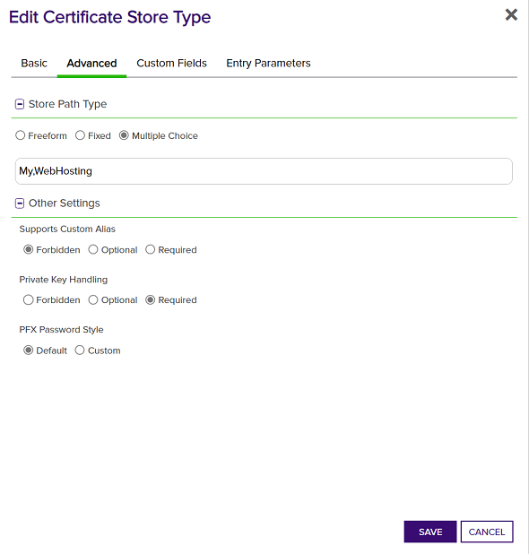

**Custom Fields:**

Custom fields operate at the certificate store level and are used to control how the orchestrator connects to the remote
target server containing the certificate store to be managed

Name|Display Name|Type|Default Value / Options|Required|Description
---|---|---|---|---|---
WinRm Protocol|WinRm Protocol|Multiple Choice| https,http |Yes|Protocol that target server WinRM listener is using
WinRm Port|WinRm Port|String|5986|Yes| Port that target server WinRM listener is using. Typically 5985 for HTTP and 5986 for HTTPS
spnwithport|SPN With Port|Bool|false|No|Internally set the -IncludePortInSPN option when creating the remote PowerShell connection. Needed for some Kerberos configurations.
ServerUsername|Server Username|Secret||No|The username to log into the target server (This field is automatically created).   Check the No Value Checkbox when using GMSA Accounts.
ServerPassword|Server Password|Secret||No|The password that matches the username to log into the target server (This field is automatically created).  Check the No Value Checkbox when using GMSA Accounts.
ServerUseSsl|Use SSL|Bool|true|Yes|Determine whether the server uses SSL or not (This field is automatically created)

*Note that some of the Names in the first column above have spaces and some do not, it is important to configure the Name field exactly as above.*

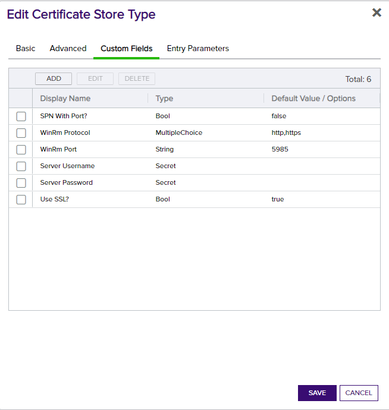

**Entry Parameters:**

Entry parameters are inventoried and maintained for each entry within a certificate store.
They are typically used to support binding of a certificate to a resource.

Name|Display Name| Type|Default Value|Required When|Description
---|---|---|---|---|---
SiteName | IIS Site Name|String|Default Web Site|Adding, Removing, Reenrolling | IIS web site to bind certificate to
IPAddress | IP Address | String | * | Adding, Removing, Reenrolling | IP address to bind certificate to (use '*' for all IP addresses)
Port | Port | String | 443 || Adding, Removing, Reenrolling|IP port for bind certificate to
HostName | Host Name | String |||| Host name (host header) to bind certificate to, leave blank for all host names
SniFlag | SNI Support | Multiple Choice | 0 - No SNI||Type of SNI for binding (Multiple choice configuration should be entered as "0 - No SNI,1 - SNI Enabled,2 - Non SNI Binding,3 - SNI Binding")
Protocol | Protocol | Multiple Choice | https| Adding, Removing, Reenrolling|Protocol to bind to (always "https"). (Multiple choice configuration should be "https") 
ProviderName | Crypto Provider Name | String ||| Name of the Windows cryptographic provider to use during reenrollment jobs when generating and storing the private keys. If not specified, defaults to 'Microsoft Strong Cryptographic Provider'. This value would typically be specified when leveraging a Hardware Security Module (HSM). The specified cryptographic provider must be available on the target server being managed. The list of installed cryptographic providers can be obtained by running 'certutil -csplist' on the target Server.
SAN | SAN | String || Reenrolling | Specifies Subject Alternative Name (SAN) to be used when performing reenrollment jobs. Certificate templates generally require a SAN that matches the subject of the certificate (per RFC 2818). Format is a list of <san_type>=<san_value> entries separated by ampersands. Examples: 'dns=www.mysite.com' for a single SAN or 'dns=www.mysite.com&dns=www.mysite2.com' for multiple SANs. Can be made optional if RFC 2818 is disabled on the CA.

None of the above entry parameters have the "Depends On" field set.

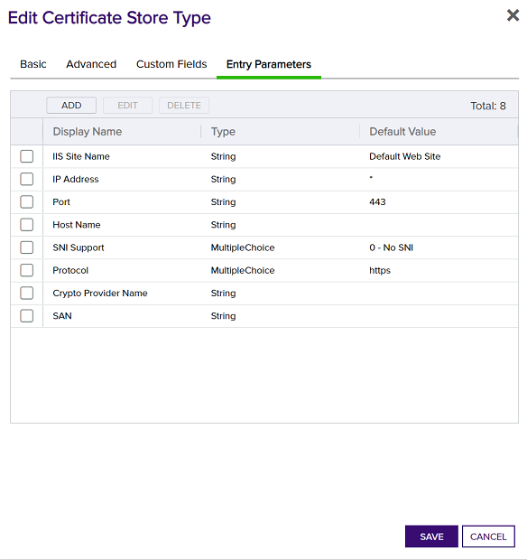

Click Save to save the Certificate Store Type.

	
SQL Server Extension

**In Keyfactor Command create a new Certificate Store Type as specified below:**

**Basic Settings:**

CONFIG ELEMENT | VALUE | DESCRIPTION
--|--|--
Name | Windows SQL Server Certificate| Display name for the store type (may be customized)
Short Name| WinSql | Short display name for the store type
Custom Capability | Leave Unchecked | Store type name orchestrator will register with. Check the box to allow entry of value
Supported Job Types | Inventory, Add, Remove, Reenrollment | Job types the extension supports
Needs Server | Checked | Determines if a target server name is required when creating store
Blueprint Allowed | Checked | Determines if store type may be included in an Orchestrator blueprint
Uses PowerShell | Unchecked | Determines if underlying implementation is PowerShell
Requires Store Password	| Unchecked | Determines if a store password is required when configuring an individual store.
Supports Entry Password	| Unchecked | Determines if an individual entry within a store can have a password.

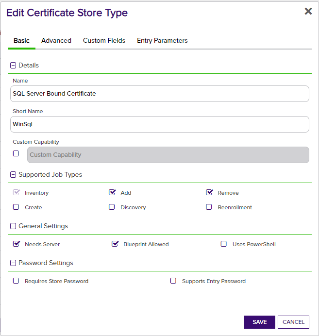

**Advanced Settings:**

CONFIG ELEMENT | VALUE | DESCRIPTION
--|--|--
Store Path Type	| Fixed | Fixed to a defined path.  SQL Server Supports the Personal or "My" store on the Local Machine.
Store Path Value | My | Fixed Value My on the Local Machine Store.
Supports Custom Alias | Forbidden | Determines if an individual entry within a store can have a custom Alias.
Private Keys | Required | This determines if Keyfactor can send the private key associated with a certificate to the store. Required because SQL Server certificates without private keys would be useless.
PFX Password Style | Default or Custom | "Default" - PFX password is randomly generated, "Custom" - PFX password may be specified when the enrollment job is created (Requires the *Allow Custom Password* application setting to be enabled.)

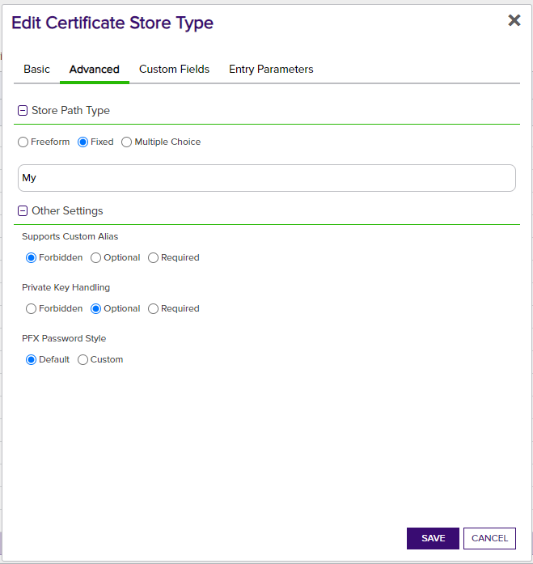

**Custom Fields:**

Custom fields operate at the certificate store level and are used to control how the orchestrator connects to the remote
target server containing the certificate store to be managed

Name|Display Name|Type|Default Value / Options|Required|Description
---|---|---|---|---|---
WinRm Protocol|WinRm Protocol|Multiple Choice| https,http |Yes|Protocol that target server WinRM listener is using
WinRm Port|WinRm Port|String|5986|Yes| Port that target server WinRM listener is using. Typically 5985 for HTTP and 5986 for HTTPS
spnwithport|SPN With Port|Bool|false|No|Internally set the -IncludePortInSPN option when creating the remote PowerShell connection. Needed for some Kerberos configurations.
ServerUsername|Server Username|Secret||No|The username to log into the target server (This field is automatically created).   Check the No Value Checkbox when using GMSA Accounts.
ServerPassword|Server Password|Secret||No|The password that matches the username to log into the target server (This field is automatically created).  Check the No Value Checkbox when using GMSA Accounts.
ServerUseSsl|Use SSL|Bool|true|Yes|Determine whether the server uses SSL or not (This field is automatically created)
RestartService|Restart SQL Service After Cert Installed|Bool|False|Yes|If true, Orchestrator will restart the SQL Server Service after installing the certificate.

*Note that some of the Names in the first column above have spaces and some do not, it is important to configure the Name field exactly as above.*

**Entry Parameters:**

Entry parameters are inventoried and maintained for each entry within a certificate store.
They are typically used to support binding of a certificate to a resource.

Name|Display Name| Type|Default Value|Required When|Description
---|---|---|---|---|---
InstanceName | Instance Name|String||Not required | When enrolling leave blank or use MSSQLServer for the Default Instance, Instance Name for an Instance or MSSQLServer,Instance Name if enrolling to multiple instances plus the default instance.
ProviderName | Crypto Provider Name | String ||| Name of the Windows cryptographic provider to use during reenrollment jobs when generating and storing the private keys. If not specified, defaults to 'Microsoft Strong Cryptographic Provider'. This value would typically be specified when leveraging a Hardware Security Module (HSM). The specified cryptographic provider must be available on the target server being managed. The list of installed cryptographic providers can be obtained by running 'certutil -csplist' on the target Server.
SAN | SAN | String || Reenrolling | Specifies Subject Alternative Name (SAN) to be used when performing reenrollment jobs. Certificate templates generally require a SAN that matches the subject of the certificate (per RFC 2818). Format is a list of <san_type>=<san_value> entries separated by ampersands. Examples: 'dns=www.mysite.com' for a single SAN or 'dns=www.mysite.com&dns=www.mysite2.com' for multiple SANs. Can be made optional if RFC 2818 is disabled on the CA.

Click Save to save the Certificate Store Type.

	
WinCert Extension

**1. In Keyfactor Command create a new Certificate Store Type using the settings below**

**Basic Settings:**

CONFIG ELEMENT | VALUE | DESCRIPTION
--|--|--
Name | Windows Certificate | Display name for the store type (may be customized)
Short Name| WinCert | Short display name for the store type
Custom Capability | WinCert | Store type name orchestrator will register with. Check the box to allow entry of value
Supported Job Types | Inventory, Add, Remove, Reenrollment | Job types the extension supports
Needs Server | Checked | Determines if a target server name is required when creating store
Blueprint Allowed | Unchecked | Determines if store type may be included in an Orchestrator blueprint
Uses PowerShell | Unchecked | Determines if underlying implementation is PowerShell
Requires Store Password	| Unchecked | Determines if a store password is required when configuring an individual store.
Supports Entry Password	| Unchecked | Determines if an individual entry within a store can have a password.

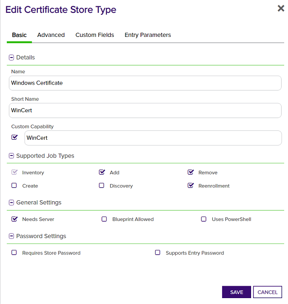

**Advanced Settings:**

CONFIG ELEMENT | VALUE | DESCRIPTION
--|--|--
Store Path Type	| Freeform | Allows users to type in a valid certificate store.
Supports Custom Alias | Forbidden | Determines if an individual entry within a store can have a custom Alias.
Private Keys | Optional | This determines if Keyfactor can send the private key associated with a certificate to the store. Typically the personal store would have private keys, whereas trusted root would not.
PFX Password Style | Default or Custom | "Default" - PFX password is randomly generated, "Custom" - PFX password may be specified when the enrollment job is created (Requires the *Allow Custom Password* application setting to be enabled.)

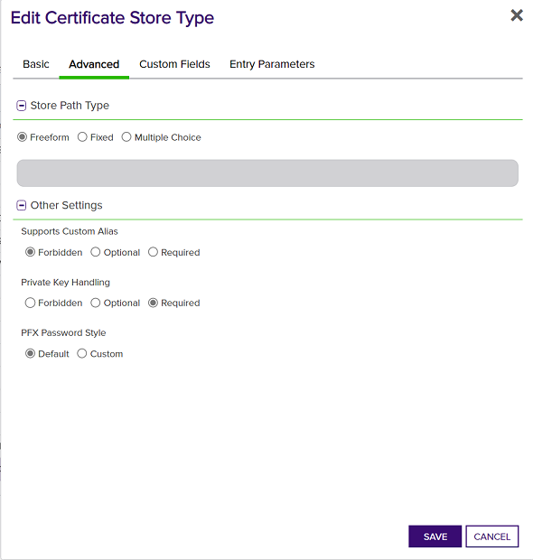

**Custom Fields:**

Custom fields operate at the certificate store level and are used to control how the orchestrator connects to the remote target server containing the certificate store to be managed

Name|Display Name|Type|Default Value / Options|Required|Description
---|---|---|---|---|---
WinRm Protocol|WinRm Protocol|Multiple Choice| https,http |Yes|Protocol that target server WinRM listener is using
WinRm Port|WinRm Port|String|5986|Yes| Port that target server WinRM listener is using. Typically 5985 for HTTP and 5986 for HTTPS
spnwithport|SPN With Port|Bool|false|No|Internally set the -IncludePortInSPN option when creating the remote PowerShell connection. Needed for some Kerberos configurations.
ServerUsername|Server Username|Secret||No|The username to log into the target server (This field is automatically created)
ServerPassword|Server Password|Secret||No|The password that matches the username to log into the target server (This field is automatically created)
ServerUseSsl|Use SSL|Bool|True|Yes|Determine whether the server uses SSL or not (This field is automatically created)

*Note that some of the Names in the first column above have spaces and some do not, it is important to configure the Name field exactly as above.*

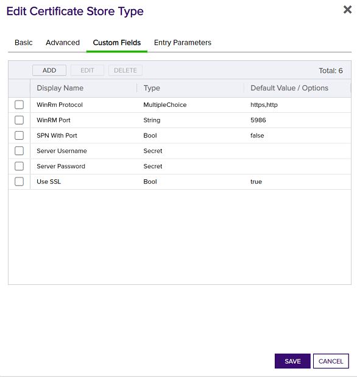

**Entry Parameters:**

Entry parameters are inventoried and maintained for each entry within a certificate store.
They are typically used to support binding of a certificate to a resource.
For the WinCert store type they are used to control how reenrollment jobs are performed.

Name|Display Name| Type|Default Value|Required When|Description
---|---|---|---|---|---
ProviderName | Crypto Provider Name | String ||| Name of the Windows cryptographic provider to use during reenrollment jobs when generating and storing the private keys. If not specified, defaults to 'Microsoft Strong Cryptographic Provider'. This value would typically be specified when leveraging a Hardware Security Module (HSM). The specified cryptographic provider must be available on the target server being managed. The list of installed cryptographic providers can be obtained by running 'certutil -csplist' on the target Server.
SAN | SAN | String || Reenrolling | Specifies Subject Alternative Name (SAN) to be used when performing reenrollment jobs. Certificate templates generally require a SAN that matches the subject of the certificate (per RFC 2818). Format is a list of <san_type>=<san_value> entries separated by ampersands. Examples: 'dns=www.mysite.com' for a single SAN or 'dns=www.mysite.com&dns=www.mysite2.com' for multiple SANs. Can be made optional if RFC 2818 is disabled on the CA.

None of the above entry parameters have the "Depends On" field set.

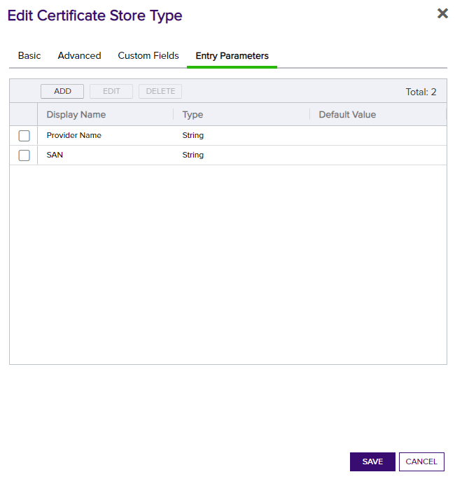

Click Save to save the Certificate Store Type.

## Creating New Certificate Stores
Once the Certificate Store Types have been created, you need to create the Certificate Stores prior to using the extension.

**Note:**  A new naming convention for the Client Machine allows for multiple stores on the same server with different cert store path and cert store types. This convention is \{MachineName\}\|\{[optional]localmachine\}. If the optional value is 'localmachine' (legacy 'localhost' is still supported) is supplied, a local PowerShell runspace executing in the context of the Orchestrator service account will be used to access the certificate store.
Here are the settings required for each Store Type previously configured.

IISU Certificate Store

In Keyfactor Command, navigate to Certificate Stores from the Locations Menu.  Click the Add button to create a new Certificate Store using the settings defined below.

#### STORE CONFIGURATION 
CONFIG ELEMENT	|DESCRIPTION
----------------|---------------
Category | Select IIS Bound Certificate or the customized certificate store display name from above.
Container | Optional container to associate certificate store with.
Client Machine | Contains the Hostname of the Windows Server containing the certificate store to be managed. If this value is a hostname, a WinRM session will be established using the credentials specified in the Server Username and Server Password fields.
Store Path | Windows certificate store to manage. Choose "My" for the Personal Store or "WebHosting" for the Web Hosting Store. 
Orchestrator | Select an approved orchestrator capable of managing IIS Bound Certificates (one that has declared the IISU capability)
WinRm Protocol | Protocol to use when establishing the WinRM session. (Listener on Client Machine must be configured for selected protocol.)
WinRm Port | Port WinRM listener is configured for (HTTPS default is 5986)
SPN with Port | Typically False. Needed in some Kerberos configurations.
Server Username | Account to use when establishing the WinRM session to the Client Machine. Account needs to be an administrator or have been granted rights to manage IIS configuration and manipulate the local machine certificate store. If no account is specified, the security context of the Orchestrator service account will be used.
Server Password | Password to use when establishing the WinRM session to the Client Machine
Use SSL | Ignored for this certificate store type. Transport encryption is determined by the WinRM Protocol Setting
Inventory Schedule | The interval that the system will use to report on what certificates are currently in the store. 

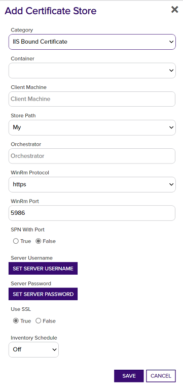

Click Save to save the settings for this Certificate Store

SQL Server Certificate Store

In Keyfactor Command, navigate to Certificate Stores from the Locations Menu.  Click the Add button to create a new Certificate Store using the settings defined below.

#### STORE CONFIGURATION 
CONFIG ELEMENT	|DESCRIPTION
----------------|---------------
Category | Select SQL Server Bound Certificate or the customized certificate store display name from above.
Container | Optional container to associate certificate store with.
Client Machine | Hostname of the Windows Server containing the certificate store to be managed. If this value is a hostname, a WinRM session will be established using the credentials specified in the Server Username and Server Password fields.
Store Path | Windows certificate store to manage. Fixed to "My". 
Orchestrator | Select an approved orchestrator capable of managing SQL Server Bound Certificates.
WinRm Protocol | Protocol to use when establishing the WinRM session. (Listener on Client Machine must be configured for selected protocol.)
WinRm Port | Port WinRM listener is configured for (HTTPS default is 5986)
SPN with Port | Typically False. Needed in some Kerberos configurations.
Server Username | Account to use when establishing the WinRM session to the Client Machine. Account needs to be an administrator or have been granted rights to manage IIS configuration and manipulate the local machine certificate store. If no account is specified, the security context of the Orchestrator service account will be used.
Server Password | Password to use when establishing the WinRM session to the Client Machine
Restart SQL Service After Cert Installed | For each instance the certificate is tied to, the service for that instance will be restarted after the certificate is successfully installed.
Use SSL | Ignored for this certificate store type. Transport encryption is determined by the WinRM Protocol Setting
Inventory Schedule | The interval that the system will use to report on what certificates are currently in the store. 

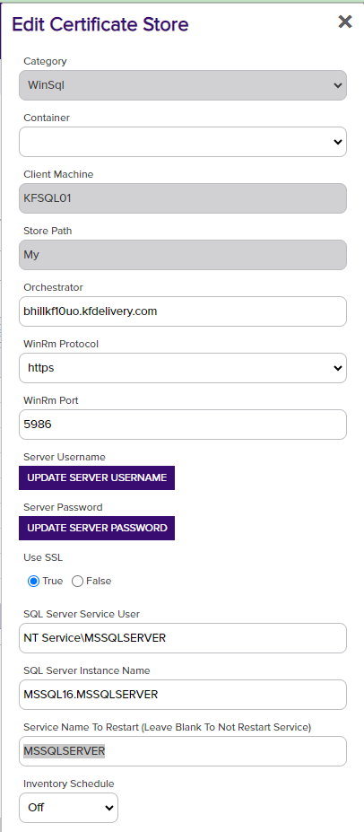

Click Save to save the settings for this Certificate Store

WinCert Certificate Store

In Keyfactor Command, navigate to Certificate Stores from the Locations Menu.  Click the Add button to create a new Certificate Store using the settings defined below.

#### STORE CONFIGURATION 
CONFIG ELEMENT	|DESCRIPTION
----------------|---------------
Category | Select Windows Certificate or the customized certificate store display name from above.
Container | Optional container to associate certificate store with.
Client Machine | Hostname of the Windows Server containing the certificate store to be managed.  If this value is a hostname, a WinRM session will be established using the credentials specified in the Server Username and Server Password fields.
Store Path | Windows certificate store to manage. Store must exist in the Local Machine store on the target server. 
Orchestrator | Select an approved orchestrator capable of managing Windows Certificates (one that has declared the WinCert capability)
WinRm Protocol | Protocol to use when establishing the WinRM session. (Listener on Client Machine must be configured for selected protocol.)
WinRm Port | Port WinRM listener is configured for (HTTPS default is 5986)
SPN with Port | Typically False. Needed in some Kerberos configurations.
Server Username | Account to use when establishing the WinRM session to the Client Machine. Account needs to be an admin or have been granted rights to manipulate the local machine certificate store. If no account is specified, the security context of the Orchestrator service account will be used.
Server Password | Password to use when establishing the WinRM session to the Client Machine
Use SSL | Ignored for this certificate store type. Transport encryption is determined by the WinRM Protocol Setting
Inventory Schedule | The interval that the system will use to report on what certificates are currently in the store. 

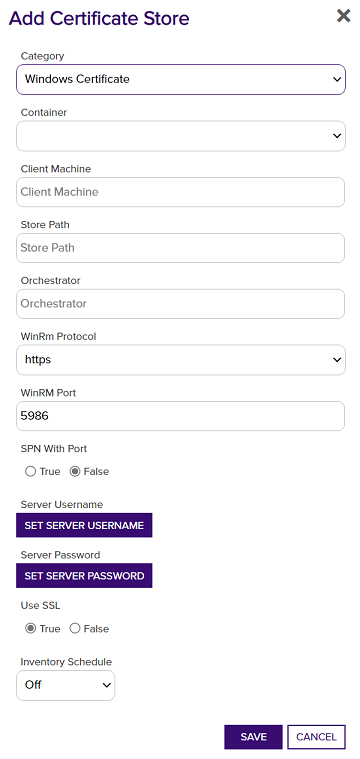

## Test Cases

IISU

Case Number|Case Name|Enrollment Params|Expected Results|Passed|Screenshot
----|------------------------|------------------------------------|--------------|----------------|-------------------------
1	|New Cert Enrollment To New Binding With KFSecret Creds|**Site Name:** FirstSite **Port:** 443 **IP Address:**`*` **Host Name:** www.firstsite.com **Sni Flag:** 0 - No SNI **Protocol:** https|New Binding Created with Enrollment Params specified creds pulled from KFSecret|True|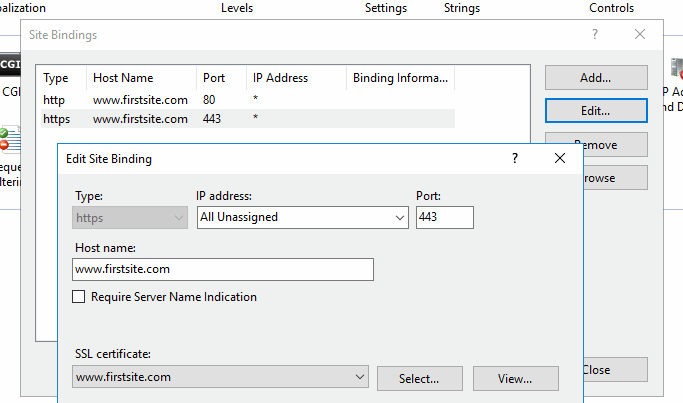
2   |New Cert Enrollment To Existing Binding|**Site Name:** FirstSite **Port:** 443 **IP Address:**`*` **Host Name:** www.firstsite.com **Sni Flag:** 0 - No SNI **Protocol:** https|Existing Binding From Case 1 Updated with New Cert|True|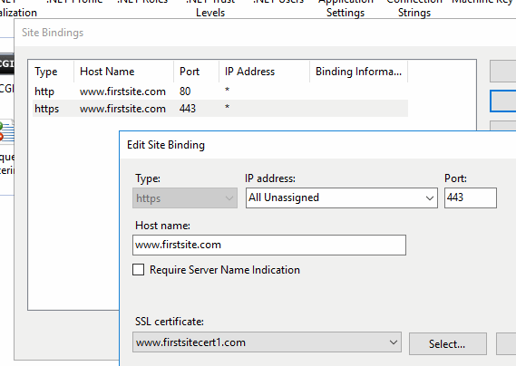
3   |New Cert Enrollment To Existing Binding Enable SNI |**Site Name:** FirstSite **Port:** 443 **IP Address:**`*` **Host Name:** www.firstsite.com **Sni Flag:** 1 - SNI Enabled **Protocol:** https|Will Update Site In Case 2 to Have Sni Enabled|True|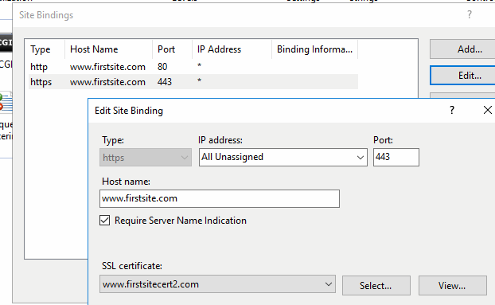
4   |New Cert Enrollment New IP Address|**Site Name:** FirstSite **Port:** 443 **IP Address:**`192.168.58.162` **Host Name:** www.firstsite.com **Sni Flag:** 1 - SNI Enabled **Protocol:** https|New Binding Created With New IP and New SNI on Same Port|True|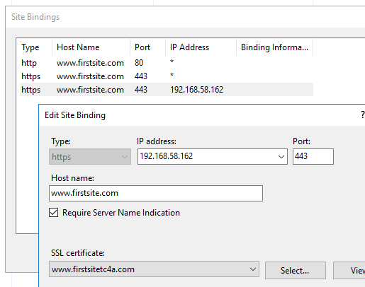
5   |New Cert Enrollment New Host Name|**Site Name:** FirstSite **Port:** 443 **IP Address:**`192.168.58.162` **Host Name:** www.newhostname.com **Sni Flag:** 1 - SNI Enabled **Protocol:** https|New Binding Created With different host on Same Port and IP Address|True|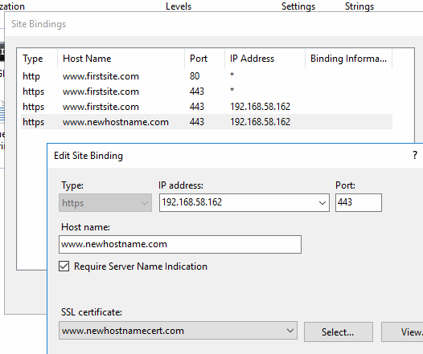
6   |New Cert Enrollment Same Site New Port |**Site Name:** FirstSite **Port:** 4443 **IP Address:**`192.168.58.162` **Host Name:** www.newhostname.com **Sni Flag:** 1 - SNI Enabled **Protocol:** https|New Binding on different port will be created with new cert enrolled|True|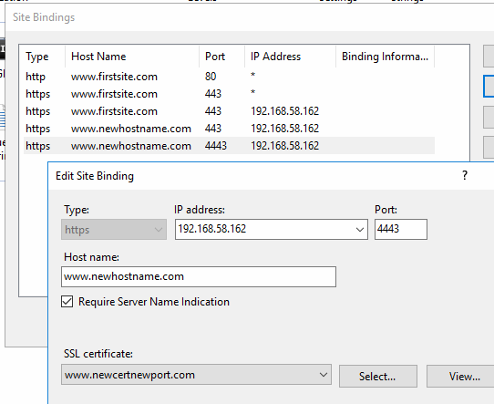
7   |Remove Cert and Binding From Test Case 6|**Site Name:** FirstSite **Port:** 4443 **IP Address:**`192.168.58.162` **Host Name:** www.newhostname.com **Sni Flag:** 1 - SNI Enabled **Protocol:** https|Cert and Binding From Test Case 6 Removed|True|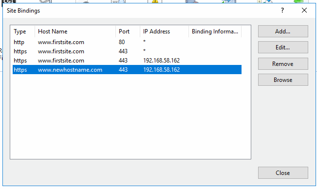
8   |Renew Same Cert on 2 Different Sites|`SITE 1` **Site Name:** FirstSite **Port:** 443 **IP Address:**`*` **Host Name:** www.firstsite.com **Sni Flag:** 1 - SNI Enabled **Protocol:** https `SITE 2` **First Site** **Site Name:** SecondSite **Port:** 443 **IP Address:**`*` **Host Name:** cstiis04.cstpki.int **Sni Flag:** 1 - SNI Enabled **Protocol:** https|Cert will be renewed on both sites because it has the same thumbprint|True|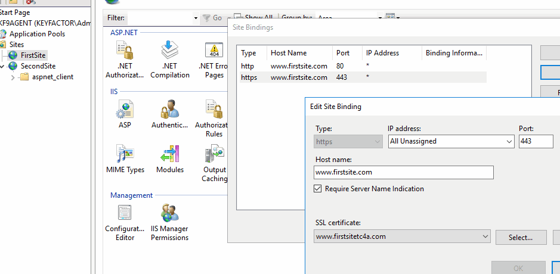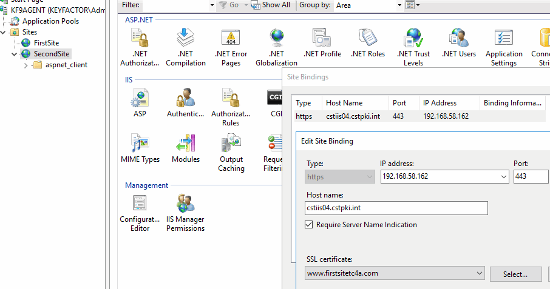
9   |Renew Same Cert on Same Site Same Binding Settings Different Hostname|`BINDING 1` **Site Name:** FirstSite **Port:** 443 **IP Address:**`*` **Host Name:** www.firstsitebinding1.com **Sni Flag:** 1 - SNI Enabled **Protocol:** https `BINDING 2` **Site Name:** FirstSite **Port:** 443 **IP Address:**`*` **Host Name:** www.firstsitebinding2.com **Sni Flag:** 1 - SNI Enabled **Protocol:** https|Cert will be renewed on both bindings because it has the same thumbprint|True|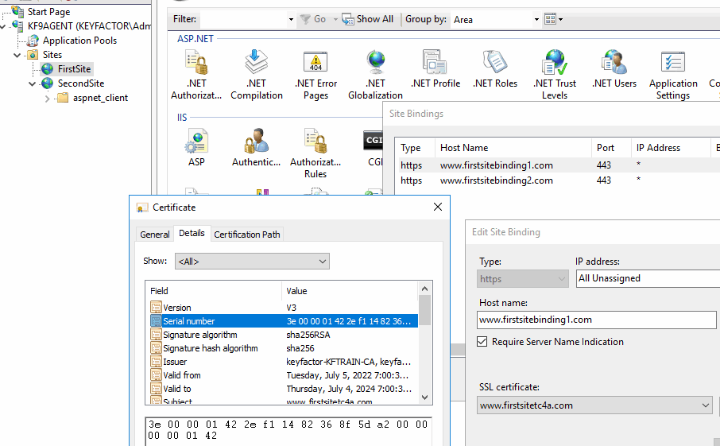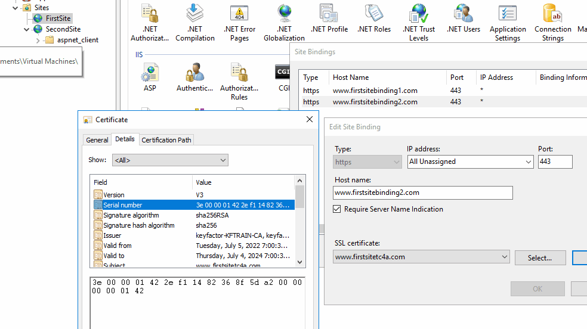
10  |Renew Single Cert on Same Site Same Binding Settings Different Hostname Different Certs|`BINDING 1` **Site Name:** FirstSite **Port:** 443 **IP Address:**`*` **Host Name:** www.firstsitebinding1.com **Sni Flag:** 1 - SNI Enabled **Protocol:** https `BINDING 2` **Site Name:** FirstSite **Port:** 443 **IP Address:**`*` **Host Name:** www.firstsitebinding2.com **Sni Flag:** 1 - SNI Enabled **Protocol:** https|Cert will be renewed on only one binding because the other binding does not match thumbprint|True|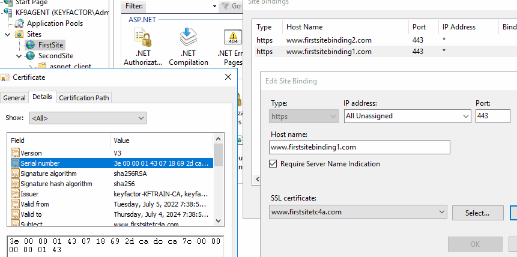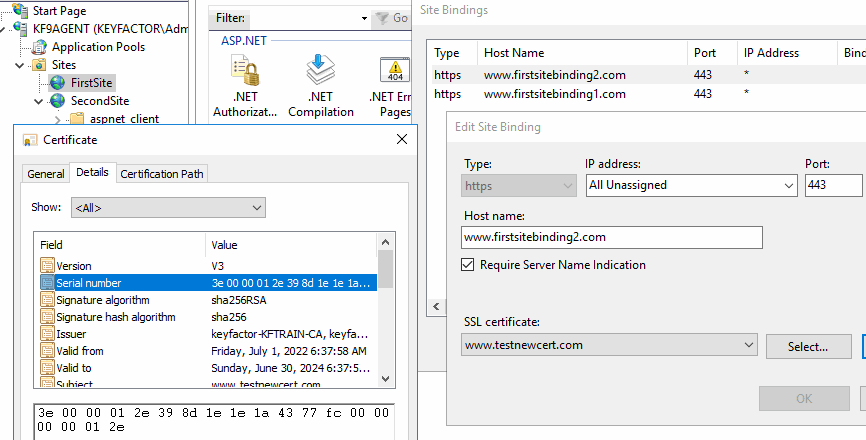
11  |Renew Same Cert on Same Site Same Binding Settings Different IPs|`BINDING 1` **Site Name:** FirstSite **Port:** 443 **IP Address:**`192.168.58.162` **Host Name:** www.firstsitebinding1.com **Sni Flag:** 1 - SNI Enabled **Protocol:** https `BINDING 2` **Site Name:** FirstSite **Port:** 443 **IP Address:**`192.168.58.160` **Host Name:** www.firstsitebinding1.com **Sni Flag:** 1 - SNI Enabled **Protocol:** https|Cert will be renewed on both bindings because it has the same thumbprint|True|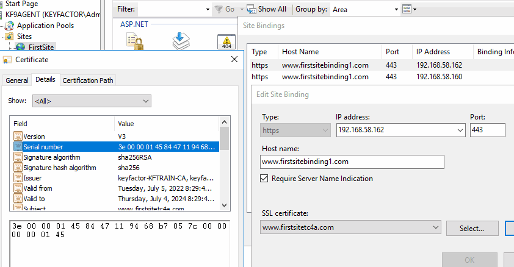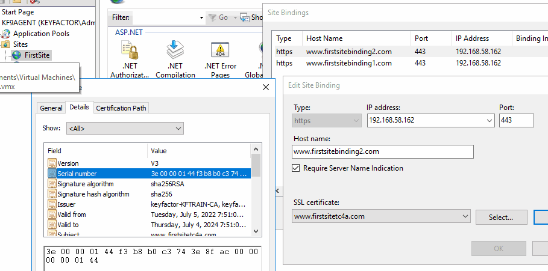
12  |Renew Same Cert on Same Site Same Binding Settings Different Ports|`BINDING 1` **Site Name:** FirstSite **Port:** 443 **IP Address:**`192.168.58.162` **Host Name:** www.firstsitebinding1.com **Sni Flag:** 1 - SNI Enabled **Protocol:** https `BINDING 2` **Site Name:** FirstSite **Port:** 543 **IP Address:**`192.168.58.162` **Host Name:** www.firstsitebinding1.com **Sni Flag:** 1 - SNI Enabled **Protocol:** https|Cert will be renewed on both bindings because it has the same thumbprint|True|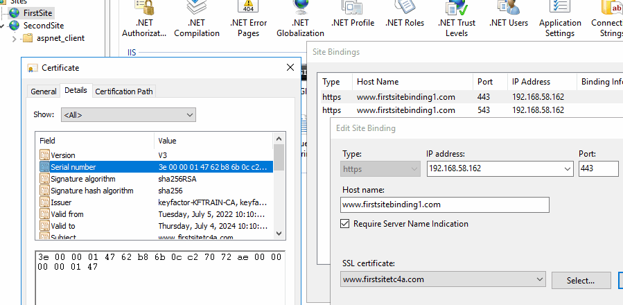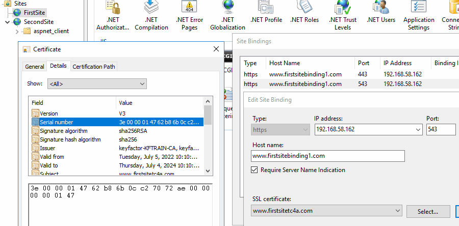
13	|ReEnrollment to Fortanix HSM|**Subject Name:** cn=www.mysite.com **Port:** 433 **IP Address:**`*` **Host Name:** mysite.command.local **Site Name:**Default Web Site **Sni Flag:** 0 - No SNI **Protocol:** https **Provider Name:** Fortanix KMS CNG Provider **SAN:** dns=www.mysite.com&dns=mynewsite.com|Cert will be generated with keys stored in Fortanix HSM and the cert will be bound to the supplied site.|true|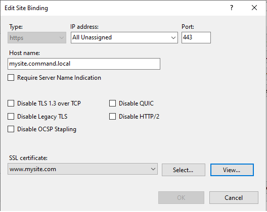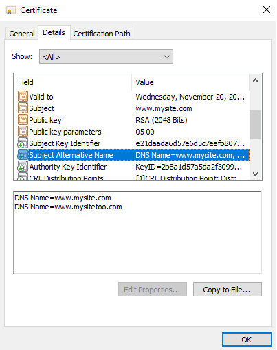
14	|New Cert Enrollment To New Binding With Pam Creds|**Site Name:** FirstSite **Port:** 443 **IP Address:**`*` **Host Name:** www.firstsite.com **Sni Flag:** 0 - No SNI **Protocol:** https|New Binding Created with Enrollment Params specified creds pulled from Pam Provider|True|
15	|New Cert Enrollment Default Site No HostName|**Site Name:** Default Web Site **Port:** 443 **IP Address:**`*` **Host Name:** **Sni Flag:** 0 - No SNI **Protocol:** https|New Binding Installed with no HostName|True|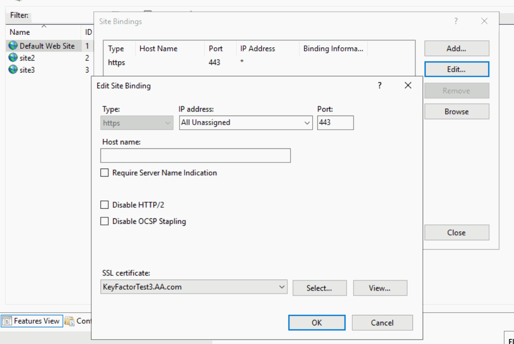
	

WinSql

Case Number|Case Name|Enrollment Params|Expected Results|Passed|Screenshot
----|------------------------|------------------------------------|--------------|----------------|-------------------------
1	|New Cert Enrollment To Default Instance Leave Blank|**Instance Name:** |Cert will be Installed to default Instance, Service will be restarted for default instance|True|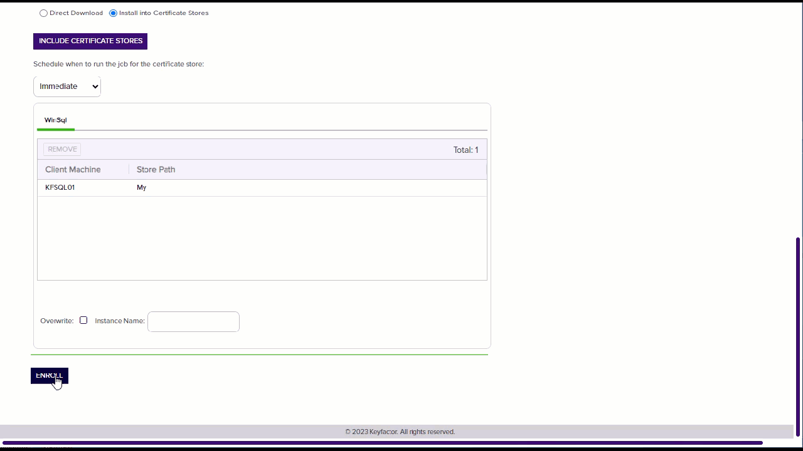
2	|New Cert Enrollment To Default Instance MSSQLServer|**Instance Name:** MSSQLServer|Cert will be Installed to default Instance, Service will be restarted for default instance|True|
3	|New Cert Enrollment To Instance1|**Instance Name:** Instance1|Cert will be Installed to Instance1, Service will be restarted for Instance1|True|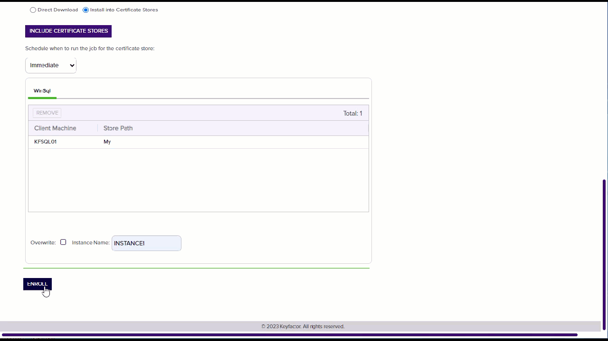
4	|New Cert Enrollment To Instance1 and Default Instance|**Instance Name:** MSSQLServer,Instance1|Cert will be Installed to Default Instance and Instance1, Service will be restarted for Default Instance and Instance1|True|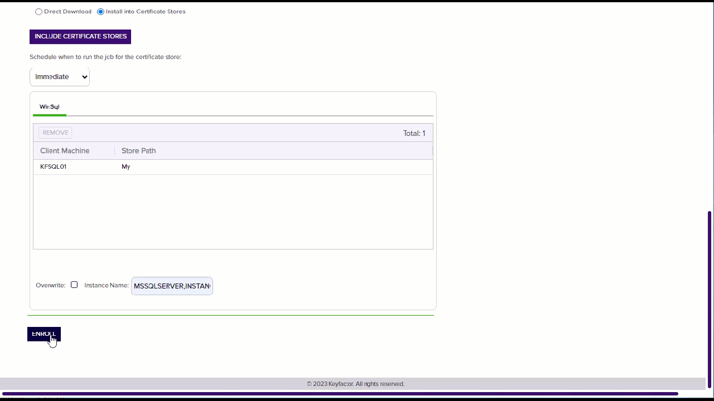
5	|One Click Renew Cert Enrollment To Instance1 and Default Instance|N/A|Cert will be Renewed/Installed to Default Instance and Instance1, Service will be restarted for Default Instance and Instance1|True|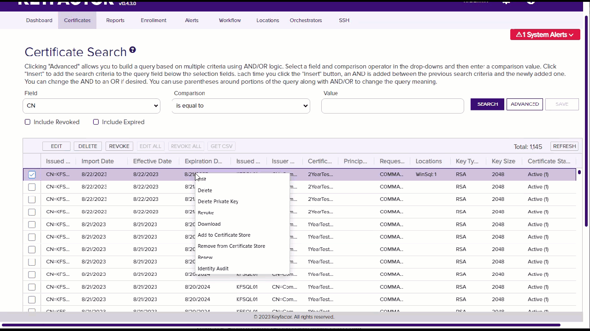
6	|Remove Cert From Instance1 and Default Instance|**Instance Name:** |Cert from TC5 will be Removed From Default Instance and Instance1|True|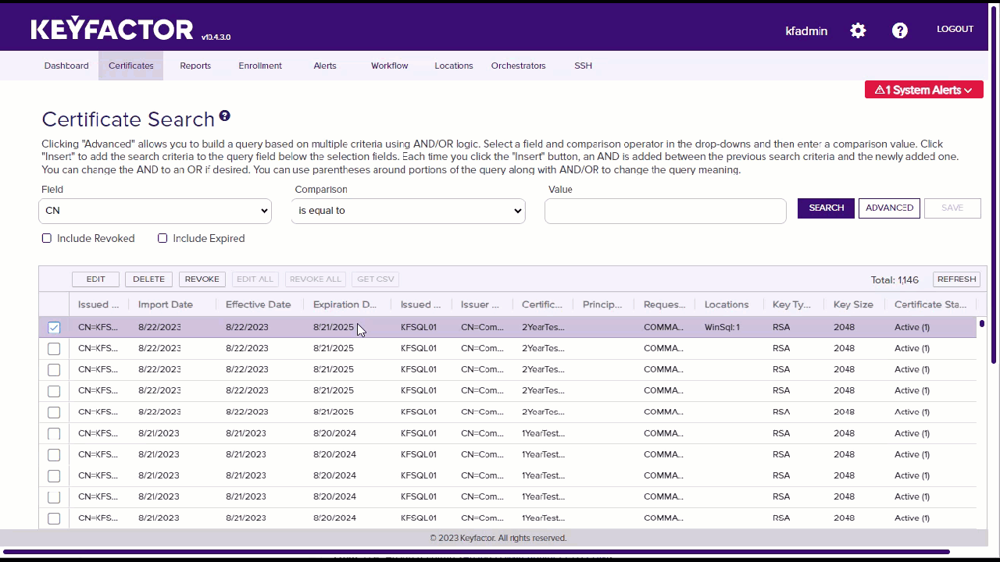
7	|Inventory Different Certs Different Instance|N/A|2 Certs will be inventoried and each tied to its Instance|True|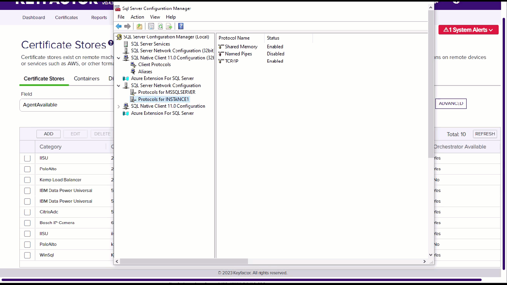
8	|Inventory Same Cert Different Instance|N/A|2 Certs will be inventoried the cert will have a comma separated list of Instances|True|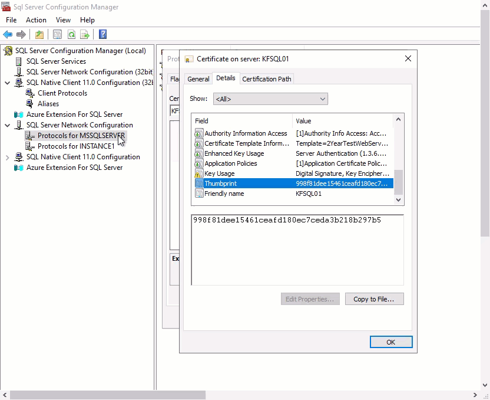
9	|Inventory Against Machine Without SQL Server|N/A|Will fail with error saying it can't find SQL Server|True|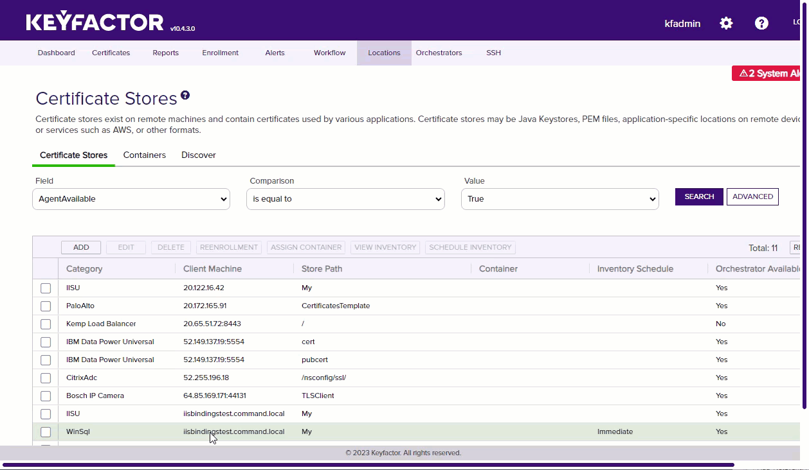
	

