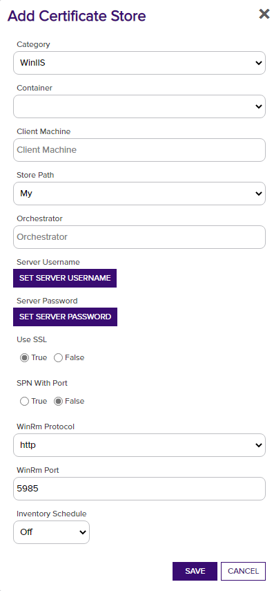

**WinCertStore Orchestrator Configuration**

**Overview**

The WinCertStore Orchestrator remotely manages certificates in a Windows Server local machine certificate store.  Users are able to determine which store they wish to place certificates in by entering the correct store path.  For a complete list of local machine cert stores you can execute the PowerShell command: 

	Get-ChildItem Cert:\LocalMachine

The returned list will contain the actual certificate store name to be used when entering store location.

By default, most certificates are stored in the “Personal” (My) and “Web Hosting” (WebHosting) stores.

This agent implements four job types:  Inventory, Management Add/Remove, and ReEnrollment.

WinRM is used to remotely manage the certificate stores and IIS bindings.  WinRM must be properly configured to allow the orchestrator on the server to manage the certificates.  Setting up WinRM is not in the scope of this document.

**Note:**
In version 2.0 of the IIS Orchestrator, the certificate store type has been renamed and additional parameters have been added. Prior to 2.0 the certificate store type was called “IISBin” and as of 2.0 it is called “IISU”. If you have existing certificate stores of type “IISBin”, you have three options:
1. Leave them as is and continue to manage them with a pre 2.0 IIS Orchestrator Extension. Create the new IISU certificate store type and create any new IIS stores using the new type.
1. Delete existing IIS stores. Delete the IISBin store type. Create the new IISU store type. Recreate the IIS stores using the new IISU store type.
1. Convert existing IISBin certificate stores to IISU certificate stores. There is not currently a way to do this via the Keyfactor API, so direct updates to the underlying Keyfactor SQL database is required. A SQL script (IIS-Conversion.sql) is available in the repository to do this. Hosted customers, which do not have access to the underlying database, will need to work Keyfactor support to run the conversion. On-premises customers can run the script themselves, but are strongly encouraged to ensure that a SQL backup is taken prior running the script (and also be confident that they have a tested database restoration process.)

**Note: There is an additional certificate store type of “IIS” that ships with the Keyfactor platform. Migration of certificate stores from the “IIS” type to either the “IISBin” or “IISU” types is not currently supported.**

**Note: In version 3.0, the orchestrator has been renamed from IISU to WinCert.  There is currently no succession process to update previous certificate store types.**

**1. Create the New Certificate Store Type**

In Keyfactor Command create a new Certificate Store Type similar to the one below:

#### STORE TYPE CONFIGURATION
**Basic Settings:**

CONFIG ELEMENT	| DESCRIPTION
------------------|------------------
Name	|A descriptive name for the extension.  Example:  WinCert (for general windows cert store), WinIIS (for IIS Webstore cert store)  
Short Name	|The short name that identifies the registered functionality of the orchestrator. Currently must be either Win or WinIIS
Custom Capability|Store type name orchestrator will register with. Currently must be Win or WinIIS.
Job Types	|Inventory (Checked), Add, Remove, and Reenrollment are the supported job types.
General Settings|Needs Server - Checked Blueprint Allowed - Unchecked Uses PowerShell - Unchecked
Requires Store Password	|Determines if a store password is required when configuring an individual store.  This must be unchecked.
Supports Entry Password	|Determined if an individual entry within a store can have a password.  This must be unchecked.
<<<<<<< HEAD

=======
Supports Custom Alias	|Determines if an individual entry within a store can have a custom Alias.  This must be Forbidden.
Uses PowerShell	|Unchecked
Store Path Type	|Determines what restrictions are applied to the store path field when configuring a new store.  This must be Multiple Choice
Store Path Value|A comma separated list of options to select from for the Store Path. This, combined with the hostname, will determine the location used for the certificate store management and inventory.  Must be My, WebHosting
Private Keys	|This determines if Keyfactor can send the private key associated with a certificate to the store.  This is required since IIS will need the private key material to establish TLS connections.
PFX Password Style	|This determines how the platform generate passwords to protect a PFX enrollment job that is delivered to the store.  This can be either Default (system generated) or Custom (user determined).
Job Types	|Inventory, Add, Remove, and Reenrollment are the supported job types. 
>>>>>>> origin/release-2.0

**Advanced Settings:**

CONFIG ELEMENT	| DESCRIPTION
------------------|------------------
Store Path Type	|Determines what restrictions are applied to the store path field when configuring a new store.
Store Path Value|When using this as a Windows Cert Store, this option must be freeform, allowing the user to type in a particular store path. When using this for bound or IIS Certificates, This must be a comma separated list of options to select from for the Store Path. This, combined with the hostname, will determine the location used for the certificate store management and inventory.  Must be My, WebHosting
Supports Custom Alias	|Determines if an individual entry within a store can have a custom Alias.  This must be Forbidden.
Private Keys	|This determines if Keyfactor can send the private key associated with a certificate to the store.  This is required since IIS will need the private key material to establish TLS connections.
PFX Password Style	|This determines how the platform generate passwords to protect a PFX enrollment job that is delivered to the store.  This can be either Default (system generated) or Custom (user determined).

**Custom Fields:**

- **SPN With Port** – Defaults to false but some customers need for remote PowerShell Access

Parameter Name|Display Name|Parameter Type|Default Value|Required|Description
---|---|---|---|---|---
spnwithport\*|SPN With Port?|Boolean|false|No|An SPN is the name by which a client uniquely identifies an instance of a service
WinRm Protocol\*|WinRm Protocol|Multiple Choice|http|Yes|Protocol that WinRM Runs on
WinRm Port\*|WinRm Port|String|5985|Yes|Port that WinRM Runs on
ServerUsername|Server Username|Secret||No|The username to log into the IIS Server
ServerPassword|Server Password|Secret||No|The password that matches the username to log into the IIS Server
ServerUseSsl|Use SSL|Bool|True|Yes|Determine whether the server uses SSL or not

**NOTE: Elements with an asterisk (*) are only required when communicating with a Web Server and bound certificates.

**Entry Parameters:**
This section must be configured with binding fields. The parameters will be populated with the appropriate data when creating a new certificate store. 

- **Site Name** – Required (Adding an entry, Removing an entry, Reenrolling an entry). The site name for the web site being bound to – i.e. &quot;Default Web Site&quot;
- **IP Address** – Required (Adding an entry, Removing an entry, Reenrolling an entry). The IP address for the web site being bound to. Default is &quot;\*&quot; for all IP Addresses.
- **Port** – Required (Adding an entry, Removing an entry, Reenrolling an entry). The port for the web site being bound to. Default is &quot;443&quot;.
- **Host Name** – Optional. The host name for the web site being bound to.
- **Protocol** - Required (Adding an entry, Removing an entry, Reenrolling an entry) 
   - https
   - http
- **Sni Flag** – Optional. Set the SNI flag associated with the binding being created. Default is "0". Acceptable values are:
   - 0 - No SNI
   - 1 - SNI Enabled
   - 2 - Non SNI Binding
   - 3 - SNI Binding
<<<<<<< HEAD
- **Provider Name\*** - Optional. Name of the Windows cryptographic provider to use when generating and storing the private key for the certificate being enrolled by a reenrollment job. If not specified, defaults to 'Microsoft Strong Cryptographic Provider'. This value would typically be changed when leveraging a Hardware Security Module (HSM). The specified cryptographic provider must be available on the target IIS server being managed. The list of installed cryptographic providers can be obtained by running 'certutil -csplist' in a command shell on the target IIS Server.
- **SAN\*** - Optional. Specifies Subject Alternative Name (SAN) to be used when performing reenrollment jobs. Certificate templates generally require a SAN that matches the subject of the certificate (per RFC 2818). Format is a list of <san_type>=<san_value> entries separated by ampersands. Examples: 'dns=www.mysite.com' for a single SAN or 'dns=www.mysite.com&dns=www.mysite2.com' for multiple SANs.
=======
- **Provider Name** - Optional. Name of the Windows cryptographic provider to use when generating and storing the private key for the certificate being enrolled by a reenrollment job. If not specified, defaults to 'Microsoft Strong Cryptographic Provider'. This value would typically be changed when leveraging a Hardware Security Module (HSM). The specified cryptographic provider must be available on the target IIS server being managed. The list of installed cryptographic providers can be obtained by running 'certutil -csplist' in a command shell on the target IIS Server.
- **SAN** - Optional. Specifies Subject Alternative Name (SAN) to be used when performing reenrollment jobs. Certificate templates generally require a SAN that matches the subject of the certificate (per RFC 2818). Format is a list of <san_type>=<san_value> entries separated by ampersands. Examples: 'dns=www.mysite.com' for a single SAN or 'dns=www.mysite.com&dns=www.mysite2.com' for multiple SANs.
>>>>>>> origin/release-2.0

Parameter Name|Parameter Type|Default Value|Required When
---|---|---|---
Port|String|443|Adding Entry, Removing Entry, Reenrolling and Entry
IPAddress|String|*|Adding Entry, Reenrolling an Entry
HostName |String||
SiteName |String|Default Web Site|Adding Entry, Removing Entry, Reenrolling an Entry
SniFlag  |String|0 - No SNI|
Protocol  |Multiple Choice|https|Adding Entry, Removing Entry, Reenrolling an Entry
<<<<<<< HEAD
ProviderName\*	|String||
SAN\*	|String||Reenrolling an Entry (if the CA follows RFC 2818 specifications)

**NOTE: Elements with an asterisk (*) are only required when not binding certificates to a web server.
=======
ProviderName	|String||
SAN	|String||Reenrolling an Entry (if the CA follows RFC 2818 specifications)
>>>>>>> origin/release-2.0

**2. Register the IIS Universal Orchestrator with Keyfactor**
See Keyfactor InstallingKeyfactorOrchestrators.pdf Documentation.  Get from your Keyfactor contact/representative.

**3a. Create an IIS Binding Certificate Store within Keyfactor Command**

In Keyfactor Command create a new Certificate Store similar to the one below, selecting "WinIIS" as the Category and the parameters as described in &quot;Create the New Certificate Store Type for the New IIS AnyAgent&quot;. 

#### STORE CONFIGURATION 
CONFIG ELEMENT	|DESCRIPTION
----------------|---------------
Category	|The type of certificate store to be configured. Select category based on the display name configured above.
Container	|This is a logical grouping of like stores. This configuration is optional and does not impact the functionality of the store.
Client Machine	|The hostname of the server to be managed. The Change Credentials option must be clicked to provide a username and password. This account will be used to manage the remote server via PowerShell.
Credentials |Local or domain admin account that has permissions to manage iis (Has to be admin)
Store Path	|My or WebHosting
Orchestrator	|This is the orchestrator server registered with the appropriate capabilities to manage this certificate store type. 
SPN with Port?|
WinRm Protocol|http or https
WinRm Port |Port to run WinRm on Default for http is 5985
Server Username|Username to log into the IIS Server
Server Password|Password for the username required to log into the IIS Server
Use SSL|Determines whether SSL is used ot not

Inventory Schedule	|The interval that the system will use to report on what certificates are currently in the store. 

**3b. Create a Windows Certificate Store within Keyfactor Command**

In Keyfactor Command create a new Certificate Store similar to the one below, selecting "WinIIS" as the Category and the parameters as described in &quot;Create the New Certificate Store Type for the New IIS AnyAgent&quot;. 

#### STORE CONFIGURATION 
CONFIG ELEMENT	|DESCRIPTION
----------------|---------------
Category	|The type of certificate store to be configured. Select category based on the display name configured above.
Container	|This is a logical grouping of like stores. This configuration is optional and does not impact the functionality of the store.
Client Machine	|The hostname of the server to be managed. The Change Credentials option must be clicked to provide a username and password. This account will be used to manage the remote server via PowerShell.
Credentials |Local or domain admin account that has permissions to manage iis (Has to be admin)
Store Path	|Any correctly spelled local machine store path
Orchestrator	|This is the orchestrator server registered with the appropriate capabilities to manage this certificate store type. 
Server Username|Username to log into the Server
Server Password|Password for the username required to log into the IIS Server
Use SSL|Determines whether SSL is used ot not

#### TEST CASES
Case Number|Case Name|Enrollment Params|Expected Results|Passed|Screenshot
----|------------------------|------------------------------------|--------------|----------------|-------------------------
1	|New Cert Enrollment To New Binding With KFSecret Creds|**Site Name:** FirstSite **Port:** 443 **IP Address:**`*` **Host Name:** www.firstsite.com **Sni Flag:** 0 - No SNI **Protocol:** https|New Binding Created with Enrollment Params specified creds pulled from KFSecret|True|
2   |New Cert Enrollment To Existing Binding|**Site Name:** FirstSite **Port:** 443 **IP Address:**`*` **Host Name:** www.firstsite.com **Sni Flag:** 0 - No SNI **Protocol:** https|Existing Binding From Case 1 Updated with New Cert|True|
3   |New Cert Enrollment To Existing Binding Enable SNI |**Site Name:** FirstSite **Port:** 443 **IP Address:**`*` **Host Name:** www.firstsite.com **Sni Flag:** 1 - SNI Enabled **Protocol:** https|Will Update Site In Case 2 to Have Sni Enabled|True|
4   |New Cert Enrollment New IP Address|**Site Name:** FirstSite **Port:** 443 **IP Address:**`192.168.58.162` **Host Name:** www.firstsite.com **Sni Flag:** 1 - SNI Enabled **Protocol:** https|New Binding Created With New IP and New SNI on Same Port|True|
5   |New Cert Enrollment New Host Name|**Site Name:** FirstSite **Port:** 443 **IP Address:**`192.168.58.162` **Host Name:** www.newhostname.com **Sni Flag:** 1 - SNI Enabled **Protocol:** https|New Binding Created With different host on Same Port and IP Address|True|
6   |New Cert Enrollment Same Site New Port |**Site Name:** FirstSite **Port:** 4443 **IP Address:**`192.168.58.162` **Host Name:** www.newhostname.com **Sni Flag:** 1 - SNI Enabled **Protocol:** https|New Binding on different port will be created with new cert enrolled|True|
7   |Remove Cert and Binding From Test Case 6|**Site Name:** FirstSite **Port:** 4443 **IP Address:**`192.168.58.162` **Host Name:** www.newhostname.com **Sni Flag:** 1 - SNI Enabled **Protocol:** https|Cert and Binding From Test Case 6 Removed|True|
8   |Renew Same Cert on 2 Different Sites|`SITE 1` **Site Name:** FirstSite **Port:** 443 **IP Address:**`*` **Host Name:** www.firstsite.com **Sni Flag:** 1 - SNI Enabled **Protocol:** https `SITE 2` **First Site** **Site Name:** SecondSite **Port:** 443 **IP Address:**`*` **Host Name:** cstiis04.cstpki.int **Sni Flag:** 1 - SNI Enabled **Protocol:** https|Cert will be renewed on both sites because it has the same thrumbprint|True|
9   |Renew Same Cert on Same Site Same Binding Settings Different Hostname|`BINDING 1` **Site Name:** FirstSite **Port:** 443 **IP Address:**`*` **Host Name:** www.firstsitebinding1.com **Sni Flag:** 1 - SNI Enabled **Protocol:** https `BINDING 2` **Site Name:** FirstSite **Port:** 443 **IP Address:**`*` **Host Name:** www.firstsitebinding2.com **Sni Flag:** 1 - SNI Enabled **Protocol:** https|Cert will be renewed on both bindings because it has the same thrumbprint|True|
10  |Renew Single Cert on Same Site Same Binding Settings Different Hostname Different Certs|`BINDING 1` **Site Name:** FirstSite **Port:** 443 **IP Address:**`*` **Host Name:** www.firstsitebinding1.com **Sni Flag:** 1 - SNI Enabled **Protocol:** https `BINDING 2` **Site Name:** FirstSite **Port:** 443 **IP Address:**`*` **Host Name:** www.firstsitebinding2.com **Sni Flag:** 1 - SNI Enabled **Protocol:** https|Cert will be renewed on only one binding because the other binding does not match thrumbprint|True|
11  |Renew Same Cert on Same Site Same Binding Settings Different IPs|`BINDING 1` **Site Name:** FirstSite **Port:** 443 **IP Address:**`192.168.58.162` **Host Name:** www.firstsitebinding1.com **Sni Flag:** 1 - SNI Enabled **Protocol:** https `BINDING 2` **Site Name:** FirstSite **Port:** 443 **IP Address:**`192.168.58.160` **Host Name:** www.firstsitebinding1.com **Sni Flag:** 1 - SNI Enabled **Protocol:** https|Cert will be renewed on both bindings because it has the same thrumbprint|True|
12  |Renew Same Cert on Same Site Same Binding Settings Different Ports|`BINDING 1` **Site Name:** FirstSite **Port:** 443 **IP Address:**`192.168.58.162` **Host Name:** www.firstsitebinding1.com **Sni Flag:** 1 - SNI Enabled **Protocol:** https `BINDING 2` **Site Name:** FirstSite **Port:** 543 **IP Address:**`192.168.58.162` **Host Name:** www.firstsitebinding1.com **Sni Flag:** 1 - SNI Enabled **Protocol:** https|Cert will be renewed on both bindings because it has the same thrumbprint|True|
13	|ReEnrollment to Fortanix HSM|**Subject Name:** cn=www.mysite.com **Port:** 433 **IP Address:**`*` **Host Name:** mysite.command.local **Site Name:**Default Web Site **Sni Flag:** 0 - No SNI **Protocol:** https **Provider Name:** Fortanix KMS CNG Provider **SAN:** dns=www.mysite.com&dns=mynewsite.com|Cert will be generated with keys stored in Fortanix HSM and the cert will be bound to the supplied site.|true|
14	|New Cert Enrollment To New Binding With Pam Creds|**Site Name:** FirstSite **Port:** 443 **IP Address:**`*` **Host Name:** www.firstsite.com **Sni Flag:** 0 - No SNI **Protocol:** https|New Binding Created with Enrollment Params specified creds pulled from Pam Provider|True|
15	|New Cert Enrollment Default Site No HostName|**Site Name:** Default Web Site **Port:** 443 **IP Address:**`*` **Host Name:** **Sni Flag:** 0 - No SNI **Protocol:** https|New Binding Installed with no HostName|True|

